# Lecture 1 - Introduction to Cyber-Physical Systems & Internet of Things

## Lecture Information

| **Master's Degree** | Digital Automation Engineering (D.M.270/04)           |
|---------------------|-------------------------------------------------------|
| **Curriculum**      | Digital Infrastructure                                |
| **Lecture Title**   | Cyber-Physical Systems & Internet of Things           |
| **Author**          | Prof. Marco Picone (marco.picone@unimore.it)          |
| **Academic Year**   | A.A 2025/2026                                         |
| **Last Update**     | September 2025                                        | 

# Outline

- Cyber-Physical Systems
- Cyber-Physical Application Scenarios
- Internet of Things (IoT) Definition & Vision
- From WSN and M2M to IoT
- IoT Characteristics
- IoT Protocol Stack
- IoT Connectivity
- IoT Software

# Internet & Connected Devices

## Where do we started ?

Since from the beginning of the Internet, there was the desire to connect more “things” to it. Source: ARPANET Completion Report: January 4, 1978.

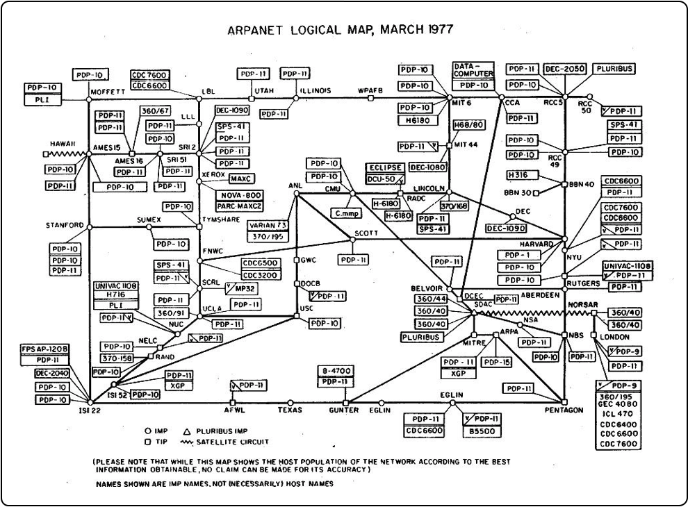

**Figure 1.1:** ARPANET Completion Report January 4, 1978

The original idea of the Internet was to connect computers, but very soon, the idea of connecting other devices to the network emerged. The image above shows a representation of the ARPANET network in 1978, where we can see various types of devices connected to the network such as mainframe computers, minicomputers, and terminals through different geographical locations such as universities, research institutions, and government agencies involving multiple countries and satellite links.

---

## Where are we today ?

Today, the Internet and the Web have evolved far beyond their original purpose of connecting a handful of computers. They now interconnect billions of devices worldwide—including smartphones, tablets, sensors, vehicles, appliances, and industrial machines—across every continent. This massive global network enables seamless communication, collaboration, and data exchange at unprecedented scale.

The exponential growth in connected devices has led to an explosion in the volume of data generated, transmitted, and processed every second. Modern Internet infrastructure supports vast amounts of real-time information, multimedia content, and interactive services. Cloud computing, edge computing, and advanced networking technologies have made it possible to deliver rich digital experiences, from social media and streaming platforms to e-commerce, smart cities, and industrial automation.

As a result, the Internet has become the backbone for countless services and applications, powering innovation and transforming how we live, work, and interact. The availability of massive data volumes and intelligent services continues to drive new opportunities and challenges in connectivity, security, and digital transformation.

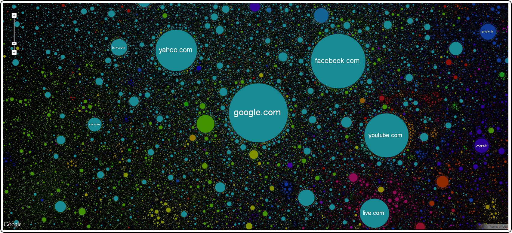

**Figure 1.2:** A "snapshot" of the current state of the Internet/Web

---

## The First "Connected Devices" - The Cold Drink Machine

The ARPANET-connected Coke machine at Carnegie Mellon University is widely recognized as one of the earliest examples of a "smart" connected device. 
This innovative project demonstrated how everyday appliances could be enhanced with network connectivity, paving the way for future developments in the Internet of Things (IoT).

Key highlights of the ARPANET-connected Coke machine:

- Developed by students at Carnegie Mellon University's School of Computer Science.
- Switches were installed in the Coke machine to monitor the number of bottles in each row.
- The system tracked how long each bottle remained in the machine; bottles stored for a longer time were labeled as "cold."
- Users could remotely access the machine's status via a finger interface over ARPANET.
- This pioneering experiment inspired inventors worldwide to create their own network-connected appliances.

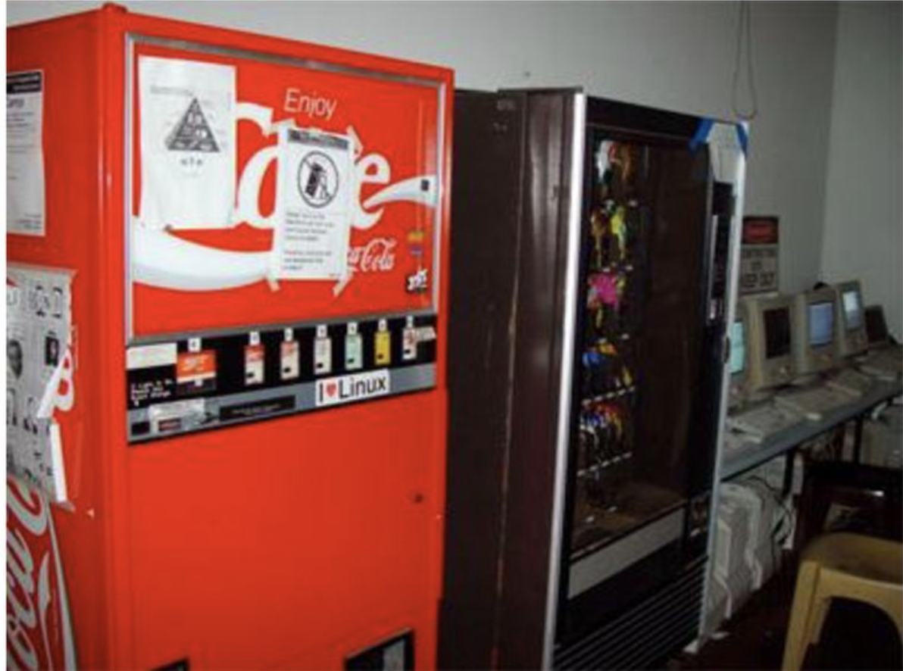

**Figure 1.3:** CSE3002 Team Project History of Internet of Things (IoT) Devices and Their Influence on Cyber Security Team F Christopher Byars Dylan Leonard Brian Patino. 
[**[Link]**](https://hqsoftwarelab.com/blog/the-history-of-iot-a-comprehensive-timeline-of-major-events-infographic/)

---

## The First "Connected Devices" - The XCoffee

> The XCoffee is created at the Computer Laboratory of the University of Cambridge. Two academics who worked at the Trojan Room in the 
> laboratory had a video-frame grabber attached to one of the computers. They decided to connect a camera controlled by a server application 
> that was observing the coffee pot and taking pictures of it several times a minute. Then the pictures were sent to the client application, to 
> keep the user updated on the information about whether the pot was filled.

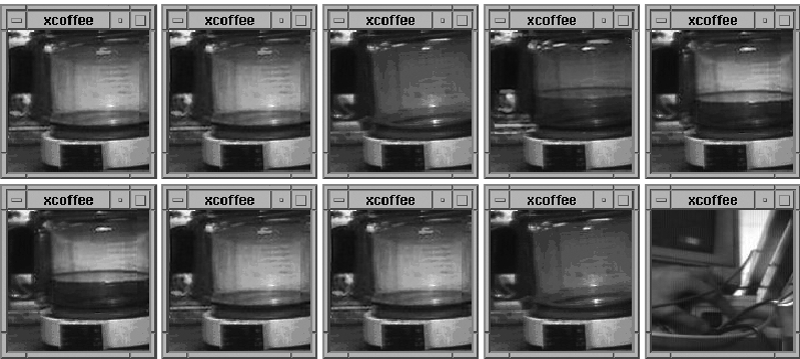

**Figure 1.4:** The XCoffee Machine - The First "Connected Device"

**Sources:** [Link1](https://www.cl.cam.ac.uk/coffee/qsf/coffee.html), [Link2](https://odannyboy.medium.com/the-first-things-on-the-internet-of-things-5d817d45ac9c),[Link3](https://hqsoftwarelab.com/blog/the-history-of-iot-a-comprehensive-timeline-of-major-events-infographic/)

---

## The Mobile Centric World

The mobile revolution is changing the way we live, work, and interact. Mobile devices have become an integral part of our daily lives, enabling us to stay connected, access information, and perform various tasks on the go. The proliferation of smartphones, tablets, and wearable devices has transformed communication, entertainment, and productivity, making it easier than ever to stay connected to the world around us.

In the picture below, you can see how the mobile revolution has transformed St. Peter's Square in Vatican City. The left image from 2005 shows a traditional gathering of people, while the right image from 2013 captures a sea of mobile devices held up by attendees, highlighting the significant impact of mobile technology on social interactions and events.

>What a difference 8 years makes: St. Peter’s Square in 2005 and yesterday (2013)” 
(Facebook NBC News)

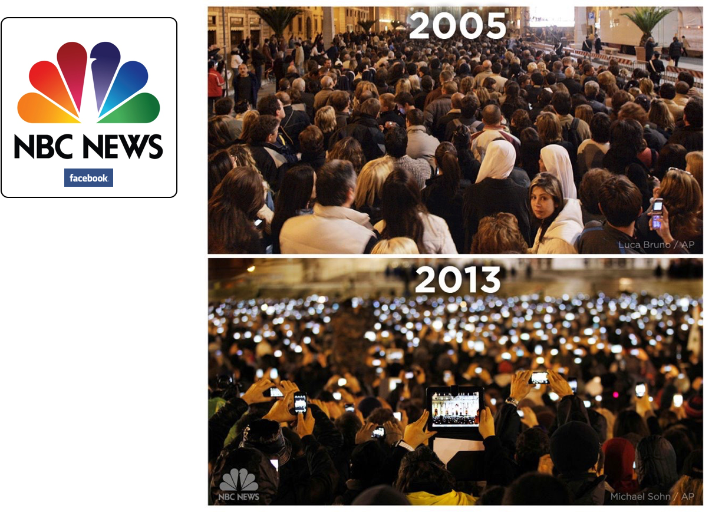    

**Figure 1.5:** Piazza San Pietro - The Mobile Revolution

This image hides an interesting aspect on what we are not seeing and able to support this massive number of mobile devices. The answer is the **Network and Internet infrastructures, which are the backbone of the mobile revolution and are able to support the increasing demand for data and connectivity combined with Cloud Computing infrastructures and services**.

Those infrastructures evolved a lot in the last 20 years, and they are still evolving to support the new requirements of the mobile world and as we will see in this course, the Internet of Things world.

Another interesting example is the event of the concert of Vasco Rossi in Modena Park, July 2017, where more than 230K people attended the event and almost all of them were using their mobile devices to share the event in real time.

**Figure 1.6:** 230K Devices at Vasco Rossi Concert @ Modena Park - July 2017

**Source:** [Link](https://www.digitaldata.olivetti.com/timbigdata/concerto-di-vasco-rossi)

This is another example of how the mobile revolution is changing the way we live and interact, and how the 
underlying network and internet infrastructures are crucial to support this massive connectivity.

---

### Mobile & Wearable Computing

Another interesting aspect of the mobile revolution is the rise of wearable computing devices, such as smartwatches, fitness trackers, and augmented reality glasses. These devices are designed to be worn on the body and provide users with real-time access to information, notifications, and health monitoring features.

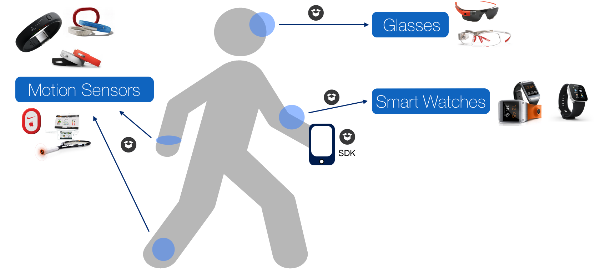

**Figure 1.7:** Wearable Computing Devices

Nowadays, we are not just associated to one or two mobile devices, but we are surrounded by a plethora of connected devices that are becoming an integral part of our daily lives. From smart home devices to connected cars, the Internet of Things (IoT) is transforming the way we interact with our environment and the world around us. 

This devices creates a new paradigm where the physical and digital worlds are increasingly interconnected, leading to new opportunities and challenges in terms of connectivity, security, and data management.

---

# The Internet of Things (IoT) Evolution & Revolution

In the context of the mobile revolution, the Internet of Things (IoT) has emerged as a transformative concept that envisions a world where everyday objects are connected to the internet, enabling them to collect and exchange data. The IoT represents a significant evolution in the way we interact with technology, 
as it extends connectivity beyond traditional computing devices to encompass a wide range of physical objects and environments.

> 🔍 The **Internet of Things (IoT)** refers to the idea of a network of networks with billions of uniquely identified physical devices
> denoted also as **Smart Objects** organized in an **Internet-like structure**.
> Smart Objects are items such as sensors, consumer devices, and enterprise assets that are **connected to both the Internet and each other**.

**Figure 1.8:** IoT Pillars - Communication Technologies (e.g., LoRa, NB-IoT), Hardware (e.g., Raspberry Pi, Arduino), Software (e.g., C/C++, Python, Linux, RTOS) and Protocols (e.g., MQTT, CoAP)

One of the **key characteristics of the Internet of Things (IoT)** is its reliance on the **Internet** itself. 
The IoT is not simply about connecting devices; it is about connecting them **using standard Internet protocols**, rather than proprietary solutions. This approach is **crucial for achieving scalability, interoperability, and global accessibility** in IoT systems.

At the core of IoT connectivity is the **Internet Protocol (IP)**, which provides a **universal and standardized method for devices to communicate and exchange data** across networks. 
Devices that join an IoT network are **directly or indirectly connected to an IP network**, allowing them to be **addressed, managed, and integrated using standard IP-based protocols**.
By leveraging **IP as a common protocol**, IoT devices can not only communicate with each other, but also **connect seamlessly to the broader Internet and cloud services**. This enables **new opportunities for data storage, processing, and analysis**, and supports the development of **innovative applications and services** on a global scale.

A key element to consider it that being connected to the Internet is not mandatory for all the devices, but they must be able to communicate using IP protocols, even if they are connected to a local network that is not directly connected to the Internet.
We can have IoT deployments that are fully connected to the Internet, partially connected, or even completely isolated from it, depending on the specific use case and requirements.
The common factor is that the devices must be able to communicate using IP protocols, regardless of their connectivity to the broader Internet.

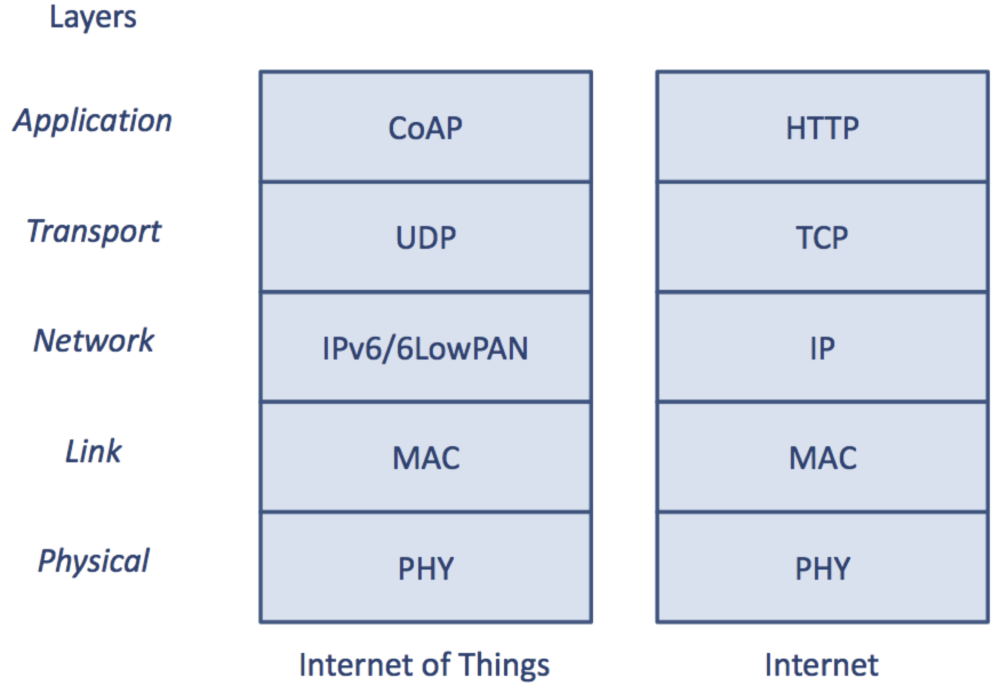

**Figure 1.9:** IoT Protocol Stack vs Traditional Networking Stack

IoT device cannot always use the traditional Internet protocol stack due to their **resource constraints** (e.g., limited processing power, memory, and energy).
For this reason, IoT devices often use **lightweight protocols** that are specifically designed for resource-constrained environments. 
These protocols are optimized for low power consumption, reduced bandwidth usage, and efficient data transmission.

For example, two widely adopted protocols in IoT applications are **MQTT (Message Queuing Telemetry Transport)** and **CoAP (Constrained Application Protocol)**. 

- **MQTT** is a lightweight, publish-subscribe messaging protocol designed for efficient communication between devices with limited bandwidth and resources. It is commonly used for telemetry and remote monitoring in IoT scenarios. MQTT can be compared to traditional enterprise messaging protocols such as **AMQP (Advanced Message Queuing Protocol)**, as both support the publish-subscribe paradigm, but MQTT is optimized for constrained environments.

- **CoAP** is a specialized web transfer protocol designed for use with resource-constrained devices and networks. It follows a request/response model similar to **HTTP (Hypertext Transfer Protocol)**, but is much more lightweight, making it suitable for IoT deployments where minimizing overhead is critical.

These protocols are specifically engineered to be lightweight and efficient, addressing the limitations of IoT devices in terms of processing power, memory, and energy consumption. In contrast, traditional protocols like HTTP and **TCP (Transmission Control Protocol)** are more resource-intensive and may not be practical for all IoT scenarios.

The **adoption of standard Internet protocols**—such as **IP, TCP, UDP, and HTTP**—along with 
the use of **lightweight alternatives** like **MQTT** and **CoAP**, is **essential** for the successful 
implementation and widespread adoption of IoT systems. By leveraging these protocols,
**IoT devices can achieve seamless connectivity, interoperability, and scalability**, enabling a wide range of applications 
and services that enhance our daily lives and transform various industries.

For example, **smart home devices** (e.g., thermostats, lights, and security cameras) use standard protocols 
to communicate with mobile apps and cloud platforms, allowing users to monitor and control their homes remotely. 
In **industrial IoT**, sensors and machines use MQTT to transmit telemetry data to centralized dashboards 
for real-time monitoring and predictive maintenance. **Healthcare wearables** leverage CoAP to efficiently 
send patient data to hospital systems for continuous health tracking.

Furthermore, the use of **standard Internet protocols facilitates the integration of IoT devices with existing IT infrastructure and cloud services**, 
enabling new opportunities for **data analytics, machine learning, and artificial intelligence**. 
For instance, IoT sensors in agriculture can use lightweight protocols like MQTT to efficiently transmit environmental data—such as soil moisture, 
temperature, and humidity—to cloud-based analytics platforms. MQTT optimizes communication between resource-constrained devices and the cloud 
by enabling reliable, low-bandwidth data transfer. Once collected, this data can be exposed via HTTP APIs, 
making it accessible to traditional applications such as dashboards for real-time monitoring or AI models for advanced analytics. 
This seamless integration of IoT protocols and standard web technologies enables organizations 
to build smarter, more responsive, and data-driven solutions across domains.

---

## IoT Main Characteristics

The **Internet of Things (IoT)** is defined by several distinctive characteristics that set it apart from traditional computing paradigms. 
The most important keywords and concepts include:

- **Unique Identifiable Objects**: Each "thing" in the IoT ecosystem is uniquely identifiable and typically equipped with **embedded intelligence** (e.g., sensors, actuators, microcontrollers) to **sense** or **interact** with the environment and **communicate** with external systems.
- **Constrained Devices**: Many IoT devices operate with **limited processing power**, **storage**, and **energy resources**, requiring efficient and lightweight solutions.
- **IP-Based Networks**: IoT connectivity is built on **Internet Protocol (IP)** standards (including **IPv4** and **IPv6**), enabling global addressing and interoperability.
- **Diverse Communication Technologies**: IoT leverages a wide range of **communication technologies** such as **WiFi**, **Cellular**, **Bluetooth**, **LPWAN**, and **IEEE 802.15.4** to connect devices across different environments.
- **Standard Protocols & Interoperability**: The use of **standard protocols** (e.g., **MQTT**, **CoAP**, **HTTP**) is essential for **interoperability** among heterogeneous devices and platforms.
- **Disruptive Heterogeneity**: IoT systems exhibit significant **heterogeneity** in terms of **data formats**, **hardware architectures**, and **software platforms**, posing challenges for integration and management.
- **Security**: Ensuring **security** and **privacy** is critical due to the vast number of connected devices and the sensitive nature of the data exchanged.
- **Interaction between People & Things**: IoT enables seamless **interaction** and **collaboration** between **people** and **things**, fostering new applications and user experiences.

These characteristics collectively drive the evolution of IoT, shaping its architecture, protocols, and application domains.

---

## Some of the Main IoT Challenges

The Internet of Things (IoT) presents several significant challenges that need to be addressed to ensure its successful implementation and widespread adoption. 
Some of the main challenges include:

- **Scalability**: The IoT ecosystem is expected to grow exponentially, with billions of devices connected to the internet. Managing and scaling such a vast network of devices poses significant challenges in terms of infrastructure, data management, and network performance.
- **Interoperability**: IoT devices come from various manufacturers and use different communication protocols and data formats. Ensuring seamless interoperability among heterogeneous devices and platforms is crucial for the success of IoT systems.
- **Heterogeneity**: The diversity of IoT devices, ranging from simple sensors to complex machines, introduces challenges in terms of device management, configuration, and integration. Developing standardized approaches to handle this heterogeneity is essential.
- **Security**: The proliferation of connected devices increases the attack surface for cyber threats. Ensuring robust security measures to protect IoT devices and the data they generate is essential to prevent unauthorized access, data breaches, and other security risks.
- **Data Management**: IoT generates massive amounts of data that need to be collected, stored, processed, and analyzed. Efficient data management strategies are required to handle the volume, velocity, and variety of IoT data.
- **Energy Efficiency**: Many IoT devices are battery-powered and operate in resource-constrained environments. Developing energy-efficient solutions is critical to prolong device lifespan and reduce maintenance costs.
- **Privacy**: IoT devices often collect sensitive personal data, raising concerns about user privacy. Implementing privacy-preserving mechanisms and ensuring compliance with data protection regulations is essential.
- **Real-Time Processing**: Many IoT applications require real-time data processing and decision-making. Ensuring low latency and high reliability in data transmission and processing is crucial for time-sensitive applications.

---

# From Wireless Sensor Networks (WSN) and Machine-to-Machine (M2M) to IoT

**Wireless Ad-hoc Sensor Networks (WSN)** are considered the **precursors** to the modern **Internet of Things (IoT)**, 
but they operated without a common, shared **IP network**. WSNs laid the foundation for pervasive interaction between people and their environments, 
with their potential captured in the three key elements of their acronym:

- **Wireless**: Emphasizes the freedom and **mobility** enabled by eliminating physical wires, allowing for flexible and rapid **system deployment**.
- **Sensor**: Highlights the use of **sensing technology** to **perceive** and **interact** with the physical world, enabling a wide range of applications.
- **Networks**: Focuses on the ability to create systems with **distributed**, **communicating devices** whose collective functionality emerges from their **collaboration** across large areas.

These core characteristics made WSNs a critical step toward the development of scalable, distributed, and intelligent IoT systems.

---

## Telemetry & Machine-to-Machine (M2M)

Telemetry and Machine-to-Machine (M2M) communication are foundational concepts in the evolution of connected devices and the Internet of Things (IoT). Telemetry focuses on the remote collection of measurements, while M2M extends this paradigm to enable autonomous, bidirectional communication between devices.

**Key characteristics:**

- **Telemetry** enables the remote acquisition of data from field devices, allowing for continuous monitoring and analysis without direct human intervention.
    - **Long-range measurements:** Examples include temperature, humidity, and wind data from remote weather stations using cellular or satellite networks (e.g., Inmarsat); telemetry in **Formula 1** for real-time vehicle diagnostics.
    - **Short-range measurements:** Medical devices such as **pacemakers** use low-power telemetry coils to monitor patient activity non-invasively.
- **Machine-to-Machine (M2M)** communication generalizes telemetry by supporting **autonomic**, **bidirectional** data exchange between non-human-operated machines and central collector systems.
    - **Autonomous operation:** Devices communicate and coordinate actions without manual input.
    - **Bidirectional communication:** Information flows both from field devices to central systems and vice versa, enabling remote control, configuration, and updates.

---

## M2M Fragmentation

The Machine-to-Machine (M2M) landscape is marked by significant fragmentation and lack of standardization across industry verticals. 
This fragmentation leads to inefficiencies, increased costs, and limited scalability, as each sector tends to develop 
its own bespoke solutions rather than leveraging common architectures and reusable components.

**Key challenges of M2M fragmentation include:**

- **Industry-Specific Solutions:** Most industries address their M2M requirements independently, often converging on similar architectures and elements but rarely sharing solutions. As a result, the "M2M wheel" is repeatedly reinvented from one sector to another.
- **Customization Overload:** Solutions are typically designed, produced, and implemented on an industry-by-industry basis. This leads to unique, customized hardware and software, often resulting in sole-sourcing and vendor lock-in.
- **Limited Developer Ecosystem:** Software development is restricted to small groups of experts familiar with the specific architecture and APIs of each platform, driving up development and support costs.
- **Poor Economies of Scale:** The diversity and uniqueness of solutions make it difficult to achieve economies of scale for components, resulting in higher costs and slower innovation.

---

## Difference between M2M and IoT

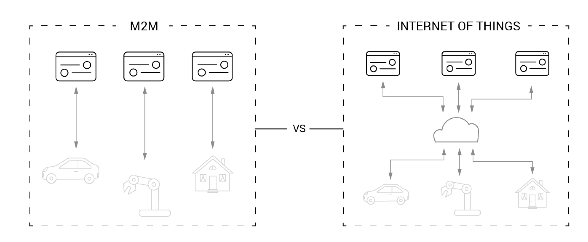

**Figure 1.10:** Schematic representation of the difference between M2M and IoT

| **Aspect**             | **M2M**                                   | **IoT**                                                    |
|------------------------|-------------------------------------------|------------------------------------------------------------|
| **Communication**      | Point-to-point                            | Many-to-many via Internet/cloud                            |
| **Scope**              | Device-specific, narrow                   | Wide, heterogeneous, spanning multiple domains             |
| **Data Processing**    | Local, limited                            | Cloud-based, distributed, advanced analytics               |
| **Standards**          | Proprietary, domain-specific              | Open, global, cross-domain                                 |
| **Scalability**        | Limited, hard to extend                   | Highly scalable, billions of devices                       |
| **Applications**       | Vertical solutions (e.g., smart meter)    | Horizontal ecosystems (e.g., smart cities, Industry 4.0)   |

WSN and M2M laid the groundwork for IoT by demonstrating the potential of connected devices. 
However, IoT expands upon these concepts by leveraging standard Internet protocols, enabling global connectivity, interoperability, 
and scalability across diverse applications and industries. Furthermore, in the IoT the possibility of distributing data processing and intelligence across
the edge, fog and cloud layers is a key aspect that differentiate it from the traditional M2M approach with the potential of enabling more complex and intelligent applications
working together in a collaborative manner.

---

# IoT Device Core Characteristics

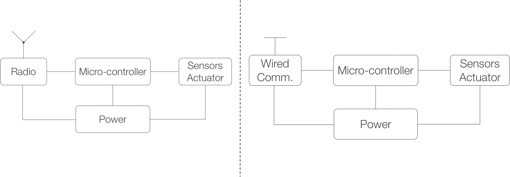

**Figure 1.11:** Schematic representation of the core characteristics of IoT devices

Understanding the core components of IoT devices is fundamental for designing, developing, and deploying effective cyber-physical and IoT systems. Identifying these modules allows engineers to address key requirements such as connectivity, sensing, processing, and energy management, ensuring that devices can reliably interact with both the physical and digital worlds. A clear grasp of these building blocks also supports interoperability, scalability, and security across diverse application domains.
The main modules of an IoT device usually include:

- **Communication:** Enables the device to exchange data with other systems or networks, typically via a radio transceiver with an antenna or a wired connection.
- **Microcontroller:** Acts as the device’s “brain,” running embedded software to control its behavior and manage operations.
- **Sensors or Actuators:** Allow the device to sense environmental conditions or interact with the physical world, providing input or output capabilities.
- **Power Source:** Supplies energy to the device’s electronic circuits. Common options include batteries, piezoelectric sources (activated by physical force), or small solar cells (powered by light).

IoT devices do not work alone, but they are part of a larger ecosystem that includes multiple devices, networks, cloud services, and user interfaces through 
different types of architectures and deployment models as we briefly introduce in the next section.

---

# A Shared IoT Multi-Layer Model

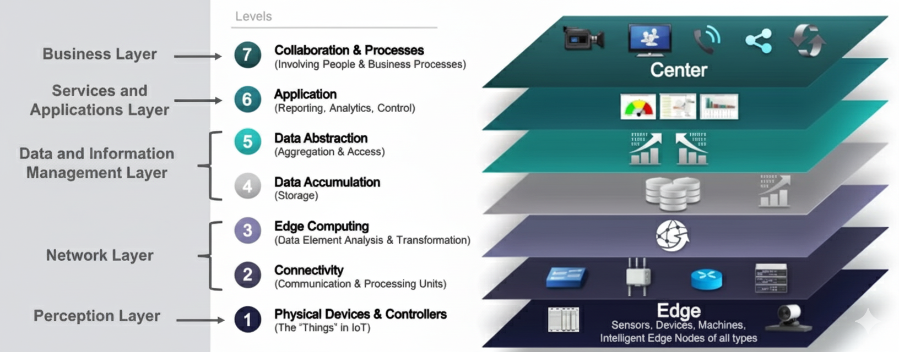

**Figure 1.12:** An example of an IoT Multi-Layer Model in the Industrial Domain where different layers are represented and interconnected to support the IoT ecosystem. 
[Link1](https://www.altexsoft.com/blog/iot-architecture-layers-components/), [Link2](https://newsroom.cisco.com/c/r/newsroom/en/us/a/y2014/m10/the-internet-of-things-world-forum-unites-industry-leaders-in-chicago-to-accelerate-the-adoption-of-iot-business-models.html)

A general multi-layer reference model is often used to abstract and describe IoT systems and architectures. 
This model provides a high-level overview of the main layers, clarifies their roles and interactions, 
and supports the development of scalable, interoperable IoT solutions. While the model can be tailored to specific 
implementations and requirements, it serves as a foundational framework for understanding IoT architectures.

This architecture typically comprises the following layers:

- **Perception Layer:**
  - **Physical Devices & Controllers:** This is the foundational layer where the "things" of IoT reside. It includes all the physical sensors, actuators, devices, and intelligent edge nodes that collect data from the environment or interact with it.
- **Network Layer:**
  - **Connectivity:** Responsible for the secure and reliable transmission of data from the perception layer to higher layers. This involves various communication technologies like Wi-Fi, Bluetooth, cellular, and specialized IoT protocols.
  - **Edge Computing:** This layer processes data closer to the source (at the "edge" of the network), performing data element analysis and transformation. It helps reduce latency, conserve bandwidth, and improve security by processing data locally before sending it to the cloud.
- **Data and Information Management Layer:**
  - **Data Accumulation:** Focuses on storing the vast amounts of data collected from IoT devices. This often involves various database technologies optimized for big data.
  - **Data Abstraction:** This layer is responsible for aggregating and accessing the stored data, presenting it in a standardized and meaningful format for higher-level applications.
- **Services and Applications Layer:**
  - **Application:** This layer provides the specific functionalities and services that utilize the processed IoT data. This includes reporting, analytics, and control mechanisms that enable users to interact with and manage their IoT systems.
- **Business Layer:**
  - **Collaboration & Processes:** The highest layer, where the insights derived from IoT data are integrated into broader business processes and decision-making. It involves people, organizational workflows, and strategic collaborations that drive value from IoT deployments.

---

# IoT Software an Overview

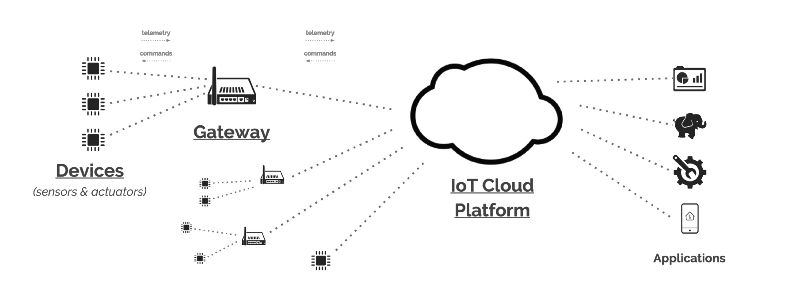

**Figure 1.13:** A schematic representation of the main actors involved in an IoT solution. 
[Link1](https://iot.eclipse.org/community/resources/white-papers/)

An effective IoT solution comprises a diverse array of connected devices ("things") that collect and transmit data. These devices often communicate via gateways, which serve as intermediaries to bridge local device networks with broader enterprise or cloud infrastructures. The network enables secure and reliable data exchange between devices, gateways, and a centralized IoT platform—typically hosted on enterprise back-end servers or in the cloud.

The IoT platform plays a pivotal role by aggregating, processing, and integrating device data into existing enterprise systems and workflows. Each component—devices, gateways, and the cloud platform—fulfills distinct responsibilities:

- **Devices ("Things")**: Sense, actuate, and generate data from the physical environment.
- **Gateways**: Manage connectivity, protocol translation, and local processing, ensuring seamless communication between devices and the network.
- **IoT Platform (Cloud/Enterprise Server)**: Orchestrates device management, data analytics, integration with business applications, and overall system reliability.

This layered architecture ensures scalable, interoperable, and secure IoT deployments that can be tailored to meet specific business and operational requirements.
Of course this architecture can be more complex and include additional components such as:

- **Edge/Fog Computing Nodes**: Intermediate processing units that perform data analysis and decision-making closer to the data source, reducing latency and bandwidth usage.
- **Security Modules**: Dedicated components for ensuring data integrity, confidentiality, and authentication across the IoT ecosystem.
- **User Interfaces**: Dashboards, mobile apps, and other interfaces that allow users to interact with and manage IoT devices and data.
- **Analytics Engines**: Advanced data processing units that apply machine learning and AI techniques to derive insights from IoT data.
- **Integration Layers**: Middleware that facilitates communication and data exchange between the IoT platform and existing enterprise systems (e.g., ERP, CRM).
- **Management and Orchestration Tools**: Software for monitoring, updating, and managing the entire IoT infrastructure.
- **APIs and SDKs**: Tools that enable developers to build applications and services on top of the IoT platform.
- **Data Storage Solutions**: Scalable databases and data lakes designed to handle the large volumes of data generated by IoT devices.
- **Communication Networks**: Various network technologies (e.g., LPWAN, 5G, Wi-Fi) that provide connectivity options tailored to different IoT use cases.
- **Backup and Recovery Systems**: Mechanisms to ensure data resilience and availability in case of failures.
- **Monitoring and Alerting Systems**: Tools that provide real-time monitoring of device status, performance metrics, and alerting for anomalies or failures.
- **Development and Testing Environments**: Platforms that facilitate the development, simulation, and testing of IoT applications before deployment.

---

## IoT Software - Sensor & Actuator

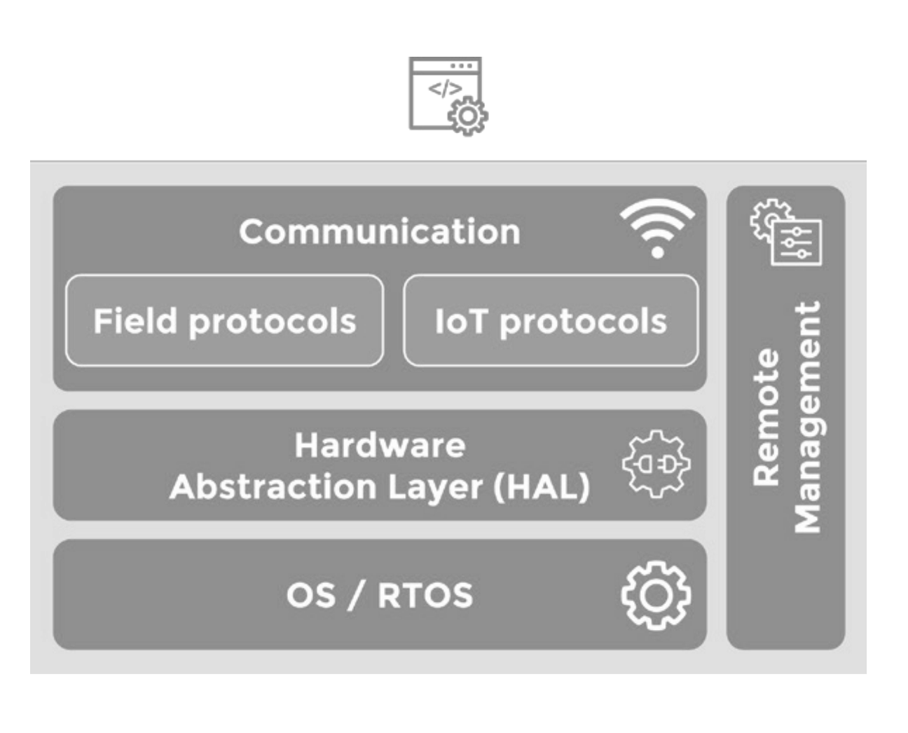

**Figure 1.14:** IoT Devices software stack and main components. 
[Link1](https://iot.eclipse.org/community/resources/white-papers/)

The "Thing" serves as the initial component in an IoT solution, typically generating data and interacting with the physical world. 
Things are often constrained in terms of size and power supply, hence they commonly utilize **Microcontrollers (MCUs)** with limited capabilities. 
These MCUs are specialized for specific tasks, designed for cost-effective mass production. The software running on MCU-based devices is tailored to support specific functions. 
Key features of the software stack on such devices may include:

- **IoT Operating System**: While many devices operate without an operating system, some incorporate embedded or real-time operating systems specifically suited for small, constrained devices, offering IoT-specific capabilities.
- **Hardware Abstraction**: This software layer allows access to MCU's hardware features, such as flash memory, GPIOs, and serial interfaces, abstracting their complexities.
- **Communication Support**: Drivers and protocols facilitate device connectivity to wired or wireless protocols like Bluetooth, Z-Wave, Thread, CAN bus, MQTT, CoAP, enabling efficient device communication.
- **Remote Management**: The capability to remotely control the device, enabling firmware upgrades or battery level monitoring, ensuring efficient device management.
 
---

## IoT Software - Gateways

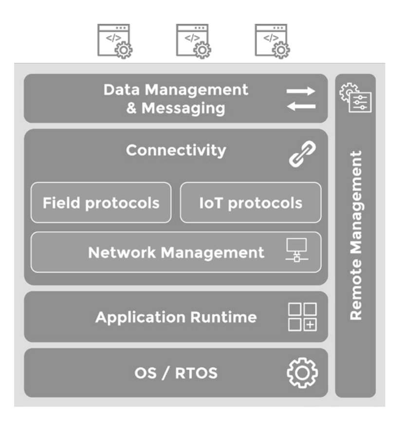

**Figure 1.14:** IoT Gateways software stack and main components. 
[Link1](https://iot.eclipse.org/community/resources/white-papers/)

IoT gateways play a pivotal role in connecting sensors, actuators, and devices to external networks and cloud platforms. 
They act as intermediaries, enabling seamless communication, data processing, and protocol translation between heterogeneous devices and systems. 
Gateways can be standalone hardware units or embedded as functional modules within larger devices such as industrial machines, vehicles, or smart home appliances.

Key functions and characteristics of IoT gateways include:

- **Edge Data Processing and Storage:** Perform local data aggregation, filtering, and temporary storage to reduce network latency and bandwidth usage.
- **Protocol Translation:** Bridge communication between devices using different protocols, ensuring interoperability across diverse hardware and software ecosystems.
- **Device-to-Device Connectivity:** Enable direct communication and coordination among connected devices within a local network.
- **Security and Reliability:** Implement authentication, encryption, and access control to protect data and ensure reliable operation.
- **Scalability:** Support large numbers of devices by managing connections and distributing workloads across multiple gateways.
- **Remote Management:** Facilitate firmware updates, configuration changes, and monitoring of connected devices from centralized platforms.
- **Integration with Cloud and Enterprise Systems:** Forward processed data to cloud services or enterprise applications for advanced analytics and decision-making.

---

# Cyber–Physical Systems

In this context, **Cyber-Physical Systems (CPS)** play a crucial role in bridging the gap between the physical and digital worlds. CPS are systems that integrate computation, networking, and physical processes to enable real-time monitoring, control, and interaction with the physical environment.

*A **Cyber-Physical System (CPS)** refers to integrated systems that combine computational elements with physical components, 
enabling the interaction and collaboration between the digital and physical worlds. 
CPS typically involve a network of **sensors**, **actuators**, and **computational devices** that **collect data** from 
the physical environment, **process** it, and **control** physical processes or objects.*

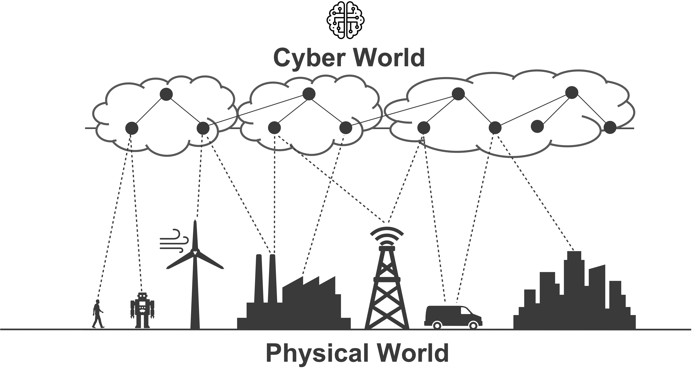

Typically, CPS are characterized by the following features:

- **Integration of Physical and Cyber Components**: CPS seamlessly integrate physical components (sensors, actuators, etc.) with cyber components (computers, networks, software) to enable real-time monitoring and control of physical processes.
- **Real-Time Interaction**: CPS are designed to operate in real-time, allowing for immediate response to changes in the physical environment and enabling dynamic interactions between the physical and digital worlds.
- **Networked Communication**: CPS rely on networked communication to facilitate data exchange and coordination between distributed components, enabling collaboration and coordination across different physical locations.
- **Autonomy and Adaptability**: CPS often incorporate autonomous decision-making capabilities, allowing them to adapt to changing conditions and optimize performance based on real-time data.
- **Safety and Reliability**: CPS are often deployed in safety-critical applications, requiring robust safety and reliability measures to ensure the integrity and security of both physical and cyber components. 

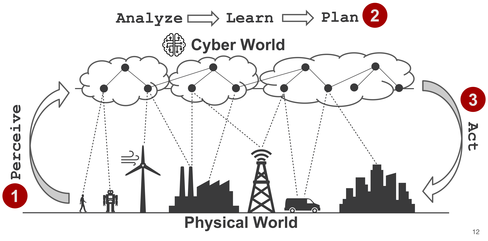

As illustrated in the figure above, CPS typically involve the following phases:

1. **Perceive**: In this phase, sensors collect data from the physical environment, such as temperature, pressure, or motion.
2. **Process**: The collected data is then processed and analyzed using computational algorithms to extract meaningful insights and patterns. This phase can be further broken down into sub-phases:
   - **Analyze**: The collected data is then processed and analyzed using computational algorithms to extract meaningful insights and patterns.
   - **Learn**: Learning techniques may be applied to enable the system to learn from historical data and improve its performance over time.
   - **Plan**: Based on the analysis and learning, the system can plan actions or responses to be taken in the physical environment.
3. **Act**: Finally, actuators are used to execute the planned actions, such as adjusting a thermostat, controlling a robotic arm, or activating an alarm. 

**Note:** After the action phase, the cycle continues with the system continuously perceiving, analyzing, learning, planning, and acting in a dynamic and adaptive manner.

---

## A Multi-Disciplinary Approach

The field of cyber-physical systems is cross-disciplinary in nature — building upon complex technology systems that promote advancement in countless fields
Cyber-physical systems are engineered systems where functionalities and salient properties emerge from the networked interaction of cyber/digital and physical components
CPS technology seeks to develop and deploy technologies needed for the seamless integration of cyber and physical systems including:

- Processes
- Software
- Networking
- Artificial Intelligence
- Coordination/Orchestration Algorithms
- Systems on Chip (SoC)
- Embedded Systems
- Robotics
- and counting …

Cyber-physical systems are also a way to encompass the large spectrum of application scenarios including:

- Industry 4.0
- Internet of Things (IoT)
- Automotive
- Military
- Medical & Healthcare
- and so on

They have recently emerged as the leading domain for the study and implementation of multi-component systems where computational and physical resources are strictly interconnected and seamlessly integrated. CPSs integrate in the same environment and application scenario:

- Sensing
- Actuation
- Computation
- Control
- Networking
- Communication

They represent a major paradigm in the framework of collective and connected systems, as well as a vertical study of systems: they are inherently transdisciplinary, generalizing and expanding individual sub-fields.

---

### An Industrial "Example" of CPS Technologies

**Sources:** [Link1](https://www.mouser.it/new/analog-devices/adi-industry-4), [Link2](https://www.linkedin.com/pulse/examples-industry-40-use-cases-luka-kozamernik/)

The previous figure shows some of the main technologies that are used in CPS and Industry 4.0 applications that traditionally are complex systems that integrate physical processes with computational resources and networking capabilities to enable real-time monitoring, control, and optimization of industrial processes. There are many technologies that are used in CPS and Industry 4.0 applications, including for example:

- **Industrial Internet of Things (IIoT)**: IIoT refers to the use of IoT technologies in industrial applications, enabling the connection and communication of industrial devices and systems for improved monitoring and control.
- **Edge Computing**: Edge computing involves processing data closer to the source, reducing latency and improving real-time decision-making capabilities in CPS applications.
- **Cloud Computing**: Cloud computing provides scalable and flexible computing resources for data storage, processing, and analysis in CPS applications.
- **Artificial Intelligence (AI) and Machine Learning (ML)**: AI and ML techniques are used to analyze large volumes of data generated by CPS, enabling predictive maintenance, anomaly detection, and optimization of industrial processes.
- **Robotics and Automation**: Robotics and automation technologies are used to automate physical processes in CPS applications, improving efficiency and reducing human intervention.
- **Cybersecurity**: Cybersecurity measures are essential to protect CPS applications from cyber threats and ensure the integrity and confidentiality of data and systems.
- **Advanced Sensors and Actuators**: Advanced sensors and actuators are used to collect real-time data from physical processes and enable precise control and actuation in CPS applications.
- **Communication Protocols**: Various communication protocols, such as MQTT, OPC-UA, and Modbus, are used to enable communication and data exchange between different components in CPS applications.
- **Digital Twins**: Digital twins are virtual representations of physical systems that enable simulation, analysis, and optimization of CPS applications.
- **Augmented Reality (AR) and Virtual Reality (VR)**: AR and VR technologies are used to enhance visualization and interaction with CPS applications, enabling remote monitoring and control.
- **Big Data Analytics**: Big data analytics techniques are used to analyze large volumes of data generated by CPS applications, enabling insights and decision-making based on data-driven approaches.

---

### From Technologies to Services

One important aspect of CPS is that technologies are meant to enable the creation of added value for the end user, by improving efficiency, productivity, safety, and sustainability in various application domains. CPS technologies are often designed to be interoperable and scalable, allowing for seamless integration with existing systems and the ability to adapt to changing requirements and environments.

As illustrated in the previous figure, CPS technologies can enable services in the industrial domain such as:

- **Predictive Maintenance**: CPS technologies can enable predictive maintenance by monitoring the condition of industrial equipment in real-time, analyzing data to predict potential failures, and scheduling maintenance activities proactively to minimize downtime
- **Remote Monitoring and Control**: CPS technologies can enable remote monitoring and control of industrial processes, allowing operators to monitor and control equipment and systems from a centralized location, improving efficiency and reducing the need for on-site personnel
- **Decision Support Systems**: CPS technologies can provide decision support systems that analyze data from various sources, such as sensors, historical data, and external factors, to provide insights and recommendations for optimizing industrial processes and improving decision-making
- **Quality Control and Inspection**: CPS technologies can enable automated quality control and inspection processes, using sensors and computer vision techniques to detect defects and ensure product quality in real-time
- **Energy Management**: CPS technologies can enable energy management systems that monitor and optimize energy consumption in industrial processes, reducing costs and environmental impact
- **Supply Chain Optimization**: CPS technologies can enable supply chain optimization by providing real-time visibility into inventory levels, production status, and logistics, allowing for better coordination and optimization of the supply chain
- **Worker Safety and Health Monitoring**: CPS technologies can enable worker safety and health monitoring systems that track worker movements, environmental conditions, and physiological data to ensure a safe working environment and prevent accidents
- **Process Optimization**: CPS technologies can enable process optimization by analyzing data from various sources to identify inefficiencies and optimize industrial processes for improved productivity and quality
- **Asset Tracking and Management**: CPS technologies can enable asset tracking and management systems that monitor the location, condition, and usage of industrial assets, improving asset utilization and reducing losses
- **Environmental Monitoring**: CPS technologies can enable environmental monitoring systems that track environmental conditions, such as air quality, temperature, and humidity, to ensure compliance with regulations and promote sustainability in industrial operations.

---

### CPS Software as Distributed Software

One of the main characteristics of CPS is that each component is characterized by its own software module that is responsible for the management of the component itself. When multiple components are integrated into a CPS, the software modules of each component need to interact and communicate with each other to enable the overall functionality of the system and we start talking about **Distributed Systems** and **Distributed Software**.

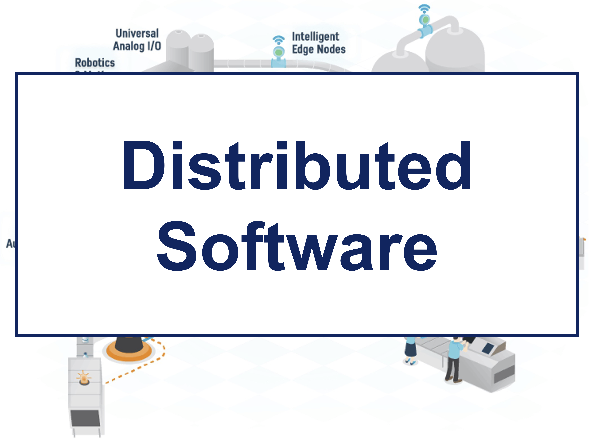

Some of the main challenges and characteristics of CPS software include:

- **Integration of Physical and Digital Components:** CPS involves the integration of software systems with physical components such as sensors, actuators, and control systems. The software must interact with these physical elements to monitor and control the underlying physical processes.
- **Real-Time and Predictability:** CPS often operates in real-time or near-real-time environments where timely and predictable responses are critical. The software must be designed to meet stringent timing requirements, ensuring timely data collection, processing, and control actions.
- **Heterogeneity and Interoperability:** CPS typically involve a mix of diverse technologies, devices, and communication protocols. The software must be capable of interacting and integrating with different hardware and software components, ensuring interoperability and seamless communication among them.
- **Safety and Reliability:** CPS are often deployed in safety-critical domains such as automotive, healthcare, and industrial automation. The software must be developed with a strong emphasis on safety and reliability, adhering to rigorous standards and employing techniques like fault tolerance and error handling.
- **Scalability and Adaptability:** CPS are often deployed in large-scale systems where the number of connected devices and data volumes can be substantial. The software must be scalable, capable of handling increasing system complexity and data loads. Additionally, it should be adaptable to dynamic changes in the environment or system requirements.
- **Network and Connectivity:** CPS software must utilize the network connectivity for communication between the cyber and physical world, as well as among different CPS components. For example, a smart grid system must coordinate the power generation and distribution among different sources and consumers through the internet.
- **Security and Privacy:** CPS are vulnerable to cybersecurity threats due to their interconnected nature. The software must incorporate robust security measures to protect against potential attacks and ensure the privacy and integrity of sensitive data.
- **Verification and Validation:** Due to the critical nature of CPS, software development for CPS requires thorough verification and validation processes. Rigorous testing, simulation, and formal methods are employed to ensure the correctness, performance, and safety of the software.

If we escalate to the more general Cyber-Physical System models, the design and control challenges become even harder, since individual component autonomy must be glued by explicitly addressing interdependence and coordination, interoperability, distributed control and emergence of behaviors. In this context centralized and static management and control model are not expected to be the right solution approach to address all these challenges and the current main existing issues are the following: 

- **Centralized** and **monolithic** Software architectures
- Missing management of the **massive heterogeneity** and **fragmentation** of the physical layer (protocols, software, hardware, data format, etc …) 
- **Limited interoperability** and collaboration both between existing solutions and through cross-domain application scenarios 
- **Centralized learning** and coordination

On the other hand, the envisioned goal is to build a new generation of distributed, highly-dynamic, opportunistic, able to operate in an open and coordinated environment through:

- **distributed** and **continuum** architectures (across device, edge, cloud)
- **networking** and **intelligent communication**
- **effective management** of the physical layer heterogeneity
- **standardization** and **native interoperability**
- **control**, **supervision** and **management**
- **local coordination**
- **autonomy** of the sub-systems
- **native system re-configuration**
- **decentralized learning** & **dynamic evolution** and **behaviors**

---

## From CPS to CPSoS (Cyber-Physical System of Systems)

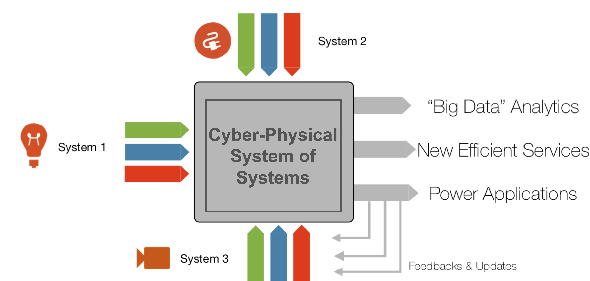

The concept of **Cyber-Physical System of Systems (CPSoS)** refers to the **integration** and **collaboration** of multiple, interconnected **Cyber-Physical Systems (CPSs)** to form a more complex and sophisticated system. In a CPSoS, each individual CPS maintains its **autonomy** and **functionality**, yet participates in **coordinated interaction** and **networked communication** with other CPS units to achieve shared objectives.

A **CPSoS** is characterized by:
- **Distributed Coordination:** Multiple CPS units interact and cooperate, leveraging their individual capabilities to address system-wide goals.
- **Autonomous Components:** Each CPS unit operates independently, with its own physical components, computational resources, and control logic.
- **Scalability and Complexity:** CPSoS can range from small, localized collaborations to vast, large-scale networks of CPS units.
- **Enhanced System Intelligence:** By combining the strengths and resources of diverse CPS units, CPSoS enables improved **performance**, **efficiency**, and **adaptability** beyond what isolated systems can achieve.
- **Resilience and Flexibility:** The distributed nature of CPSoS fosters greater **system-wide resilience**, allowing for dynamic adaptation and robust operation even in the face of failures or changing environments.

The key idea behind **CPSoS** is to create a **synergistic network** where the **collective intelligence** and **resources** of multiple CPS units result in superior functionality, adaptability, and reliability, paving the way for advanced applications in domains such as smart cities, industrial automation, healthcare, and transportation.

CPSoS are increasingly prevalent across diverse domains, including smart cities, transportation, industrial automation, and healthcare. **Key examples** of CPSoS include:

- **Interconnected traffic management systems** that coordinate signals and monitor flows across a city
- **Coordinated smart grid networks** integrating distributed energy resources for efficient power management
- **Integrated healthcare monitoring systems** enabling real-time patient data sharing across facilities
- **Smart manufacturing environments** where multiple production lines and robots collaborate seamlessly

Of course, managing CPSoS introduces significant challenges such as:

- **Interoperability:** Achieving seamless communication and data exchange between heterogeneous CPS units
- **Heterogeneity:** Integrating systems with diverse architectures, protocols, and technologies
- **Scalability and Complexity:** Coordinating large numbers of autonomous CPS units while maintaining system performance
- **Security and Privacy:** Protecting sensitive data and ensuring robust operation across interconnected systems

In summary, CPSoS represent a higher-level integration 
of multiple CPS units, enabling collaborative and coordinated operation. 
This approach unlocks advanced functionalities, improved performance, 
and increased system intelligence, but requires addressing interoperability, 
scalability, and security challenges.

