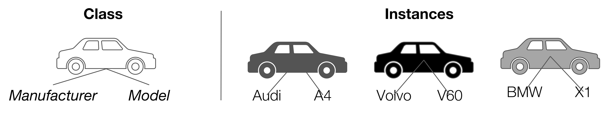

<!-- omit in toc -->
# Lecture 2 - Python Object Oriented Programming & Use Case Modelling

<!-- omit in toc -->
## Lecture Information

| **Master's Degree** | Digital Automation Engineering (D.M.270/04)                                      |
|---------------------|----------------------------------------------------------------------------------|
| **Curriculum**      | Digital Infrastructure                                                           |
| **Lecture Title**   | Python & Object-Oriented Programming (OOP)                                       |
| **Author**          | Prof. Marco Picone (marco.picone@unimore.it)                                     |
| **Academic Year**   | 2025/2026                                                                        |
| **Last Update**     | September 2025                                                                   |
| **License**         | [Creative Commons Attribution 4.0](https://creativecommons.org/licenses/by/4.0/) | 


<!-- omit in toc -->
# Table of Contents

- [2.1 Object Oriented Programming (OOP) Introduction](#21-object-oriented-programming-oop-introduction)
  - [2.1.1 What Is Object-Oriented Programming ?](#211-what-is-object-oriented-programming-)
  - [2.1.2 Procedural Programming vs. Object-Oriented Programming](#212-procedural-programming-vs-object-oriented-programming)
    - [2.1.2.1 Example: Procedural vs. Object-Oriented Approach](#2121-example-procedural-vs-object-oriented-approach)
    - [2.1.2.2 Key Points](#2122-key-points)
  - [2.1.3 Limitation of "Simple" Data Structures](#213-limitation-of-simple-data-structures)
  - [2.1.4 Introducing Classes, Objects and Instances](#214-introducing-classes-objects-and-instances)
- [2.2 Defining a Class in Python](#22-defining-a-class-in-python)
  - [2.2.1 The `__init__` Method](#221-the-__init__-method)
  - [2.2.2 Creating an Instance of a Class](#222-creating-an-instance-of-a-class)
  - [2.2.3 Multiple Instances of the Same Class](#223-multiple-instances-of-the-same-class)
  - [2.2.3 Adding Attributes to the `__init__` Method](#223-adding-attributes-to-the-__init__-method)
  - [2.2.4 Understanding `self`](#224-understanding-self)
  - [2.2.5 Creating Instances with Attributes](#225-creating-instances-with-attributes)
  - [2.2.6 Instances Without Parameters](#226-instances-without-parameters)
  - [2.2.7 Access Instance Attributes](#227-access-instance-attributes)
  - [2.2.8 Change Instance Attributes](#228-change-instance-attributes)
  
# 2.1 Object Oriented Programming (OOP) Introduction

## 2.1.1 What Is Object-Oriented Programming ?

**Object-Oriented Programming (OOP)** is a powerful programming paradigm that organizes software design around data, or **objects**, rather than functions and logic. OOP enables developers to model real-world entities and their interactions, making code more modular, reusable, and easier to maintain. 

**Key Points of OOP:**

- **Objects:**  
  - Represent real-world entities (e.g., a person, a car, an email).
  - Bundle together **properties** (attributes/data) and **behaviors** (methods/functions).
- **Properties (Attributes):**  
  - Define the characteristics of an object.  
    - *Example (Person):* `name`, `age`, `address`
    - *Example (Email):* `recipient_list`, `subject`, `body`
- **Behaviors (Methods):**  
  - Define what an object can do or how it interacts.  
    - *Example (Person):* `walk()`, `talk()`, `breathe()`, `run()`
    - *Example (Email):* `add_attachment()`, `send()`
- **Encapsulation:**  
  - Combines data and methods that operate on that data within a single unit (object).
  - Helps protect the internal state of an object from unintended interference.
- **Abstraction:**  
  - Hides complex implementation details and exposes only the necessary features of an object.
- **Inheritance:**  
  - Allows new classes (objects) to acquire the properties and behaviors of existing ones, promoting code reuse.
- **Polymorphism:**  
  - Enables objects to be treated as instances of their parent class rather than their actual class, allowing for flexible and interchangeable code.

**Why Use OOP?**

- Encourages **modular** and **organized** code structure.
- Facilitates **code reuse** through inheritance and composition.
- Makes it easier to **maintain** and **extend** software systems.
- Models complex systems more naturally by mirroring real-world relationships.

> **Objective:**  
> This course will introduce you to the fundamental tools and design principles of OOP, empowering you to structure your code effectively and laying the groundwork for deeper exploration of advanced object-oriented concepts in the future.

---

## 2.1.2 Procedural Programming vs. Object-Oriented Programming

Object-oriented programming (OOP) is a programming paradigm that models both tangible real-world entities (like cars, sensors, or users) and abstract relationships (such as companies and employees, or students and teachers) as **software objects**. Each object encapsulates both **data** (attributes) and **behavior** (methods), allowing you to represent complex systems in a modular and intuitive way.

In contrast, **procedural programming** organizes code as a sequence of instructions or function calls, much like following a **recipe**: you define a set of steps that the program executes in order to accomplish a task. While this approach works well for simple or linear problems, it can become unwieldy as systems grow in complexity.

---

### 2.1.2.1 Example: Procedural vs. Object-Oriented Approach

**Procedural Programming Example:**

```python
# Representing a car using procedural programming
car_make = "Tesla"
car_model = "Model 3"
car_year = 2023

def start_car(make, model):
  print(f"{make} {model} is starting...")

start_car(car_make, car_model)
```

**Object-Oriented Programming Example:**

```python
# Representing a car using object-oriented programming
class Car:
  def __init__(self, make, model, year):
    self.make = make
    self.model = model
    self.year = year

  def start(self):
    print(f"{self.make} {self.model} is starting...")

my_car = Car("Tesla", "Model 3", 2023)
my_car.start()
```

---

### 2.1.2.2 Key Points

- **OOP models both data and behavior together** in objects, making code more modular and easier to maintain.
- **Procedural programming** separates data and functions, which can lead to less organized code as complexity increases.
- **Objects are central in OOP**: they represent both the structure (data) and the capabilities (methods) of entities in your program.
- **OOP mirrors real-world relationships**, making it easier to design and reason about complex systems.

**Fundamental Takeaways:**

- **Encapsulation:** Objects bundle data and behavior, hiding internal details.
- **Modularity:** Code is organized into reusable, self-contained objects.
- **Abstraction:** Complex systems are simplified by modeling only relevant features.
- **Reusability:** Objects and classes can be reused and extended, reducing duplication.
- **Maintainability:** Changes are easier to manage due to clear structure and separation of concerns.

By adopting OOP, you can build software that is more robust, flexible, and aligned with real-world concepts.

---

## 2.1.3 Limitation of "Simple" Data Structures

Traditional data types and data structures in Python—such as **numbers**, **strings**, and **lists**—are well-suited for representing simple pieces of information. For example, you might use a number to store the cost of an apple, a string for the name of a poem, or a list for your favorite colors.

However, when you need to represent **more complex entities**—such as IoT devices in a deployment—these basic structures quickly become limiting. Imagine you want to track several IoT devices, each with attributes like an **ID**, **manufacturer**, **software version**, **latitude**, and **longitude**.

A common but problematic approach is to use lists to store this information:

```python
temperature_sensor = ["device-0001", "acme-inc", "v1.0.0", 10.44121341, 44.2132112]
humidity_sensor = ["device-0002", "acme-inc", "v0.2-rc", 10.54121341, 44.3132112]
light_switch_actuator = ["device-0003", "acme-inc", "v0.1.1-rc", 10.64121341, 45.7132112]
```

While this method works for small examples, it introduces several **limitations**:

- **Lack of clarity:** It's not obvious what each element in the list represents without referring to documentation or comments.
- **Error-prone:** Mixing up the order of elements or forgetting an attribute can lead to subtle bugs.
- **Difficult to extend:** Adding new attributes (e.g., device status or last communication time) requires updating every list and all related code.
- **No behavior:** Lists can only store data; they cannot encapsulate behaviors or operations related to the device.

**Key Takeaways:**

- Basic data structures are insufficient for modeling complex, real-world entities.
- Lists and tuples lack explicit meaning for each attribute, making code harder to read and maintain.
- As complexity grows, maintaining and extending such representations becomes increasingly difficult.
- There is no way to associate behaviors (methods) with the data, limiting code organization and reusability.

> To effectively model complex entities like IoT devices, you need a way to group related data and behaviors together in a clear, maintainable, and extensible manner. This is where **Object-Oriented Programming (OOP)** becomes essential.

---

## 2.1.4 Introducing Classes, Objects and Instances



**Figure 2.1:** Simple representation of the relationship between Classes and Objects (Instances) for a `Car`.

**Classes** are fundamental building blocks in object-oriented programming. A **class** serves as a **blueprint** or **template** for creating user-defined data structures. It defines the **attributes** (data) and **methods** (behaviors) that characterize a particular type of object, but it does **not** hold any actual data itself.

- **Class:**  
  - Specifies what data (attributes) and behaviors (methods) an object should have.
  - Acts as a **blueprint**—it describes *how* something should be structured, but does not represent any specific item.

For example, a `Car` class might define that every car has a `manufacturer` and a `model`, and can perform actions like `start()` or `drive()`. However, the class itself does **not** represent any particular car.

- **Object (Instance):**  
  - An **object** (or **instance**) is a **concrete realization** of a class.
  - When you create an object from a class, you are building an **instance** that contains **actual data**.
  - Each instance has its own unique values for the attributes defined by the class.

For example, if `Car` is the class, then `my_car = Car("Audi", "A4")` creates an **instance** of the `Car` class. This instance represents a specific car with the manufacturer `"Audi"` and model `"A4"`.

**Key Points:**

- A **class** is a **template**; an **object** (or **instance**) is a **real, usable entity** created from that template.
- You can create multiple objects from the same class, each with different attribute values.
- Classes define **what** data and behaviors objects will have; objects hold the **actual data** and can perform the defined behaviors.

---

# 2.2 Defining a Class in Python

All **class definitions** in Python begin with the `class` keyword, followed by the **class name** (written in **CapitalizedWords** notation by convention) and a colon. Any code that is **indented** beneath the class definition becomes part of the class body.

Here’s a simple example of a `Car` class:

```python
class Car:
  pass
```

- The body of the `Car` class contains only the `pass` statement for now just to illustrate the syntax of a class definition.
- `pass` acts as a **placeholder**, indicating where code will be added in the future. It allows the class to be defined without causing errors, even if it currently has no attributes or methods.

> **Note:**  
> By convention, Python class names use **CapitalizedWords** notation (also known as PascalCase or UpperCamelCase). For example, a class representing a generic sensor device should be named `SensorDevice`.

---

## 2.2.1 The `__init__` Method

The `Car` class isn’t very useful yet because it doesn’t define any properties or behaviors. To make it more meaningful, we can add **attributes** such as `manufacturer` and `model` (keeping it simple for now).

These attributes are defined and initialized in a special method called `__init__()`. The `__init__()` method is known as the **constructor** and is automatically called whenever a new object (instance) of the class is created. It sets up the initial state of the object by assigning values to its properties.

**Key aspects of the `__init__()` method:**

- The first parameter of `__init__()` is always `self`, which refers to the instance being created.
- You can add additional parameters to `__init__()` to initialize object attributes.
- The `__init__()` method allows each object to have its own unique data.

**Example: Defining an empty `__init__()` method in the `Car` class**

```python
class Car:
  def __init__(self):
    pass  # Placeholder for future initialization code
```

> The `pass` statement is used here as a placeholder, indicating that the method doesn’t do anything yet but will be expanded later.

---

## 2.2.2 Creating an Instance of a Class

To create an instance of a class, you simply call the class as if it were a function. This invokes the `__init__()` method and creates a new object.

```python
my_car = Car()
```

In this example, `my_car` is an instance of the `Car` class. 
The `__init__()` method is called automatically when the instance is created.

---

## 2.2.3 Multiple Instances of the Same Class

Let's see what happens when you create **multiple instances** of the same class:

```python
car_1 = Car()
car_2 = Car()

print(car_1)
print(car_2)
print(car_1 == car_2)
```

**Output:**
```
<__main__.Car object at 0x106702d30>
<__main__.Car object at 0x108702d40>
False
```

**Explanation:**

- `car_1` and `car_2` are two **separate objects** (instances) of the `Car` class.
- When you print each object, Python displays their **memory addresses**, showing that they occupy different locations in memory.
- Comparing `car_1 == car_2` returns **`False`** because, by default, two different instances are considered **not equal**, even if they are created from the same class and have the same (empty) content.

**Key Points:**

- **Each call to the class creates a new, independent object.**
- **Instances have unique memory addresses**—they are distinct entities in memory.
- **Default equality (`==`) checks if two variables refer to the same object, not if their contents are the same.**
- **Objects created from the same class can behave differently if their attributes are set differently.**

This demonstrates that **classes are blueprints**, and each time you instantiate a class, you get a new, unique object—even if no attributes have been set yet.

> **Note:** Dedicated methods can be implemented to customize how instances are compared for equality based on their attributes, but by default, they are compared by their identity (memory address). In Python, this can be achieved by overriding the `__eq__` method in the class definition. This method allows you to define custom logic for comparing two instances of the class based on their attributes rather than their memory addresses.

---

## 2.2.3 Adding Attributes to the `__init__` Method

The `__init__()` method in a Python class acts as a constructor and is designed to initialize the attributes of each new object (instance) you create. By defining **parameters** in the `__init__()` method, you can **require that specific information be provided when an object is instantiated**. 

Inside the method, you assign these parameter values to instance attributes using the `self` keyword, which ensures that each object maintains its own unique data. This approach allows you to create flexible and reusable classes, where each instance can have different attribute values based on the arguments passed during creation. 

For example, by adding `manufacturer` and `model` as parameters to the `__init__()` method of the `Car` class, you ensure that every `Car` object is initialized with its own manufacturer and model information.

```python
class Car:
  def __init__(self, manufacturer, model):
    self.manufacturer = manufacturer
    self.model = model
```

**Key Aspects:**

- The `__init__()` method is the **constructor** of the class and is called automatically when a new `Car` object is created.
- The method’s **signature** is indented by four spaces, and its **body** is indented by eight spaces. This indentation is crucial in Python to indicate code blocks and class/method structure.
- The first parameter, `self`, refers to the **instance** being created.
- Inside `__init__()`, attributes are defined using `self.attribute_name = value`. For example:
  - `self.manufacturer = manufacturer` creates an attribute `manufacturer` and assigns it the value passed to the constructor.
  - `self.model = model` creates an attribute `model` and assigns it the corresponding value.
- These attributes are **unique to each instance** of the class.

---

## 2.2.4 Understanding `self`

In Python, `self` is a conventional name used to refer to the instance of the class within its methods. It acts as a reference to the current object, allowing you to access its attributes and methods. 

When you define a method in a class, the first parameter must always be `self`, which represents the instance that the method is being called on. This allows you to differentiate between instance variables (attributes) and local variables within the method. Here’s a breakdown of how `self` works:

- **Instance Reference:**  
  - `self` refers to the specific instance of the class that is being manipulated. It allows you to access and modify the instance's attributes and call its methods.
  - For example, in the `__init__()` method of the `Car` class, `self.manufacturer` refers to the `manufacturer` attribute of the specific `Car` instance being created.
  - When you create an instance of the class, Python automatically passes the instance as the first argument to the method, which is why you don’t need to provide it explicitly when calling the method.

```python
class Car:
  def __init__(self, manufacturer, model):
    self.manufacturer = manufacturer  # 'self' refers to the instance being created
    self.model = model

my_car = Car("Toyota", "Corolla")  # 'my_car' is passed as 'self' to __init__()
```

---

## 2.2.5 Creating Instances with Attributes

Now that we have defined the `Car` class with attributes, let's create instances of this class with specific values for `manufacturer` and `model`:

```python
car_1 = Car("Toyota", "Corolla")
car_2 = Car("Honda", "Civic")

print(car_1.manufacturer, car_1.model)
print(car_2.manufacturer, car_2.model)
```

**Output:**
```
Toyota Corolla
Honda Civic
```

**Explanation:**

- When creating `car_1`, we pass `"Toyota"` and `"Corolla"` as arguments, which are assigned to the `manufacturer` and `model` attributes, respectively.
- Similarly, `car_2` is created with its own `manufacturer` and `model`.
- Each instance maintains its own state, allowing us to access the specific values assigned during creation.
- As you can see the `self` is visible only inside the class methods, and it is not used when creating instances or accessing attributes from outside the class. You just pass the required arguments to the class constructor (in this case, `manufacturer` and `model`) without mentioning `self`.

---

## 2.2.6 Instances Without Parameters

In Python, you can create instances of a class without passing any parameters to the constructor. This is possible when the `__init__()` method is defined without any additional parameters (besides `self`). In such cases, the instance will be created with default values or uninitialized attributes. On the other hand, if the `__init__()` method requires parameters, you must provide those arguments when creating an instance.

```python
# Attempting to create a Car instance without required arguments
car_1 = Car()  # This will cause an error!
```

Output:

```
Traceback (most recent call last):
   File "<pyshell#6>", line 1, in <module>
     Car()
 TypeError: __init__() missing 2 required positional arguments: 'manufacturer' and 'model'
```

**Explanation:**

- The `Car` class requires two arguments (`manufacturer` and `model`) when creating a new instance.
- If you try to instantiate a `Car` without providing these arguments, Python raises a `TypeError` indicating that the required positional arguments are missing.
- Always ensure you supply all required arguments when calling the constructor of a class that defines them in its `__init__()` method.

> **Tip:**  
> If you want to allow creating instances without specifying all attributes, you can provide default values in the `__init__()` method parameters.

```python
class Car:
  def __init__(self, manufacturer="Unknown", model="Unknown"):
    self.manufacturer = manufacturer
    self.model = model
```

Now you can create instances without arguments

```python
car_1 = Car()  # Uses default values
car_2 = Car("Honda", "Civic")  # Provides specific values
```

---

## 2.2.7 Access Instance Attributes

After you create instances of the `Car` class, you can **access their attributes** using **dot notation**. This allows you to retrieve or modify the values stored in each object's attributes.

```python
car1 = Car("Audi", "A4")
print(f"Car 1 -> Manufacturer: {car1.manufacturer} Model: {car1.model}")
```

**Output:**

```
Car 1 -> Manufacturer: Audi Model: A4
```

Or for example you can save the attributes in variables

```python
car2 = Car("BMW", "X3")
manufacturer = car2.manufacturer
model = car2.model
print(f"Car 2 -> Manufacturer: {manufacturer} Model: {model}")
``` 

**Key Aspects:**

- **Dot notation** (`object.attribute`) is used to access or modify instance attributes.
- All instances of the `Car` class are **guaranteed to have the defined attributes** (e.g., `.manufacturer`, `.model`).
- You can **confidently use these attributes** in your code, knowing they will always be present and hold the values assigned during object creation.
- This approach **improves code reliability and readability** compared to using basic data structures like lists or dictionaries.

By organizing data with classes, you ensure that each object has a consistent structure, making your code more robust and maintainable.

---

## 2.2.8 Change Instance Attributes

Although instance attributes are **guaranteed to exist** after initialization, their values can be **changed dynamically** at any time. This flexibility allows you to update the state of an object as your program runs.

**Example: Modifying Instance Attributes**

```python
car1 = Car("Audi", "A4")
print(f"Car 1 -> Manufacturer: {car1.manufacturer} Model: {car1.model}")

# Change the model attribute
car1.model = "Q3"
print(f"Car 1 -> Manufacturer: {car1.manufacturer} Model: {car1.model}")
```

**Output:**
```
Car 1 -> Manufacturer: Audi Model: A4
Car 1 -> Manufacturer: Audi Model: Q3
```

In this example:

- We first create a `Car` object with the model `"A4"`.
- We then update the `model` attribute to `"Q3"` using dot notation.
- The change is immediately reflected when we print the object's attributes again.

**Key Aspects:**
- **Instance attributes can be modified at any time** after object creation.
- **Dot notation** (`object.attribute = new_value`) is used to update attribute values.
- **Each instance maintains its own state**—changing one object's attributes does not affect others.
- **Dynamic updates** allow objects to reflect changes in real-world scenarios (e.g., updating a car's model after an upgrade).

This ability to modify attributes is a core feature of object-oriented programming, enabling your objects to evolve and respond to changes throughout your program.

