<!-- omit in toc -->
# Lecture 5 - Pub/Sub Introduction & MQTT Protocol

<!-- omit in toc -->
## Lecture Information

| **Master's Degree** | Digital Automation Engineering (D.M.270/04)                                      |
|---------------------|----------------------------------------------------------------------------------|
| **Curriculum**      | Digital Infrastructure                                                           |
| **Course**          | Distributed IoT Software Architectures                                           |
| **Lecture Title**   | Pub/Sub Introduction & MQTT Protocol                                             |
| **Author**          | Prof. Marco Picone (marco.picone@unimore.it)                                     |
| **License**         | [Creative Commons Attribution 4.0](https://creativecommons.org/licenses/by/4.0/) | 

<!-- omit in toc -->
# Table of Contents

- [5.1 Publish/Subscribe (Pub/Sub) Messaging Pattern](#51-publishsubscribe-pubsub-messaging-pattern)
- [5.2 Pub/Sub Protocols Idea \& Brokers/Queues Concepts](#52-pubsub-protocols-idea--brokersqueues-concepts)
- [5.3 Pub/Sub Additional Requirements 1/2](#53-pubsub-additional-requirements-12)
- [5.4 Pub/Sub Additional Requirements 2/2](#54-pubsub-additional-requirements-22)
- [5.5 Pub/Sub Benefits \& Drawbacks](#55-pubsub-benefits--drawbacks)
- [5.6 (Some) Pub/Sub Protocols Examples](#56-some-pubsub-protocols-examples)
  - [5.6.1 ZeroMQ](#561-zeromq)
  - [5.6.2 DDS](#562-dds)
  - [5.6.3 Kafka](#563-kafka)
  - [5.6.4 MQTT \& AMQP](#564-mqtt--amqp)
- [5.7 The MQTT Protocol](#57-the-mqtt-protocol)
  - [5.7.1 Single Level Topic Wildcard](#571-single-level-topic-wildcard)
  - [5.7.2 Multi Level Topic Wildcard](#572-multi-level-topic-wildcard)
  - [5.7.3 Quality of Service (QoS) Concepts \& Levels](#573-quality-of-service-qos-concepts--levels)
    - [5.7.3.1 Why is QoS Important in IoT ?](#5731-why-is-qos-important-in-iot-)
    - [5.7.3.2 QoS 0 - Fire and Forget](#5732-qos-0---fire-and-forget)
    - [5.7.3.2 QoS 1 - At Least Once](#5732-qos-1---at-least-once)
    - [5.7.3.3 QoS 2 - Exactly Once](#5733-qos-2---exactly-once)
    - [5.7.3.4 QoS 2 - Exactly Once - Phase 1](#5734-qos-2---exactly-once---phase-1)
    - [5.7.3.5 QoS 2 - Exactly Once - Phase 2](#5735-qos-2---exactly-once---phase-2)
    - [5.7.3.6 QoS 2 - Exactly Once - Complete Flow with Publisher and Subscriber](#5736-qos-2---exactly-once---complete-flow-with-publisher-and-subscriber)
    - [5.7.3.7 QoS Downgrade](#5737-qos-downgrade)
    - [5.7.3.8 Packet Identifier](#5738-packet-identifier)
    - [5.7.3.9 QoS Use Cases Summary](#5739-qos-use-cases-summary)
    - [5.7.3.10 QoS Levels Summary Table](#57310-qos-levels-summary-table)
  - [5.7.4 Persistent Sessions](#574-persistent-sessions)
    - [5.7.4.1 Persistent Sessions Flags](#5741-persistent-sessions-flags)
    - [5.7.4.2 Session Best Practices - Persistent Sessions](#5742-session-best-practices---persistent-sessions)
    - [5.7.4.3 Session Best Practices - Clean Sessions](#5743-session-best-practices---clean-sessions)
    - [5.7.4.4 Session Comparison Summary Table](#5744-session-comparison-summary-table)
  - [5.7.5 Retained Messages](#575-retained-messages)
  - [5.7.6 Last Will and Testament (LWT)](#576-last-will-and-testament-lwt)
  - [5.7.6.1 Last Will and Testament (LWT) - Example](#5761-last-will-and-testament-lwt---example)
  - [5.7.6.2 Last Will and Testament (LWT) - Disconnect Scenarios](#5762-last-will-and-testament-lwt---disconnect-scenarios)
  - [5.7.7 MQTT Broker Bridge Mode](#577-mqtt-broker-bridge-mode)
- [References](#references)
  
# 5.1 Publish/Subscribe (Pub/Sub) Messaging Pattern

A **publish/subscribe (pub/sub) system** is a type of **Message-oriented Middleware (MoM)** designed to enable **distributed**, **asynchronous**, and **loosely coupled** communication between **message producers** (publishers) and **message consumers** (subscribers).

**Key Decoupling Features of Pub/Sub Middleware:**

- **Time Decoupling**:  
  - Publishers and subscribers do **not need to be connected simultaneously**.  
  - **Example:** An IoT sensor can publish temperature data even if the monitoring dashboard is offline; the dashboard will receive the data when it reconnects.

- **Space Decoupling**:  
  - Messages are sent to a **symbolic address** (such as a **channel** or **topic**) rather than to specific consumers.  
  - **Example:** Multiple smart thermostats publish to the topic `/home/temperature`, and any device subscribed to this topic receives updates, regardless of the publisher's identity.

- **Synchronization Decoupling**:  
  - Communication is **asynchronous** and **non-blocking**; publishers do not wait for subscribers to process messages.  
  - **Example:** An IoT device can quickly send alerts to a topic without waiting for confirmation from all subscribers.

**Core Building Block: Publisher-Subscriber Matching**

- **Matching** is performed by **message brokers**, which route messages from publishers to subscribers based on filtering rules.
- **Filtering Types**:
  - **Topic-based filtering**: Subscribers receive messages published to specific topics (e.g., `/iot/devices/alerts`).
  - **Content-based filtering**: Subscribers receive messages that match certain content criteria (e.g., only alerts with severity `high`). This requires more complex processing by the broker and it is not widely used in IoT scenarios and/or available in all pub/sub systems and protocols.

> **In IoT deployments**, pub/sub systems are ideal for handling large numbers of devices and dynamic communication patterns, such as sensors publishing data and applications subscribing to relevant updates.

---

# 5.2 Pub/Sub Protocols Idea & Brokers/Queues Concepts

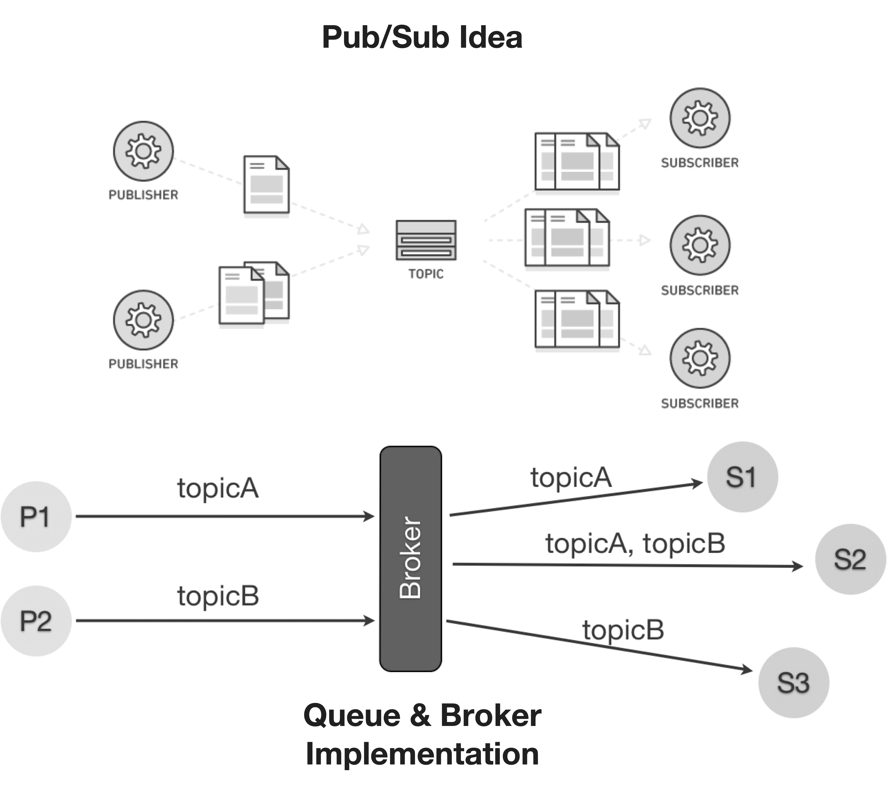

**Figure 5.1:** Schematic comparison between Pub/Sub idea and Broker/Queue concepts.

A **trending communication approach** for the Internet of Things (IoT) and many modern applications is the **Publish/Subscribe (Pub/Sub) pattern**.

**Core Concepts of Pub/Sub Architectures:**

- **Entities:**
  - **Publishers**: Generate and send information (messages).
    - *Example*: An IoT temperature sensor publishing readings.
  - **Subscribers**: Register to receive information, often filtered by specific interests or policies.
    - *Example*: A smart thermostat subscribing to temperature updates.

- **Message Dispatching:**
  - Messages are delivered to subscribers based on their **“class”** or **interest** (e.g., topic or content).
  - *Example*: Devices subscribing to the topic `/home/alerts` receive only alert messages.

- **Broker:**
  - **Definition**: A **broker** is an intermediary that manages message distribution between publishers and subscribers.
  - A **broker** acts as an intermediary, responsible for **dispatching messages**:
    - **Publishers** post messages to the broker.
    - **Subscribers** register their interests with the broker.
    - The broker **matches messages** to subscribers’ interests and forwards relevant messages.
      - *Example*: In an IoT home automation system, the broker sends motion sensor alerts only to devices subscribed to motion events.

> **Summary:**  
> The Pub/Sub pattern enables **scalable**, **flexible**, and **loosely coupled** communication in IoT systems, allowing devices to efficiently share and receive information without direct connections.

---

# 5.3 Pub/Sub Additional Requirements 1/2

Furthermore, pub/sub systems should address additional requirements that typically characterize those class of protocols and systems and that are particularly relevant in the IoT domain:

**Filtering:**  
- Interested parties typically want to receive **only relevant information**, not all published messages.
- The **filtering capabilities** of the middleware determine how expressive and selective subscriptions can be.
- **Topic-based filtering:**  
  - Suitable for basic subscriptions to specific sensors or device types.
  - *Example:* Subscribing to `/iot/weather/neighborhood1` to receive weather data only from sensors in a particular area.
- **Hierarchical topic structure:**  
  - Enables monitoring groups of related resources.
  - *Example:* Subscribing to `/iot/home/temperature` to receive temperature updates from all sensors in a smart home.
- **Content-based filtering:**  
  - Allows subscriptions based on message content or specific events.
  - *Example:* Receiving alerts only when a sensor reading exceeds a threshold, such as temperature > 30°C.
  - Requires more advanced processing, sometimes involving **complex event processing**. This is not widely used in IoT scenarios and/or available in all pub/sub systems and protocols.

**Quality of Service (QoS) Semantics:**  

- Some applications can tolerate **loss of data messages**, while others require **guaranteed delivery**.
- The middleware should support **annotating subscriptions and messages** with QoS requirements.
  - *Example:* Critical alerts from fire sensors may require guaranteed delivery, while periodic temperature readings may tolerate occasional loss.
- For devices with **low sampling rates**, the system should provide subscribers with the **latest available value** while waiting for the next update.
  - *Example:* A dashboard displays the most recent humidity reading until a new value is published.

---

# 5.4 Pub/Sub Additional Requirements 2/2

**Topology:**  
Pub/sub systems can be deployed using different topologies, depending on application requirements and target architecture:

- **Centralized Topology:**  
  - A single logical **broker** manages message forwarding and filtering.  
  - The broker itself may be distributed across multiple physical or virtual machines for scalability and reliability.  
  - *Example (IoT):* All smart home devices publish sensor data to a central broker, which forwards relevant updates to subscribed dashboards or apps.

- **Distributed Topology:**  
  - **Producers** and **consumers** communicate directly, reducing the load on a central broker.  
  - This approach requires mechanisms for **resource discovery** so devices can find each other.  
  - *Example (IoT):* Environmental sensors in a factory directly send alerts to nearby actuators without passing through a central broker.

- **Hybrid Topology:**  
  - Devices use a central broker for **subscription management** and **message routing**, but the actual **payload** is transferred directly between endpoints.  
  - *Example (IoT):* A broker notifies a device of a new firmware update, and the device downloads the update directly from the source.

**Message Format:**  
Pub/sub solutions must be flexible to handle the diversity of connected devices and data types:

- **Payload Agnostic:**  
  - The system should make **no assumptions** about the format of the message payload, supporting both structured and unstructured data.
- **Binary Payload Support:**  
  - Support for **binary data** enables efficient serialization using frameworks like **Protocol Buffers** or **CBOR** (Concise Binary Object Representation).
  - *Example (IoT):* A camera sensor publishes compressed image data as a binary payload, which is processed by subscribers without format restrictions.

**Note:** Some pub/sub systems may also support **semantic annotations** to enhance interoperability and enable advanced filtering based on the meaning of the data and/or can use header fields to associate and describe the specific payload format (e.g., JSON, XML, CBOR, etc.) used in the message body in order to allow the subscribers to correctly interpret the payload.

> **Summary:**  
> Flexible topologies and payload-agnostic message formats are essential for scalable, interoperable pub/sub systems in IoT environments.

---

# 5.5 Pub/Sub Benefits & Drawbacks

**Advantages of the Pub/Sub Model**

- **Loose Coupling:**  
  - Publishers do **not need to know** which subscribers receive their messages, or even if any subscribers exist.  
  - *Example (IoT):* A temperature sensor publishes readings to a topic; any dashboard or app subscribed to that topic receives updates automatically.
- **Scalability:**  
  - **Brokers** can be **replicated** or distributed to handle large volumes of data and many devices.  
  - *Example (IoT):* A smart city deployment with thousands of sensors can scale by adding more brokers to route messages efficiently.
- **Flexibility:**  
  - New devices or applications can **join or leave** the system without disrupting existing communication.  
  - *Example (IoT):* Adding a new air quality sensor to a building only requires subscribing to the relevant topic.

**Main Disadvantages and Challenges of the Pub/Sub Model**

- **No Content-Type Negotiation:**  
  - Any change in the **message format** directly impacts all receivers, requiring coordinated updates.  
  - *Example (IoT):* Switching from JSON to binary payloads means all dashboards and apps must update their parsers.
- **Difficult Long-Term Evolution:**  
  - Evolving the system over time can be challenging, especially as the number of devices and message types grows.
- **Managing Heterogeneous Semantics:**  
  - Complex, open systems with **diverse data formats and meanings** are hard to manage and integrate.  
  - *Example (IoT):* Different sensors may use different units or formats for temperature, complicating data aggregation.
- **End-to-End Security Limitations (Centralized Approach):**  
  - In centralized pub/sub systems, the **broker sits between publishers and subscribers**, making true end-to-end security difficult to achieve.  
  - *Example (IoT):* Sensitive health data published by a wearable device may be exposed at the broker unless additional security measures are implemented.
- **Debugging and Monitoring Complexity:**  
  - Asynchronous and decoupled communication can make it harder to trace message flows and diagnose issues as for other distributed systems.

**Note:** Nevertheless, the **advantages** of the pub/sub model often outweigh its disadvantages, especially in **dynamic**, **large-scale IoT deployments** where flexibility and scalability are crucial combined with a **decoupled architecture**.

---

# 5.6 (Some) Pub/Sub Protocols Examples

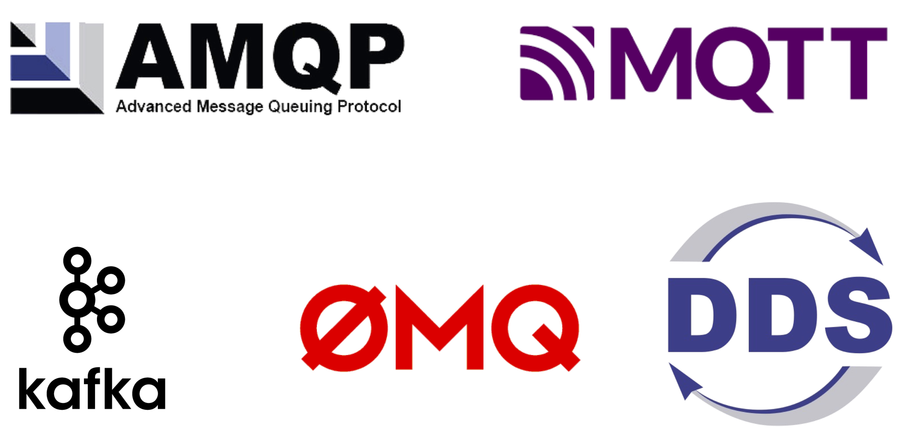

**Figure 5.2:** Some Pub/Sub Protocols Examples.

In this section, we provide a brief overview of some popular Pub/Sub protocols used in IoT and distributed systems. Each protocol has its own features, strengths, and use cases.

The following table summarizes the key characteristics of each protocol:

| Protocol | Message Type | Architecture | Transport Protocol | Payload Type | QoS Management | Load Balancing | Security | Authentication | Authorization | Standardization | Open Source |
|----------|--------------|--------------|-------------------|--------------|---------------|---------------|----------|----------------|--------------|-----------------|-------------|
| **MQTT** | Pub/Sub | Broker | TCP | Binary (user-defined) | At least once, At most once, Exactly once | Yes | TLS | SASL PLAIN | ACL | Yes (ISO/IEC 20922) | Yes |
| **AMQP** | Pub/Sub, Request/Reply, Point-to-Point | Broker | TCP | Binary (user-defined) | Exactly once | Yes | TLS | SASL (challenge-response) | ACL | Yes (ISO/IEC 19464) | Yes |
| **Kafka** | Pub/Sub | Broker | TCP | Binary (user-defined) | At least once, At most once, Exactly once | Yes | SSL | SASL PLAIN, Kerberos | ACL | - | Yes |
| **ZeroMQ** | Pub/Sub, Request/Reply | Brokerless, Point-to-Point | Multiple (TCP, IPC, etc.) | Binary (user-defined) | - | - | CurveZMQ over TCP | SASL full | - | - | Yes |
| **DDS** | Pub/Sub, Request/Reply | Distributed | UDP/IP (TCP/IP for specific cases) | Self-describing messages, DDS Data Types | Yes (durability, lifespan, reliability, deadlines, etc.) | Yes | TLS, DTLS, DDS Security | Yes | ACL | OMG | Open DDS |

> **Note:** The choice of a Pub/Sub protocol depends on the specific requirements of the application, including factors such as scalability, latency, security, and ease of integration with existing systems. A key consideration for the IoT domain is the **resource constraints** of devices, which may limit the use of more complex protocols and it is also related to energy consumption. In the IoT domain, multiple Pub/Sub protocols can be used depending on the specific use case, device capabilities, and network conditions and combined together in a multi-protocol architecture and/or integrated with other communication paradigms (e.g., RESTful APIs).

---

## 5.6.1 ZeroMQ

**ZeroMQ** is a lightweight, high-performance messaging library that enables distributed communication without requiring a mandatory broker. It is best described as a **framework** for building scalable and flexible messaging systems.

**Core Concepts and Features:**

- **Brokerless Architecture:**  
  - ZeroMQ does **not require a central broker**; communication can be direct (peer-to-peer) or brokered if needed.  
  - *Example (IoT):* Sensors in a smart factory can exchange data directly, reducing latency and central bottlenecks.

- **Flexible Communication Patterns:**  
  - Supports multiple patterns, including **Publish/Subscribe (Pub/Sub)** and **Request/Response**.  
  - Patterns can be **combined** to optimize for performance, reliability, or functionality.

- **Transport Protocols:**  
  - Works over various protocols such as **TCP** and **Unix Domain Sockets (IPC)**.  
  - *Example (IoT):* Devices on the same gateway may use IPC, while remote devices use TCP.

- **Generalized Sockets:**  
  - Messages are managed in **generalized sockets** above the transport layer, allowing for efficient message handling and queuing.

- **Small Footprint:**  
  - The stack is **minimal**, making ZeroMQ suitable for **embedded devices** and resource-constrained IoT nodes.

- **Peer Discovery:**  
  - All participants must **know each other’s endpoints** or use a central service for discovery (which can be distributed).

- **ZeroMQ Message Transport Protocol (ZMTP):**  
  - Handles communication between sockets, including a **handshake** for connection setup.
  - Supports **encryption** via **SASL** or **Kerberos** for secure messaging.

- **Message Framing:**  
  - Large payloads can be **split into multiple frames** if they exceed the maximum frame size.

**Example (IoT):**  
A network of environmental sensors uses ZeroMQ’s Pub/Sub pattern to broadcast air quality data to multiple monitoring dashboards. If a dashboard goes offline, it can reconnect and resume receiving updates without needing a central broker.

> **Summary:**  
> ZeroMQ offers a flexible, brokerless approach to messaging, making it ideal for dynamic IoT environments where direct, efficient, and secure communication is required.

---

## 5.6.2 DDS

**Data Distribution Service (DDS)** is a **data-centric publish/subscribe middleware** designed for **highly dynamic distributed systems** and **real-time applications**.

**Core Concepts and Features:**

- **Standardized by OMG:**  
  - DDS is an open standard maintained by the **Object Management Group (OMG)**, ensuring interoperability across vendors and platforms.

- **Data-Centric Architecture:**  
  - Data is published into a **DDS domain**.  
  - **Subscribers** can receive data from the domain **without knowing the source or internal structure**, as DDS uses **self-describing information packages**.
  - *Example (IoT):* Multiple sensors in a smart factory publish machine status updates; monitoring dashboards subscribe to relevant data types without needing to know each sensor’s details.

- **Optimized for Distributed Processing:**  
  - DDS enables **direct communication** between sensors, devices, and applications, **removing dependence on centralized IT infrastructure**.
  - *Example (IoT):* Autonomous vehicles exchange position and speed data directly for collision avoidance, without routing through a central server.

- **Rich Quality of Service (QoS) Parameters:**  
  - DDS supports an extensive set of **QoS policies**, including:
    - **Durability:** Retain data for late-joining subscribers.
    - **Lifespan:** Control how long data remains available.
    - **Presentation:** Manage data ordering and grouping.
    - **Reliability:** Ensure guaranteed delivery or best-effort.
    - **Deadlines:** Specify timing constraints for data delivery.
  - *Example (IoT):* Critical alerts from fire sensors use high reliability and durability, while periodic temperature readings may use best-effort delivery.

- **Dynamic Discovery:**  
  - Devices and applications can **discover each other automatically** within the DDS domain, **without a central broker or registry**.
  - *Example (IoT):* New sensors added to a building network are automatically detected and integrated into existing monitoring systems.

> **Summary:**  
> DDS is ideal for **large-scale, real-time IoT deployments** requiring **high reliability**, **dynamic discovery**, and **fine-grained control** over data delivery and quality of service. **The drawback is that it can be more complex to implement and manage compared to simpler pub/sub protocols like MQTT.**

---

## 5.6.3 Kafka

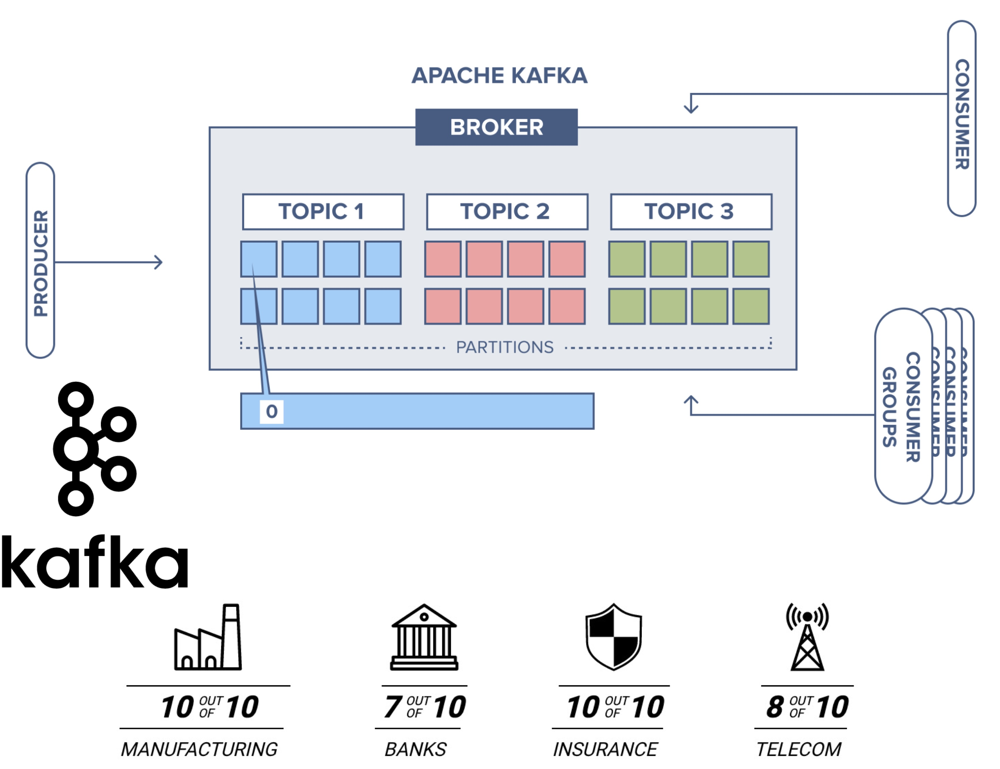

**Figure 5.3:** Simple and Schematic representation of Kafka Architecture.

**Apache Kafka** is an **open source distributed messaging system** developed by the Apache Software Foundation. Kafka is designed around the **Publish/Subscribe (Pub/Sub) pattern** and is widely used for building scalable, high-throughput data pipelines.

**Core Concepts and Features:**

- **Broker-Based Architecture:**  
  - Kafka uses a **broker** to manage message distribution.  
  - The broker is **highly scalable** and runs on distributed systems, leveraging **Apache Zookeeper** for clustering and coordination.

- **Topic Partitioning and Replication:**  
  - Each **topic** is divided into **partitions**, which are **replicated** across multiple broker instances.  
  - This enables **high availability**, **parallelization**, and **increased throughput**.  
  - *Example (IoT):* Sensor data from thousands of devices can be published to different partitions, allowing real-time processing and analytics.

- **Persistent Storage:**  
  - Kafka **persists every message** to the local disk using a **log-based storage** model.  
  - Each partition is stored in multiple log files with fixed sizes.  
  - Messages can be **retained indefinitely**, regardless of whether they have been consumed.  
  - *Example (IoT):* Historical temperature readings from smart thermostats can be replayed for trend analysis or machine learning.

- **Consumer Offset Management:**  
  - Each **consumer** maintains its own **offset**, which tracks the position in the partition log.  
  - Consumers can **re-read historical data** or resume from where they left off after a disconnect.  
  - *Example (IoT):* A dashboard application can recover and process missed sensor events after downtime.

- **Security and Reliability:**  
  - Kafka supports **secure messaging** with features like **SSL encryption**, **SASL authentication**, and **access control lists (ACLs)**.  
  - It is **widely adopted** in industry for reliable, scalable messaging.

> **Summary:**  
> Kafka is ideal for **large-scale IoT deployments** requiring **high throughput**, **durable storage**, and **flexible data consumption**. Its partitioned, persistent architecture makes it suitable for scenarios where historical data replay and robust scalability are essential. It can be integrated with other systems for real-time analytics and processing and with other lower-level protocols (e.g., MQTT) for device communication while leveraging Kafka for backend data processing and storage.

---

## 5.6.4 MQTT & AMQP

In this section, we provide a brief overview of two widely used Pub/Sub protocols: **MQTT (Message Queue Telemetry Transport)** and **AMQP (Advanced Message Queueing Protocol)**. Both protocols are designed to facilitate efficient and reliable communication in distributed systems, particularly in the context of the Internet of Things (IoT) and their are widely adopted in the industry and **really similar in terms of features and functionalities**.

**MQTT (Message Queue Telemetry Transport)**

- **Open-source**, **lightweight**, and **TCP-based** protocol designed for **resource-constrained devices** and **low-bandwidth networks**.
- Supports **hierarchical topics** for organizing messages and subscriptions.
- **Standardized by OASIS** and **endorsed by the Eclipse Foundation**.
- **Publishers** send messages to **topics**; **subscribers** receive messages from topics they are interested in.
- **Quality of Service (QoS) levels** allow for flexible message delivery guarantees:
  - *At most once*, *at least once*, *exactly once*.
- **Example (IoT):**  
  - A temperature sensor publishes readings to the topic `/home/temperature`; smart thermostats subscribe to this topic to receive updates.
- More info: [mqtt.org](http://mqtt.org)

**AMQP (Advanced Message Queueing Protocol)**

- **Open standard** for **message-oriented middleware** supporting **topics**, **queues** (for message storage), and **exchanges** (for message routing).
- Enables **reliable**, **interoperable**, and **flexible messaging** between distributed applications.
- **Exchanges** route messages to **queues** based on rules, allowing for complex routing scenarios.
- **Implementations:**  
  - **RabbitMQ**, **Apache ActiveMQ**, among others.
- **Example (IoT):**  
  - Environmental sensors publish alerts to an exchange; the exchange routes messages to queues for different monitoring applications (e.g., `/alerts/fire`, `/alerts/flood`).
- More info: [amqp.org](https://www.amqp.org)

**Similarities between MQTT and AMQP:**

Both **MQTT** and **AMQP** share several important features that make them suitable for IoT and distributed systems:

- **Asynchronous Messaging:**  
  - Both protocols support **asynchronous communication**, allowing devices to send and receive messages independently of each other's state or availability.  
  - *Example (IoT):* A sensor can publish data even if the dashboard is temporarily offline; the dashboard receives the data when it reconnects.

- **TCP-Based Transport:**  
  - Both operate over the **TCP protocol**, ensuring reliable, ordered delivery of messages across networks.

- **Application-Layer Multicast:**  
  - They implement **application-layer multicast**, enabling one-to-many message distribution via topics (MQTT) or exchanges/queues (AMQP).  
  - *Example (IoT):* Multiple devices subscribe to a topic or queue to receive updates from a single publisher.

- **Transport Layer Security (TLS):**  
  - Both protocols support **TLS encryption** for secure communication, protecting data in transit from eavesdropping or tampering.

- **Cross-Platform Availability:**  
  - There are **widely available implementations** for major platforms and programming languages, making integration straightforward in diverse IoT ecosystems.  
  - *Example (IoT):* MQTT and AMQP clients are available for Python, Java, C, and embedded systems, enabling rapid development across device types.

**Summary:**  
These shared features make MQTT and AMQP robust choices for building secure, scalable, and interoperable IoT solutions.

**Differences between MQTT and AMQP:**

**Key Differences between MQTT and AMQP:**

- **Architecture:**
  - **MQTT:** Uses a **client/broker** architecture. Clients connect to a broker, which manages message routing.
    - *IoT Example:* Sensors publish data to a central broker; dashboards subscribe to relevant topics.
  - **AMQP:** Supports both **client/broker** and **client/server** architectures, allowing more flexible deployment models.
    - *IoT Example:* Devices can interact with message queues or exchanges, enabling complex routing and processing.

- **Queuing Mechanism:**
  - **MQTT:** Primarily focuses on **topics** for message distribution; **Queues are managed by the broker and are not exposed to clients and cannot be customized or configured**.
    - *Example:* Messages are sent to topics, and subscribers receive them based on their subscriptions.
  - **AMQP:** Implements a robust **queuing mechanism** with **exchanges** and **queues**, allowing messages to be stored and processed asynchronously. Queues can be **customized** and **configured** in order to fit specific application needs and allow more complex routing scenarios. 
    - *Example:* Messages can be routed to specific queues for processing by different applications or services through various exchange types (direct, topic, fanout, headers).

- **Communication Patterns:**
  - **MQTT:** Focuses on **publish/subscribe** messaging.
    - *Example:* Devices publish sensor readings; subscribers receive updates from topics.
  - **AMQP:** Supports **publish/subscribe** as well as **request/response** and **point-to-point** messaging.
    - *Example:* An IoT device can request configuration data from a server or publish alerts to multiple consumers.

- **Protocol Overhead:**
  - **MQTT:** Has a **minimal header size** (2 bytes), resulting in **small message sizes**—ideal for resource-constrained devices and low-bandwidth networks.
  - **AMQP:** Uses a **larger header size** (8 bytes) and **negotiable message sizes**, allowing for more metadata and advanced features.

- **Supported Operations:**
  - **MQTT:** Provides basic operations—**connect**, **publish**, **subscribe**, **disconnect**.
  - **AMQP:** Offers a **richer set of operations**—**consume**, **deliver**, **publish**, **get**, **select**, **acknowledge**, **delete**, **recover**, **reject**, **open**, **close**.
    - *IoT Example:* AMQP can manage message queues for reliable delivery and complex workflows.

- **Caching and Proxy Support:**
  - **MQTT:** Offers **partial support** for caching and proxying.
  - **AMQP:** Provides **full support** for caching and proxying, enabling advanced message routing and storage.

- **Security:**
  - **MQTT:** Supports **TLS/SSL** for secure communication.
  - **AMQP:** Supports **IPSec**, **SASL**, **TLS/SSL**, and can use **SCTP** in addition to TCP for transport.
    - *IoT Example:* AMQP’s broader security options may be preferred in regulated environments.

- **Quality of Service (QoS):**
  - **MQTT:** Three levels—**QoS 0 (fire and forget)**, **QoS 1 (at least once)**, **QoS 2 (exactly once)**.
    - *Example:* Use QoS 2 for critical actuator commands; QoS 0 for periodic sensor data.
  - **AMQP:** Uses **settled** and **unsettled** message states to manage delivery guarantees, similar in concept to MQTT’s QoS.

- **Standardization:**
  - Both protocols are **supported by OASIS** and widely adopted in industry.

**Summary Table:**

| Feature                | MQTT                                    | AMQP                                      |
|------------------------|-----------------------------------------|-------------------------------------------|
| Architecture           | Client/Broker                           | Client/Broker, Client/Server              |
| Queuing Mechanism      | Topics (managed by broker)              | Exchanges and Queues (customizable)       |
| Messaging Pattern      | Publish/Subscribe                       | Publish/Subscribe, Request/Response       |
| Header Size            | 2 bytes                                 | 8 bytes                                   |
| Message Size           | Small, defined                          | Negotiable, undefined                     |
| Operations             | Connect, Publish, Subscribe, Disconnect | Rich set: Consume, Deliver, Delete, etc.  |
| Caching/Proxy Support  | Partial                                 | Full                                      |
| Security               | TLS/SSL                                 | IPSec, SASL, TLS/SSL, SCTP                |
| QoS                    | 0, 1, 2                                 | Settled/Unsettled                         |
| Standardization        | OASIS                                   | OASIS                                     |

**In summary:**  
MQTT is ideal for **simple, lightweight IoT scenarios** with constrained devices and networks, while AMQP is suited for **complex, enterprise-grade messaging** with advanced routing, security, and reliability requirements.

**Note:** In this course, we will focus on **MQTT** due to its widespread adoption in IoT applications and its suitability for resource-constrained environments. However, many concepts discussed for MQTT also apply to AMQP, given their similarities.

---

# 5.7 The MQTT Protocol

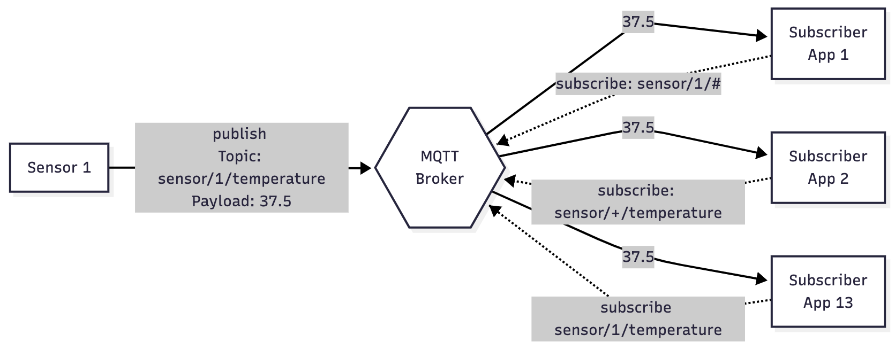

**Figure 5.4:** An example of MQTT topic and broker architecture with topic subscriptions.

**Message Queue Telemetry Transport (MQTT)** is a **lightweight**, **open-source**, and **TCP-based** **publish/subscribe (Pub/Sub) protocol** designed for environments with **resource-constrained devices** and **low-bandwidth networks**.

**Key Features and Concepts:**

- **Standardization:**  
  - MQTT is a standard of the **Organization for the Advancement of Structured Information Standards (OASIS)**.

- **Efficiency:**  
  - Optimized for scenarios where **protocol overhead** and **message size** must be minimal.
  - *Example (IoT):* Battery-powered sensors in remote locations use MQTT to send data efficiently without draining resources.

- **Topic-Based Messaging:**  
  - **Messages are published to topics** within a broker.
  - **Topics act as filters** for the message stream, organizing data by subject or device type.
  - *Example (IoT):* A temperature sensor publishes readings to `/home/livingroom/temperature`; multiple devices can subscribe to this topic.

- **Subscription and Filtering:**  
  - **Clients subscribe to topics** using **topic filters**.
  - A single client can receive messages from **multiple publishers** if they publish to the same topic.
  - **Hierarchical topic structure** allows clients to subscribe to specific segments of the topic tree.
  - *Example (IoT):* Subscribing to `/home/+/temperature` receives temperature updates from all rooms in a smart home.

- **Wildcard Support:**  
  - MQTT supports **wildcards** in topic filters for flexible and granular subscriptions:
    - `+` (single-level wildcard): Matches one segment in the topic path.
    - `#` (multi-level wildcard): Matches all remaining segments.
  - *Example (IoT):* Subscribing to `/home/#` receives all messages from any device in the home.

**Summary:**  
MQTT’s lightweight design, topic-based filtering, and support for wildcards make it ideal for **IoT applications** where devices need to communicate efficiently and flexibly in dynamic, constrained environments.

---

## 5.7.1 Single Level Topic Wildcard

The **single-level wildcard** in MQTT, represented by the `+` symbol, allows subscribers to match exactly **one topic level** in the hierarchy. This enables flexible subscriptions to multiple topics that share a common structure.

**Key Concepts:**

- The `+` wildcard **replaces one topic segment** in a subscription filter.
- It matches **any string** at that specific level, but **only one level**.
- Multiple `+` wildcards can be used in a topic filter to match multiple levels.

**Examples (IoT):**

- Subscribing to `myhome/groundfloor/+/temperature` 
- It does **MATCH**:
  - `myhome/groundfloor/livingroom/temperature`
  - `myhome/groundfloor/kitchen/temperature`
- It does **NOT** match:
  - `myhome/groundfloor/kitchen/fridge/temperature` (extra level)
  - `myhome/firstfloor/kitchen/temperature` (different second level)

**Summary:**

The single-level wildcard is ideal for **grouping devices or data types** at a specific hierarchy level, making it easier to manage subscriptions in dynamic IoT environments. 

---

## 5.7.2 Multi Level Topic Wildcard

The **multi-level wildcard** in MQTT, represented by the `#` symbol, enables subscribers to match **all topic levels** from a specific point in the hierarchy. This provides a powerful way to receive messages from a broad set of topics with a single subscription.

**Core Concepts:**

- The `#` wildcard **matches any number of topic levels**, including zero. With zero we mean that it can match the parent level only (e.g., `home/#` matches `home/`).
- It must be the **last character** in the topic filter and **preceded by a forward slash** (e.g., `home/#`).
- A subscription using `#` will receive **all messages** that start with the pattern before the wildcard, regardless of how many levels follow.

**Key Points:**

- **Flexible Subscriptions:**  
  - Ideal for monitoring all devices or events under a common topic prefix.
- **Simple Hierarchy Coverage:**  
  - Useful for aggregating data from multiple sources without specifying each topic individually.

**Examples (IoT):**

- Subscribing to `myhome/groundfloor/#` **MATCHES**:
  - `myhome/groundfloor/livingroom/temperature`
  - `myhome/groundfloor/kitchen/temperature`
  - `myhome/groundfloor/kitchen/brightness`
- It does **NOT** match:
  - `myhome/firstfloor/kitchen/temperature` (different first level)

**Summary:**

The multi-level wildcard is especially useful in **IoT scenarios** where you want to **monitor all events or sensor data** under a specific location or device group, simplifying subscription management and enabling scalable data collection.

---

## 5.7.3 Quality of Service (QoS) Concepts & Levels

**Quality of Service (QoS)** in MQTT defines the **delivery guarantee** for each message exchanged between clients and brokers. It is a crucial feature that allows clients to select the reliability level that best fits their **network conditions** and **application requirements**.

**Note:**The MQTT QoS levels and implementation work on top of the underlying **TCP/IP** transport protocol, which already provides a reliable connection. However, MQTT's QoS levels add an additional layer of control over message delivery semantics.

**Core Concepts:**

- **QoS Agreement:**  
  - The QoS level is an **agreement** between the **sender** and **receiver** about how reliably a message should be delivered.
  
- **Dual Path Consideration:**  
  - QoS applies to both:
    - **Publisher → Broker:** The publisher sets the QoS level when sending a message to the broker.
    - **Broker → Subscriber:** The subscriber sets the QoS level during subscription; the broker delivers messages using the **lower** of the publisher’s and subscriber’s QoS levels.

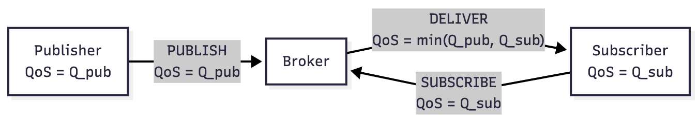

**Figure 5.5:** A dual path representation of MQTT message flow with QoS levels taking into account both publisher and subscriber QoS levels.

**MQTT QoS Levels:**

1. **QoS 0 – At most once:**  
   - **No guarantee** of delivery; messages are delivered **once or not at all**.
   - **No acknowledgment** required.
   - **Example (IoT):**  
     - A temperature sensor sends periodic readings; occasional data loss is acceptable.

2. **QoS 1 – At least once:**  
   - **Guaranteed delivery**; messages are delivered **one or more times** (possible duplicates).
   - **Acknowledgment** required from the receiver.
   - **Example (IoT):**  
     - A smart door lock sends status updates; it’s important that the message arrives, even if duplicated.

3. **QoS 2 – Exactly once:**  
   - **Highest reliability**; messages are delivered **exactly once** (no duplicates).
   - Uses a **two-phase handshake** for confirmation.
   - **Example (IoT):**  
     - A payment terminal sends transaction data; duplicate or lost messages must be avoided.

**Key Points:**

- **QoS Selection:**  
  - Clients can choose the QoS level based on **network reliability** and **application logic**.
  - **Lower QoS** may be used for non-critical data to save bandwidth and reduce latency.
  - **Higher QoS** is preferred for critical operations where data loss or duplication is unacceptable.

- **Automatic Retransmission:**  
  - MQTT handles **retransmission** and **delivery guarantees** even if the underlying network is unreliable.

> **Summary:**  
> QoS in MQTT enables flexible, reliable communication in IoT environments, allowing devices to balance performance and reliability according to their needs.

---

### 5.7.3.1 Why is QoS Important in IoT ?

**Quality of Service (QoS) is a fundamental feature of the MQTT protocol, enabling clients to select the most appropriate level of message delivery reliability for their needs.**

- **Customizable Reliability:**  
  - Clients can choose a **QoS level** that matches their **network conditions** and **application requirements**.
  - *Example (IoT):* A battery-powered sensor in a remote area may use a lower QoS to save bandwidth, while a critical alarm system uses a higher QoS for guaranteed delivery.

- **Automatic Message Handling:**  
  - MQTT **manages retransmissions** and **delivery guarantees** automatically, even over **unreliable or intermittent networks**.
  - This reduces the complexity for developers, as the protocol handles lost or duplicated messages.

**In summary:**  
QoS in MQTT empowers IoT devices to communicate reliably and efficiently, adapting to varying network reliability and application criticality without adding complexity to device logic.

---

### 5.7.3.2 QoS 0 - Fire and Forget

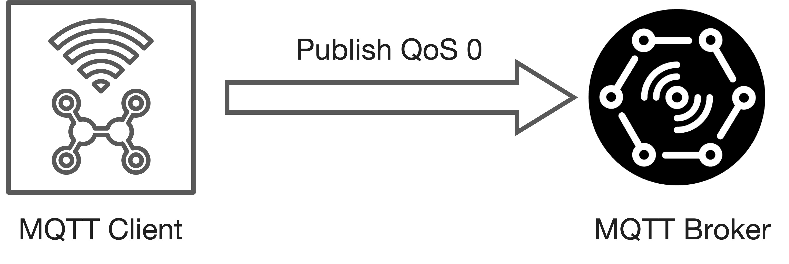

**Figure 5.6:** Example of QoS 0 - Fire and Forget with a Publisher sending data to the broker. The same applies to the Broker sending data to the Subscriber with QoS 0.

- **Minimal QoS Level:**  
  - QoS 0 is the **lowest level of message delivery guarantee** in MQTT.
- **Best-Effort Delivery:**  
  - Messages are delivered on a **best-effort basis** with **no guarantee** of delivery.
- **No Acknowledgment:**  
  - The **receiver does not acknowledge** receipt of the message.
- **No Retransmission or Storage:**  
  - The **sender does not store or retransmit** the message if delivery fails.
- **Reliability:**  
  - Delivery is only as reliable as the **underlying TCP connection**; if the connection drops, messages may be lost.
- **“Fire and Forget” Semantics:**  
  - The publisher sends the message and **does not wait for any response**.
- **Use Case Example (IoT):**  
  - A temperature sensor sends periodic readings to a broker. Occasional data loss is acceptable because the next reading will soon arrive.

**Summary:**  
QoS 0 is ideal for **non-critical data** where **speed and low overhead** are more important than guaranteed delivery, such as frequent sensor updates in IoT scenarios.

---

### 5.7.3.2 QoS 1 - At Least Once

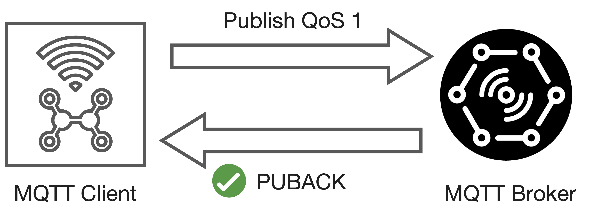

**Figure 5.7:** Example of QoS 1 - At Least Once with a Publisher sending data to the broker. The same applies to the Broker sending data to the Subscriber with QoS 1.

QoS level 1 ensures that a message is delivered **at least once** to the receiver, but it may be delivered **multiple times** in case of network issues or delays.

**Core Concepts:**

- **Message Persistence:**  
  - The **sender stores the message** until it receives a **PUBACK** (Publish Acknowledgment) packet from the receiver.
- **Acknowledgment Mechanism:**  
  - Each message is assigned a **packet identifier** to match the sent message with the received PUBACK.
- **Retransmission:**  
  - If the sender does **not receive a PUBACK** within a certain time, it **resends the PUBLISH packet**.
  - This can result in the **receiver getting duplicate messages** if the PUBACK was delayed or lost.
- **Duplicate Flag (DUP):**  
  - When resending, the sender sets the **DUP flag** in the message header.
  - The **DUP flag is for internal use only**; the receiver processes the message and sends a PUBACK regardless of the DUP flag.
- **Receiver Processing:**  
  - Upon receiving a QoS 1 message, the receiver (e.g., broker or client) can **process it immediately** and then sends a PUBACK to the sender.

**Summary:**  
QoS 1 is suitable for **important but non-critical data** in IoT, where **guaranteed delivery** is needed, but occasional **duplicates are acceptable**. It strikes a balance between reliability and performance.

---

### 5.7.3.3 QoS 2 - Exactly Once

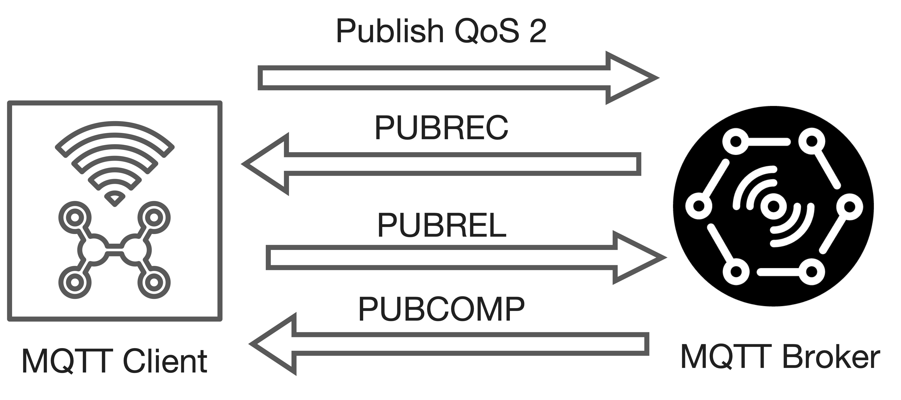

**Figure 5.8:** Example of QoS 2 - Exactly Once with a Publisher sending data to the broker. The same applies to the Broker sending data to the Subscriber with QoS 2.

QoS 2 is the **highest level of message delivery guarantee** in MQTT, ensuring that each message is **delivered exactly once** to the intended recipient—**no duplicates, no loss**.

---

### 5.7.3.4 QoS 2 - Exactly Once - Phase 1

When a receiver gets a **QoS 2 PUBLISH packet** from a sender, the following steps occur to ensure **exactly-once delivery**:

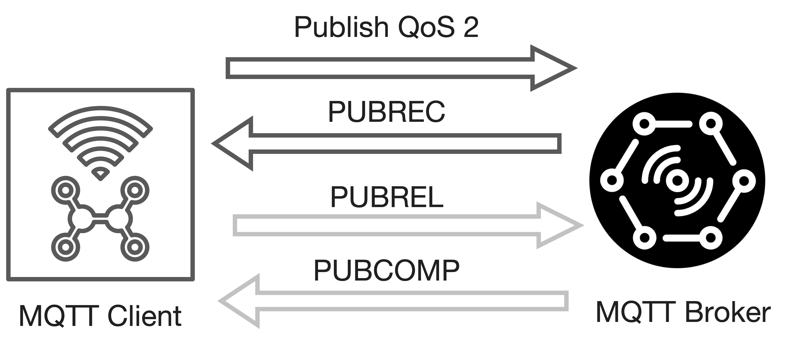

**Figure 5.9:** First part of the QoS 2 handshake.

- **Message Processing & Acknowledgment:**
  - The receiver **processes the PUBLISH message** and immediately replies with a **PUBREC (Publish Received) packet** to acknowledge receipt.
  - *Example (IoT):* A payment terminal publishes a transaction event to the broker; the broker responds with PUBREC to confirm it received the event.

- **Handling Lost Acknowledgments:**
  - If the sender **does not receive the `PUBREC` packet** within a certain time, it **retransmits the PUBLISH packet** with the **DUP (duplicate) flag** set.
  - This process repeats until the sender receives the `PUBREC` acknowledgment.
  - *Example (IoT):* If a smart meter sends usage data and the network is unstable, the meter will resend the data with the DUP flag until the broker acknowledges with PUBREC.

**Key Points:**
- The **DUP flag** helps the receiver identify retransmitted messages, but the receiver must process each PUBLISH packet as per the protocol.
- This handshake ensures that even if packets are lost or duplicated due to unreliable networks, the message is **delivered exactly once**.

**Summary:**  
This initial phase of the QoS 2 handshake guarantees that the receiver acknowledges every PUBLISH message, and the sender will keep retrying until it receives confirmation, making it suitable for **critical IoT scenarios** where **no message loss or duplication** is acceptable.

---

### 5.7.3.5 QoS 2 - Exactly Once - Phase 2

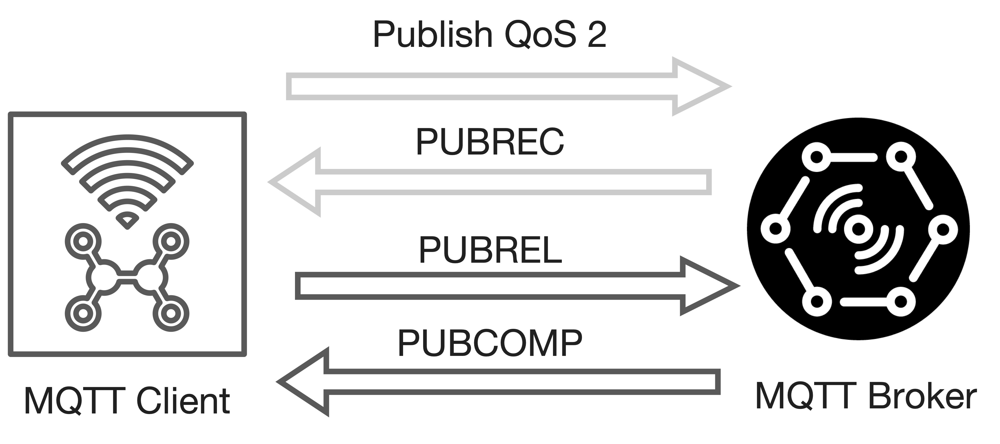

**Figure 5.10:** Second part of the QoS 2 handshake.

The second phase of the **QoS 2 handshake** ensures that the message is delivered **exactly once** and that both sender and receiver can safely discard any stored state related to the message.

**Detailed Steps:**

- Once the **sender receives a `PUBREC` packet** from the receiver:
  - The sender can **safely discard the original `PUBLISH` packet**.
  - The sender **stores the `PUBREC` packet** and responds by sending a **`PUBREL` (Publish Release) packet** to the receiver.

- When the **receiver gets the `PUBREL` packet**:
  - The receiver **processes the release** and sends back a **`PUBCOMP` (Publish Complete) packet** to the sender.
  - The receiver can now **discard all stored state** related to this message.
  - **Until the `PUBCOMP` is sent**, the receiver **keeps a reference** to the packet identifier of the original message to **prevent duplicate processing** in case of retransmissions.

- After the **sender receives the `PUBCOMP` packet**:
  - The sender can **discard any remaining state** for this message.
  - The **packet identifier** used for this message is now **available for reuse**.

**Key Points:**

- **State Management:**  
  - Both sender and receiver maintain state information throughout the handshake to ensure **no message is processed more than once**.
- **Duplicate Protection:**  
  - Storing the packet identifier until the handshake is complete prevents **duplicate message processing**.
- **Reliability:**  
  - If any packet in the handshake is lost, the sender or receiver will **retransmit** the last sent packet until the expected response is received.

**Summary:**  
This phase completes the **exactly-once delivery guarantee** of MQTT QoS 2, making it suitable for **critical IoT operations** where message duplication or loss is unacceptable.

---

### 5.7.3.6 QoS 2 - Exactly Once - Complete Flow with Publisher and Subscriber

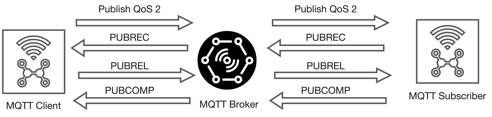

**Figure 5.10:** Complete QoS 2 handshake with both publisher and subscriber exchanging messages with the broker.

At the end of the **QoS 2 flow**, both the **sender** and **receiver** are **certain** that the message has been **delivered exactly once**, and the sender has received explicit **confirmation of delivery**.

**Key Points:**

- **Reliability:**  
  - If any packet in the handshake is **lost** (e.g., due to network issues), the **sender automatically retransmits** the last message after a timeout.
  - This mechanism ensures that **no message is lost or duplicated**, regardless of temporary network failures.

- **Symmetry:**  
  - The **responsibility for retransmission** applies to both **MQTT clients** and **brokers**—whichever acts as the sender must handle retransmissions.
  - The **recipient** (client or broker) must **respond to each command message** as specified by the protocol.

- **State Management:**  
  - Both parties **maintain state** for each message until the handshake is fully completed, preventing duplicate processing.

**Summary:**  
The **QoS 2 flow** in MQTT provides the **highest level of delivery assurance**, making it ideal for **critical IoT operations** where **message loss or duplication is unacceptable**.

---

### 5.7.3.7 QoS Downgrade

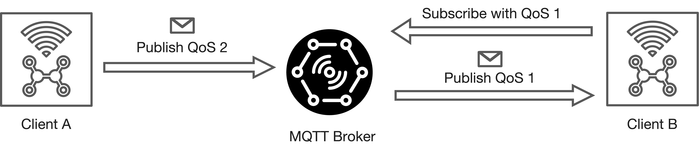

**Figure 5.11:** Example of the concept of QoS Downgrade in MQTT where the publisher sends data with QoS 2 and two subscribers are subscribed with different QoS levels (QoS 1 and QoS 0).

In MQTT, the **Quality of Service (QoS) level** can differ between the **publisher-to-broker** and **broker-to-subscriber** interactions. This is known as **QoS downgrade** and is a key aspect of how MQTT manages message delivery reliability.

**Core Concepts:**

- **Publisher QoS:**  
  - The **publisher** sets the QoS level when sending a message to the **broker**.
  - *Example (IoT):* A temperature sensor publishes data to the broker with QoS 2 (exactly once) to ensure critical readings are not lost.

- **Subscriber QoS:**  
  - Each **subscriber** specifies its desired QoS level when subscribing to a topic.
  - *Example (IoT):* A mobile dashboard subscribes to temperature updates with QoS 0 (at most once) to save bandwidth and battery.

- **QoS Downgrade Rule:**  
  - When the broker delivers a message to a subscriber, it uses the **lower** of:
    - The QoS level set by the **publisher** for the message.
    - The QoS level requested by the **subscriber** during subscription.
  - This ensures that the subscriber never receives messages at a higher QoS than it requested.

**Illustrative Example:**

- If a **publisher** sends a message with **QoS 2** and a **subscriber** is subscribed with **QoS 1**, the broker delivers the message to that subscriber with **QoS 1**.
- If the subscriber is subscribed with **QoS 0**, the broker delivers the message with **QoS 0**, regardless of the publisher's QoS.

**Why is this important in IoT?**

- **Resource Optimization:**  
  - Devices with limited resources (e.g., battery-powered sensors or mobile apps) can choose a lower QoS to reduce overhead.
- **Flexible Reliability:**  
  - Critical data can be published with high QoS, while less critical consumers can opt for lower QoS to balance reliability and efficiency.

**Summary:**  
The **QoS downgrade mechanism** in MQTT allows each device in an IoT system to select the most appropriate reliability level for its needs, ensuring efficient and flexible communication across diverse devices and network conditions.

---

### 5.7.3.8 Packet Identifier

The **packet identifier** is a key element in MQTT for managing message delivery and ensuring correct handling of QoS 1 and QoS 2 messages.

**Core Concepts:**

- **Uniqueness per Client-Broker Pair:**
  - The packet identifier is **unique between a specific client and broker** during an ongoing message exchange.
  - It is **not globally unique** across all clients or brokers.
- **Scope and Reuse:**
  - Once a QoS 1 or QoS 2 message flow is **fully completed** (i.e., all acknowledgments are exchanged), the packet identifier can be **reused** by the same client for new messages.
  - This reuse is possible because the protocol ensures that no two active message flows with the same identifier exist simultaneously for a client-broker pair.
- **Identifier Range:**
  - The packet identifier is a **16-bit unsigned integer** (range: 1–65535).
  - It is **unrealistic** for a client to have more than 65,535 unacknowledged messages in flight at once, especially in IoT scenarios with constrained devices.
- **Role in QoS Flows:**
  - For **QoS 1** (At least once) and **QoS 2** (Exactly once), the packet identifier is used to **match messages with their acknowledgments** (e.g., PUBACK, PUBREC, PUBREL, PUBCOMP).
  - This ensures that each message is tracked and processed correctly, even if retransmissions occur.

**Summary:**

The **packet identifier** mechanism in MQTT enables efficient and reliable message tracking for QoS 1 and QoS 2, while keeping resource usage minimal—an important feature for **IoT devices** with limited memory and processing power.

**Note:** The **client-id** is a crucial identifier in MQTT that uniquely identifies each client connected to the broker. It is used for session management, message delivery, and maintaining the state of subscriptions. If a client reconnects with the same client-id, it can resume its previous session, including any pending messages and subscriptions. **On the other hand, if a client with the same client-id is already connected, the broker will disconnect the existing client to maintain the uniqueness of client-ids.**

---

### 5.7.3.9 QoS Use Cases Summary

**QoS 0 (At most once):**
- **Best for:** Scenarios where **occasional message loss is acceptable** and **low overhead** is required.
- **Typical use cases:**
  - **Stable connections** (e.g., wired networks, local test clients, dashboards).
  - **Non-critical sensor data** sent at frequent intervals (e.g., temperature readings every second).
  - **No need for message queuing** for offline clients.

**QoS 1 (At least once):**
- **Best for:** Applications where **every message must be received**, but **duplicates are tolerable**.
- **Typical use cases:**
  - **Critical alerts** or **status updates** where missing a message is unacceptable, but processing duplicates is manageable.
  - **Faster delivery** than QoS 2, with less protocol overhead.
- **Application must handle duplicates** (e.g., by checking message IDs).

**QoS 2 (Exactly once):**
- **Best for:** **Mission-critical applications** where **duplicate messages can cause errors or harm**.
- **Typical use cases:**
  - **Financial transactions**, **commands to actuators**, or **state changes** where exactly-once delivery is essential.
  - **Higher protocol overhead** and **slower delivery** due to the four-step handshake.

---

### 5.7.3.10 QoS Levels Summary Table

| QoS Level | Delivery Guarantee      | Duplicates Possible | Overhead | Typical IoT Use Case Example                  |
|-----------|------------------------|---------------------|----------|-----------------------------------------------|
| **0**     | At most once           | No                  | Low      | Frequent sensor readings (e.g., temperature)  |
| **1**     | At least once          | Yes                 | Medium   | Device status updates, alerts                 |
| **2**     | Exactly once           | No                  | High     | Relevant transactions, actuator commands       |

---

**Summary:**  
Choose the **QoS level** based on your application's **reliability needs**, **network conditions**, and **resource constraints**. In IoT, balancing **performance** and **reliability** is key—use higher QoS only when necessary to avoid unnecessary overhead.

---

## 5.7.4 Persistent Sessions

In MQTT, **persistent sessions** allow clients to maintain their state and message flow even when they disconnect and reconnect. This is especially important for **IoT devices** that may experience intermittent connectivity.

**When a persistent session is enabled, the broker stores:**

- **Session Existence:**  
  - The broker remembers that a session exists for the client, even if there are **no active subscriptions**.
  - *Example (IoT):* A battery-powered sensor that connects only periodically can resume its session without re-subscribing each time.

- **All Client Subscriptions:**  
  - The broker keeps track of **all topics** the client is subscribed to.
  - *Example (IoT):* A smart thermostat remains subscribed to `/home/alerts` and `/home/temperature` even if it temporarily disconnects.

- **Unacknowledged QoS 1 and QoS 2 Messages:**  
  - Any messages in a **QoS 1 or QoS 2 flow** that the client has not yet confirmed (acknowledged) are stored.
  - *Example (IoT):* If a device loses connection before acknowledging a critical command, the broker will deliver it again upon reconnection.

- **Missed QoS 1 and QoS 2 Messages:**  
  - All **new QoS 1 or QoS 2 messages** published to the client’s subscribed topics while it was offline are queued.
  - *Example (IoT):* An environmental sensor that was offline receives all important alerts sent during its downtime as soon as it reconnects.

- **Incomplete QoS 2 Flows:**  
  - Any **QoS 2 messages** received from the client that are not yet fully acknowledged are retained until the handshake completes.

**When the client reconnects:**

- The broker **immediately restores** all stored information, allowing the client to continue as if it was never disconnected.
- This ensures **reliable message delivery** and seamless operation for IoT devices with unstable or power-saving network connections.

**Summary:**  
Persistent sessions in MQTT are crucial for **robust IoT deployments**, ensuring that important messages and subscriptions are never lost, even if devices connect sporadically or experience network interruptions.

---

### 5.7.4.1 Persistent Sessions Flags

When an MQTT client connects to a broker, it specifies whether it wants a **persistent session** using the `cleanSession` flag (in MQTT 3.1.1) or `cleanStart` flag (in MQTT 5.0):

- **`cleanSession = true`** (or `cleanStart = true`):
  - The client requests a **non-persistent (clean) session**.
  - **All session state is discarded** when the client disconnects.
  - **No messages or subscriptions are retained** for the next connection.
  - *Example (IoT):* A mobile app that only needs real-time updates while connected and does not care about missed messages when offline.

- **`cleanSession = false`** (or `cleanStart = false`):
  - The client requests a **persistent session**.
  - The broker **retains all session information**, including:
    - **Subscriptions**
    - **Unacknowledged QoS 1 and QoS 2 messages**
    - **Queued messages** published while the client was offline
  - If a persistent session already exists for the client, the broker **restores it** and delivers any queued messages upon reconnection.
  - *Example (IoT):* A battery-powered sensor that connects intermittently but needs to receive all critical alerts sent while it was offline.

**Client Responsibilities for Persistent Sessions:**

When a client requests a persistent session, it must also manage certain state information locally:

- **Track all QoS 1 and QoS 2 messages** sent to the broker that have not yet been acknowledged.
- **Store all QoS 2 messages** received from the broker that are not yet fully acknowledged (i.e., the four-step handshake is not complete).

**Summary Table:**

| Flag/Setting         | Session Type      | Broker Stores...                                   | Client Stores...                                  | Typical IoT Example                                 |
|----------------------|------------------|----------------------------------------------------|---------------------------------------------------|-----------------------------------------------------|
| `cleanSession=true`  | Non-persistent   | Nothing after disconnect                           | Nothing after disconnect                          | Real-time dashboards, temporary monitoring clients  |
| `cleanSession=false` | Persistent       | Subscriptions, queued QoS 1/2 messages, session state | Unacknowledged QoS 1/2 messages, incomplete QoS 2 flows | Sensors/devices with intermittent connectivity      |

**Key Points:**
- **Persistent sessions** ensure that important messages and subscriptions are not lost during temporary disconnects—crucial for many IoT scenarios.
- **Non-persistent sessions** are suitable for clients that only need live data and do not require message history.

---

### 5.7.4.2 Session Best Practices - Persistent Sessions

Use a **persistent session** when the client needs to maintain its state and receive all important messages, even if it disconnects temporarily.

- **Message Delivery While Offline:**
  - The broker **queues all messages** (for subscribed topics, QoS 1 and 2) while the client is offline.
  - When the client reconnects, the broker **delivers all missed messages**.
  - *Example (IoT):* A remote environmental sensor that connects periodically will receive all critical alerts or commands sent during its offline period.

- **Subscription Retention:**
  - The broker **remembers the client’s subscriptions** and restores them automatically after reconnection.
  - *Example (IoT):* A smart thermostat remains subscribed to `/home/alerts` and `/home/temperature` even after a power cycle.

- **Resuming QoS 1 and 2 Flows:**
  - All **unacknowledged QoS 1 and 2 messages** are retained and retransmitted after the client reconnects.
  - *Example (IoT):* If a device loses connection before acknowledging a command, the broker will resend it when the device is back online.

- **Recommended for:**
  - Devices with **intermittent connectivity** or **limited resources** that cannot maintain a constant connection.
  - Scenarios where **no critical message should be lost**.

---

### 5.7.4.3 Session Best Practices - Clean Sessions

Use a **clean session** when the client does not need to retain any state or receive missed messages.

- **No Subscription or Message Retention:**
  - The broker **does not store any session information** after the client disconnects.
  - **Missed messages are not delivered** when the client reconnects.
  - *Example (IoT):* A mobile dashboard app that only needs real-time data while connected and does not care about messages sent while it was offline.

- **Publish-Only Clients:**
  - Suitable for clients that **only publish messages** and do not subscribe to any topics.
  - The broker does **not retry transmission** of QoS 1 and 2 messages if the client disconnects.

- **Recommended for:**
  - **Stateless clients** or applications where **real-time data** is sufficient and **message history is not needed**.

---

### 5.7.4.4 Session Comparison Summary Table

| Session Type        | Broker Stores...                      | Messages Delivered After Reconnect | Typical IoT Example                                  |
|---------------------|---------------------------------------|------------------------------------|------------------------------------------------------|
| **Persistent**      | Subscriptions, queued QoS 1/2 messages | Yes                                | Sensors/devices with intermittent connectivity       |
| **Clean Session**   | Nothing after disconnect               | No                                 | Real-time dashboards, temporary monitoring clients   |

---

## 5.7.5 Retained Messages

**Retained messages** in MQTT are a special feature that allows the broker to store the **last known good value** for a topic and immediately deliver it to new subscribers. This is especially useful in IoT scenarios where devices or dashboards may connect intermittently and need the latest status update as soon as they subscribe.

**Core Concepts:**

- A **retained message** is a standard MQTT message with the **retained flag set to `true`**.
- The **broker stores only one retained message per topic**—the most recent message marked as retained.
- **When a client subscribes** to a topic (or topic pattern), the broker **immediately sends the retained message** for each matching topic, if one exists.
  - *Example (IoT):* A smart thermostat subscribes to `/home/livingroom/temperature` and instantly receives the last reported temperature, even if it was published hours ago.
- **Wildcard subscriptions** (e.g., `/home/+/temperature`) will receive the retained message for each topic that matches the pattern.
- The **retained message is not necessarily the last message published**—it is the last message published with the retained flag set to `true`.

**Benefits:**

- **Immediate status update:**  
  - New subscribers get the latest value right away, without waiting for the next publish event.
  - *Example (IoT):* A dashboard app reconnects and instantly displays the current state of all sensors.
- **Efficient state sharing:**  
  - Devices joining the network can quickly synchronize with the current system state.

**Managing Retained Messages:**

- **Overwriting:**  
  - Publishing a new retained message to a topic **overwrites** the previous retained message for that topic.
- **Deleting:**  
  - To **delete** a retained message, publish a retained message with a **zero-byte payload** to the topic. The broker will remove the retained message for that topic.
- **No relation to persistent sessions:**  
  - Retained messages are managed by the broker independently of client session persistence.

**Summary Table:**

| Feature                  | Description                                                                                  |
|--------------------------|----------------------------------------------------------------------------------------------|
| **Storage**              | One retained message per topic, stored by the broker                                         |
| **Delivery**             | Sent immediately to new subscribers of the topic (or matching pattern)                       |
| **Overwrite/Delete**     | Overwritten by new retained messages; deleted by sending a zero-byte retained message        |
| **Use Case (IoT)**       | Device status updates, sensor readings, last known actuator state                            |

**Summary:**  
Retained messages in MQTT provide a simple yet powerful way to ensure that new subscribers always receive the most recent state of a topic, enhancing the usability and responsiveness of IoT applications.

---

## 5.7.6 Last Will and Testament (LWT)

The **Last Will and Testament (LWT)** feature in MQTT enables clients to define a special message that the broker will automatically publish **on their behalf if they disconnect unexpectedly**. This mechanism helps maintain **topic coherence** and allows other devices to react to client failures or outages.

**Core Concepts:**

- **Purpose:**  
  - LWT provides a reliable way for clients to **signal their absence** or **critical status** to peers in case of an abrupt disconnect.
  - Especially useful in **IoT environments** with **unreliable networks** (e.g., wireless sensors, battery-powered devices).

- **Types of Disconnections:**
  - **Graceful disconnect:**  
    - The client sends a proper **DISCONNECT** message to the broker.
    - The broker discards the stored LWT message.
  - **Ungraceful disconnect:**  
    - The client loses connection without sending a DISCONNECT (e.g., power loss, network failure).
    - The broker detects the lost connection (e.g., TCP connection closed) and **publishes the LWT message** to the specified topic.

- **LWT Message Structure:**  
  - The LWT message is defined by the client at connection time and includes:
    - **Topic**: Where the message will be published.
    - **Payload**: The content of the message (e.g., `"device offline"`).
    - **Quality of Service (QoS)**: Delivery guarantee level.
    - **Retained flag**: Whether the message should be retained by the broker.

---

## 5.7.6.1 Last Will and Testament (LWT) - Example

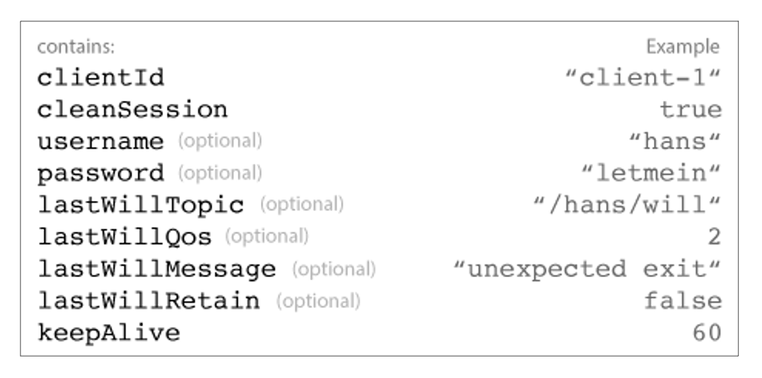

**Figure 5.12:** Example of the concept of Last Will and Testament (LWT) in MQTT where the client specifies a message to be sent if it disconnects unexpectedly.

1. **Client connects** to the broker and specifies its LWT message.
2. The broker **stores** the LWT message for that client.
3. If the client disconnects **gracefully**, the broker **removes** the LWT message.
4. If the client disconnects **ungracefully**, the broker **publishes** the LWT message to the designated topic.
5. **All subscribers** to that topic receive the LWT message.

**IoT Example:**  
- A smart sensor in a factory sets its LWT to `"sensor/alerts"` with the payload `"Sensor A offline"`. If the sensor loses power or network connectivity, the broker automatically notifies all monitoring dashboards subscribed to `"sensor/alerts"`.

**Benefits:**

- **Automatic failure notification** for monitoring and alerting.
- **Improved reliability** and **system awareness** in distributed IoT deployments.
- **Simple configuration**—no need for complex heartbeat or polling mechanisms.

---

## 5.7.6.2 Last Will and Testament (LWT) - Disconnect Scenarios

According to the **MQTT 3.1.1 specification**, the broker sends a client’s **Last Will and Testament (LWT)** message in several scenarios where the client disconnects unexpectedly or improperly:ensures the LWT message is distributed.

- **I/O Error or Network Failure:**  
  - If the broker detects any **input/output error** or **network failure** with the client connection, it will publish the LWT message.  
  - *IoT Example:* A remote sensor loses Wi-Fi connectivity due to interference; the broker notifies all subscribers that the sensor is offline.

- **Failed Communication within Keep Alive Period:**  
  - If the client fails to send any message or keep alive packet within the specified **Keep Alive interval**, the broker assumes the client is unreachable and sends the LWT message.  
  - *IoT Example:* A battery-powered device enters deep sleep and misses its keep alive window; the broker alerts monitoring systems of its absence.

- **Client Closes Connection Without DISCONNECT Packet:**  
  - If the client terminates the network connection **without sending a proper DISCONNECT packet**, the broker treats this as an ungraceful disconnect and distributes the LWT message.  
  - *IoT Example:* A device crashes or loses power suddenly; the broker automatically publishes its LWT to notify other devices.

- **Broker Closes Connection Due to Protocol Error:**  
  - If the broker detects a **protocol violation** and closes the connection, it will also send the LWT message.  
  - *IoT Example:* A misconfigured device sends invalid MQTT packets; the broker disconnects it and publishes the LWT to the relevant topic.

**Key Points:**
- The LWT mechanism ensures that other devices or applications are **immediately informed** when a client becomes unavailable, improving reliability and system awareness in IoT deployments.
- Proper use of LWT helps maintain **topic coherence** and enables automated responses to device failures (e.g., triggering alerts or fallback actions).

---

## 5.7.7 MQTT Broker Bridge Mode

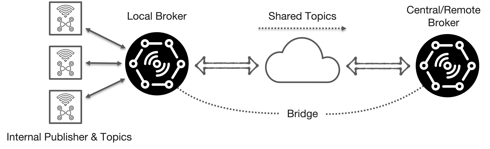

**Figure 5.13:** Example of MQTT Broker Bridge Mode where two brokers are connected to share messages between different networks or locations.

**MQTT Broker Bridge Mode** enables the connection of **two MQTT brokers**, allowing them to **share messages and topics** across different networks or locations.

**Core Concepts:**
- A **bridge** is used to **link two brokers**, facilitating communication between separate MQTT systems.
- **Typical use case:** Connecting **edge MQTT brokers** (e.g., in factories, smart buildings, or remote sites) to a **central or cloud-based MQTT broker** for unified data aggregation and management.
- **Selective bridging:** Usually, only a **subset of local MQTT topics** is bridged to the remote broker, optimizing bandwidth and privacy.
- **Configuration:** Only **one broker** needs to be configured as a **bridge**; the other operates as a standard broker.

**IoT Example:**
- An edge broker in a smart factory bridges only **critical alerts** and **machine status updates** to a central broker, while local sensor data remains within the factory network.

**Benefits:**
- **Scalable architecture:** Supports distributed deployments and hierarchical data flows.
- **Efficient data sharing:** Enables selective topic forwarding, reducing unnecessary traffic.
- **Improved reliability:** Local brokers can operate independently if the central broker is temporarily unavailable.

**Summary Table:**

| Feature                | Description                                                      |
|------------------------|------------------------------------------------------------------|
| **Bridge Purpose**     | Connects two brokers to share selected topics/messages           |
| **Common Usage**       | Edge-to-central/cloud MQTT integration in IoT deployments        |
| **Configuration**      | Only one broker needs bridge setup; other remains standard       |
| **Selective Bridging** | Only chosen topics are forwarded to remote broker                |
| **IoT Example**        | Factory edge broker bridges alerts to central monitoring system  |

---

# References

- MQTT - [http://mqtt.org/](http://mqtt.org/)
- HiveMQ - MQTT Essentials - [https://www.hivemq.com/blog/](https://www.hivemq.com/blog/)
- Mosquito MQTT Bridge Mode - [http://www.steves-internet-guide.com/mosquitto-bridge-configuration/](http://www.steves-internet-guide.com/mosquitto-bridge-configuration/)
- Difference Between AMQP & MQTT - [https://www.educba.com/amqp-vs-mqtt/](https://www.educba.com/amqp-vs-mqtt/)
- Introduction to RabbitMQT - [https://www.cloudamqp.com/blog/2015-05-18-part1-rabbitmq-for-beginners-what-is-rabbitmq.html](https://www.cloudamqp.com/blog/2015-05-18-part1-rabbitmq-for-beginners-what-is-rabbitmq.html)
- RabbitMQT - [https://www.rabbitmq.com/](https://www.rabbitmq.com/)
- AMQP & RabbitMQT - Routing and Exchanges - [https://www.cloudamqp.com/blog/2015-09-03-part4-rabbitmq-for-beginners-exchanges-routing-keys-bindings.html](https://www.cloudamqp.com/blog/2015-09-03-part4-rabbitmq-for-beginners-exchanges-routing-keys-bindings.html)

