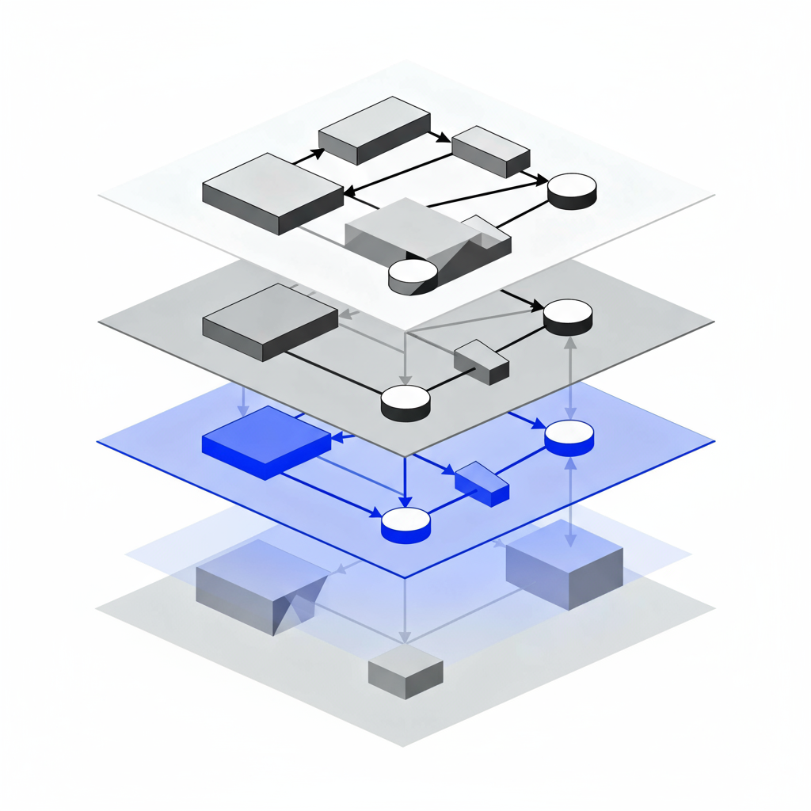
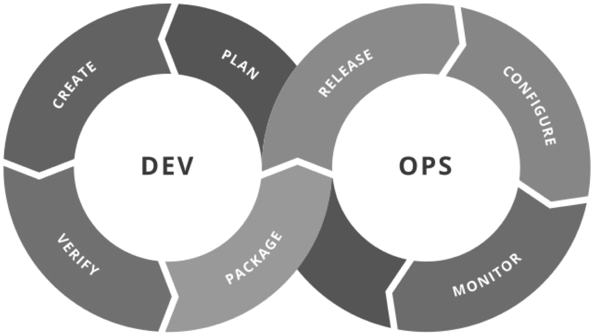
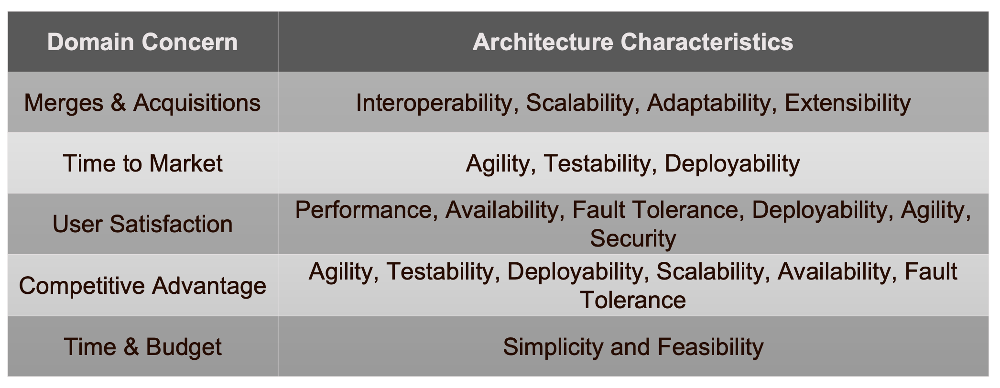

<!-- omit in toc -->
# Lecture 6 - Software Architectures Monolithic Approaches

<!-- omit in toc -->
## Lecture Information

| **Master's Degree** | Digital Automation Engineering (D.M.270/04)                                      |
|---------------------|----------------------------------------------------------------------------------|
| **Curriculum**      | Digital Infrastructure                                                           |
| **Course**          | Distributed IoT Software Architectures                                           |
| **Lecture Title**   | Software Architectures Monolithic Approaches                                     |
| **Author**          | Prof. Marco Picone (marco.picone@unimore.it)                                     |
| **License**         | [Creative Commons Attribution 4.0](https://creativecommons.org/licenses/by/4.0/) | 

<!-- omit in toc -->
# Table of Contents

- [6.1 Software Architecture - A Definition](#61-software-architecture---a-definition)
- [6.2 Software Architecture - Characteristics](#62-software-architecture---characteristics)
  - [6.2.1 Operational Characteristics](#621-operational-characteristics)
  - [6.2.2 Operational Architecture Characteristics \& DevOps](#622-operational-architecture-characteristics--devops)
  - [6.2.3 Structural Architecture Characteristics](#623-structural-architecture-characteristics)
  - [6.2.4 Cross-Cutting Architecture Characteristics](#624-cross-cutting-architecture-characteristics)
- [6.3 Extracting Software Architecture Characteristics](#63-extracting-software-architecture-characteristics)
- [6.4 Software Architecture Foundations](#64-software-architecture-foundations)
  - [6.4.1 Anti-Patterns - The Big Ball of Mud](#641-anti-patterns---the-big-ball-of-mud)
  - [6.4.2 Anti-Patterns - Additional Comments](#642-anti-patterns---additional-comments)
- [References](#references)
  
# 6.1 Software Architecture - A Definition

**Figure 6.1:** High-level representation of a multi-level Software Architectures.

Software Architecture is the **structured framework** used to conceptualize **software** **elements**, **relationships**, and **properties**. 
It involves a set of **design decisions** that define the **overall structure and behavior of a software system**, guiding its development and evolution.

---

# 6.2 Software Architecture - Characteristics

Architecture characteristics span a broad spectrum of concerns, from low-level code qualities to high-level operational behaviours. 
They are not universally standardized — organisations define and measure them according to context — and new terms and metrics constantly emerge as the ecosystem evolves.

- Core idea
  - Architecture characteristics are the measurable or observable properties that influence a system’s design, operation, maintenance, and evolution.
  - They represent trade-offs: improving one characteristic (e.g., **performance**) can impact others (e.g., **maintainability**).

- Common groups of characteristics
  - **Structural characteristics**
    - Focus on the system’s static organization: **modularity**, **cohesion**, **coupling**, **layering**, **component interfaces**.
    - Affect understandability, ease of change, and how responsibilities are decomposed.
  - **Operational characteristics**
    - Concern runtime behaviour and deployment: **scalability**, **elasticity**, **availability**, **reliability**, **performance**, **deployability**, **observability**.
    - Drive operational design choices (e.g., clustering, autoscaling, monitoring).
  - **Cross-cutting characteristics**
    - Apply across the whole system: **security**, **fault tolerance**, **logging**, **monitoring**, **configurability**, **interoperability**, **portability**.
    - Often enforced through common frameworks, policies, or platform services.

---

## 6.2.1 Operational Characteristics

Operational architecture characteristics define how a system behaves in production and under stress. They include measurable capabilities that guide design, deployment, and operational procedures.

- **Availability**
  - The proportion of time the system must be operational (e.g., 99.9%, 24/7).
  - Drives design choices: redundancy, failover, health checks, automated recovery.
  - Key considerations: Mean Time to Failure (MTTF), Mean Time to Repair (MTTR), service-level objectives (SLOs).

- **Continuity / Disaster Recovery**
  - Ability to maintain or restore critical services after a catastrophic event.
  - Includes backup strategy, off-site replication, Recovery Time Objective (RTO), and Recovery Point Objective (RPO).
  - Planning: runbooks (e.g., documentation), periodic DR (Disaster Recovery) drills, and failover validation.

- **Performance**
  - Response times, throughput, and resource utilization under expected and peak loads.
  - Requires capacity planning, stress and load testing, and profiling (CPU, memory, I/O, network).
  - Acceptance often requires dedicated test campaigns and SLAs (Service Level Agreements) for latency and throughput.

- **Recoverability**
  - How quickly and completely the system can be returned to operation after failure.
  - Impacts backup frequency, data integrity checks, and automated restore pipelines.
  - Measured by RTO/RPO and validated via restore exercises.

- **Reliability / Safety**
  - Consistency of service over time and whether failures cause unacceptable harms (financial, legal, or physical).
  - Determines need for fault-tolerant designs, graceful degradation, and safety-critical controls.
  - Validate through fault-injection testing and reliability growth tracking.

- **Robustness**
  - Ability to tolerate errors, edge cases, and partial infrastructure failures without catastrophic collapse.
  - Includes defensive coding, input validation, retry/backoff strategies, and circuit breakers.
  - Evaluated by chaos testing and error-rate monitoring.

- **Scalability**
  - Ability to maintain acceptable performance as load (users, requests, data) grows.
  - Includes vertical scaling (bigger resources) and horizontal scaling (more instances), and autoscaling policies.
  - Consider statelessness, sharding, load balancing, and capacity limits.

---

## 6.2.2 Operational Architecture Characteristics & DevOps

**Figure 6.2:** DevOps Phases.

Operational architecture characteristics overlap heavily with **operations** and **DevOps**, forming the practical bridge between design goals and production reality.

- **DevOps** — a combination of cultural practices, principles, and tooling that integrates **Development** and **Operations** to deliver software faster, more reliably, and at scale.

- Primary aims
  - **Collaboration**: cross-functional teams and shared ownership of code, infrastructure, and incidents.
  - **Automation**: reduce manual steps for builds, tests, deployments, and recovery.
  - **Faster feedback**: shorter feedback loops from production to development (metrics, logs, traces).
  - **Reliability & resilience**: build systems that meet SLOs (Service Level Objectives) and recover automatically.

- Core practices and techniques
  - **Continuous Integration / Continuous Delivery (CI/CD)** — automated build, test, and deploy pipelines to ensure safe, repeatable releases.
  - **Infrastructure as Code (IaC)** — versioned, reproducible infrastructure provisioning and configuration.
  - **Observability** — metrics, logs, and distributed tracing to diagnose behavior and validate SLOs.
  - **Testing & validation** — automated unit, integration, performance, and chaos/failure injection tests.
  - **Deployment strategies** — blue/green, canary, and automated rollbacks to reduce risk.
  - **Security automation (DevSecOps)** — automated scanning, secrets management, and compliance checks.

- How DevOps supports operational architecture characteristics
  - **Availability**: automated health checks, failover, and self-healing orchestrations driven by CI/CD and IaC.
  - **Scalability**: autoscaling policies, stateless design, and IaC enable predictable horizontal scaling.
  - **Performance**: performance testing in CI pipelines and production profiling inform capacity planning.
  - **Recoverability / Continuity**: repeatable backup/restore procedures, and tested recovery pipelines.
  - **Robustness & Reliability**: defensive coding, circuit breakers, retries, and chaos engineering exercises.
  - **Observability & Operability**: alerting tied to SLOs, dashboards, and runbooks enable faster detection and resolution.

- Organizational/cultural enablers
  - **Shift-left** testing and security practices; **shift-right** experimentation and progressive rollouts.
  - **Blameless postmortems** and continuous improvement from operational feedback.
  - Clear **SLOs/SLAs**, runbooks, and automated playbooks that connect architecture decisions to measurable operational outcomes.

- Common tooling categories (examples)
  - CI/CD servers, container registries, IaC frameworks, orchestration platforms, monitoring/observability stacks, and secret/configuration stores.

Together, DevOps practices operationalize architecture goals — turning non-functional requirements (availability, scalability, recoverability, performance, robustness) into automated, measurable, and repeatable processes.

---

## 6.2.3 Structural Architecture Characteristics

Architects are responsible for code and architecture quality — ensuring **modularity**, **controlled coupling**, **readability**, and other internal qualities that make a system maintainable, evolvable, and reliable.

- **Modularity**
  - Decomposition into well-defined, cohesive components with clear interfaces.
  - Enables independent development, testing, and deployment.

- **Controlled coupling**
  - Minimise and manage dependencies between modules (prefer abstractions, APIs).
  - Aim for loose coupling to reduce ripple effects from changes.

- **Readability / Code quality**
  - Clear, consistent code style, self-descriptive names, and documentation.
  - Facilitates onboarding, review, and maintenance.

- **Configurability**
  - Ability for users or operators to change behavior without code changes.
  - Examples: configuration files, feature flags, user-facing settings; pay attention to usability and validation.

- **Extensibility**
  - Ease of adding new features or components with minimal changes to existing code.
  - Patterns: plugins, extension points, well-defined APIs.

- **Installability**
  - Simplicity and reliability of installing the system on required platforms.
  - Includes packaging, installers, dependencies management, and clear installation docs.

- **Leverageability / Reuse**
  - Capacity to share components, libraries, and services across products.
  - Encourages common modules, versioning strategy, and documentation for reuse.

- **Localization**
  - Support for multiple languages, region-specific formats (dates, numbers, currencies), and multibyte character sets.
  - Design UI and data layers for easy translation and locale switching.

- **Maintainability**
  - Effort required to understand, fix, and enhance the system.
  - Measured by change lead time, number of artifacts to update, and clarity of tests and docs.

- **Portability**
  - Ability to run on different platforms, databases, or environments (e.g., Oracle vs MySQL, Windows vs Linux).
  - Minimise platform-specific assumptions and externalize platform bindings.

- **Supportability**
  - Facilities required for effective troubleshooting and support.
  - Includes logging, metrics, diagnostics, configurable verbosity, and runbooks for common issues.

- **Upgradeability**
  - Smooth migration path from one version to the next for servers and clients.
  - Consider data migrations, backward compatibility, and automated upgrade procedures.

Each characteristic should be tied to measurable criteria or acceptance checks (tests, metrics, documentation, or runbooks) so architectural decisions become verifiable and actionable.

---

## 6.2.4 Cross-Cutting Architecture Characteristics

Many architecture characteristics span multiple layers and concerns; these **cross‑cutting characteristics** should be treated as first‑class design constraints. 
Each item below includes a short definition, key design implications, and example acceptance checks.

- **Accessibility:** Access to all your users, including those with disabilities like colorblindness or hearing loss.
- **Archivability:** Will the data need to be archived or deleted after a period of time? (For example, customer accounts are to be deleted after three months or marked as obsolete and archived to a secondary database for future access.)
- **Authentication:** Security requirements to ensure users are who they say they are.
- **Authorization:** Security requirements to ensure users can access only certain functions within the application (by use case, subsystem, webpage, business rule, field level, etc.).
- **Legal:** What legislative constraints is the system operating in (data protection, Sarbanes Oxley, GDPR, etc.)? What reservation rights does the company require? Any regulations regarding the way the application is to be built or deployed?
- **Privacy:** Ability to hide transactions from internal company employees (encrypted transactions so even DBAs and network architects cannot see them).
- **Security:** Does the data need to be encrypted in the database? Encrypted for network communication between internal systems? What type of authentication needs to be in place for remote user access?
- **Supportability:** What level of technical support is needed by the application? What level of logging and other facilities are required to debug errors in the system?
- **Usability/Achievability:** Level of training required for users to achieve their goals with the application/solution. Usability requirements need to be treated as seriously as any other architectural issue.

For each characteristic, tie design choices to measurable acceptance criteria (tests, metrics, runbooks) and 
include them in architecture decision records so cross‑cutting concerns are verifiable and actionable.

---

# 6.3 Extracting Software Architecture Characteristics

**Figure 6.3:** Domain & Architecture Characteristics Extraction.

**- Start from the domain**
  - Describe what the system must do, who uses it, and when it is used.
  - Talk with stakeholders: product owners, users, operators, and experts to learn priorities and risks.

**- Capture and prioritize requirements**
  - List **functional needs** (features) and **non‑functional needs** (availability, speed, security, privacy, etc.).
  - Rank them by business impact. Example questions: Is uptime most important? Is low latency required? Is compliance mandatory?

**- Turn needs into measurable goals**
  - Convert priorities into clear targets: e.g. "99.9% uptime", "response <100 ms", "support 10k users", "RTO = 1 hour".
  - These targets become acceptance criteria for design and tests.

**- Make trade-offs explicit**
  - Note conflicts (e.g., stronger security can slow responses or cost more).
  - Decide and record acceptable compromises based on cost and risk.

**- Choose simple tactics that meet the goals**
  - Match tactics to goals: caching or CDNs for speed, auto‑scaling for load, encryption and IAM for security, regular backups for recoverability.
  - Prefer well‑understood, incremental changes that satisfy the measurable targets.

**- Validate and iterate**
  - Prototype and run simple tests: basic load tests, failure drills, and security scans.
  - Use monitoring and real incidents to adjust priorities and design.

**- Record decisions**
  - Keep short notes explaining: the business need → prioritized characteristics → measurable targets → chosen tactics.
  - Include runbooks or playbooks for operational steps (how to recover, who to call, what to monitor).

This simple loop (understand → prioritize → measure → choose → test → document) keeps architecture aligned with real needs and easy to review as requirements change.

---

# 6.4 Software Architecture Foundations

**Architecture styles** (or **architecture patterns**) are **named templates that describe how components are organized and how they interact**. 
They act as a communication shorthand among architects: **a single name conveys expected structure, common trade‑offs, deployment models, and typical data strategies**.

- What an architecture style gives you
  - A brief description of the system **topology** (how parts are arranged).
  - Typical **characteristics** that tend to be strong (benefits) and weak (costs).
  - Common **deployment** and **data** approaches you can expect.
  - A shared vocabulary so teams can reason quickly about design decisions.

- How to read a style in practice
  - When someone says "**layered monolith**", they implicitly communicate structure, maintainability trade‑offs, deployment simplicity, and where scaling or coupling issues may appear.
  - Treat the style as a starting point, not an exact blueprint: details and constraints matter.

- Choosing and using a style
  - Start from **requirements** (functional and non‑functional).
  - List expected **benefits** and known **trade‑offs** for each candidate style.
  - Consider **deployment**, **data ownership**, **scalability**, and **operational** needs before committing.
  - Mix and adapt patterns where useful, and record rationale in design notes or decision records.

---

## 6.4.1 Anti-Patterns - The Big Ball of Mud

**Figure 6.4:** The Big Ball of Mud Anti-Pattern.

In Software Architecture there is the anti-pattern denoted as "**Big Ball of Mud**" defined in a paper released in 1997 by Brian Foote and Joseph Yoder

It refers to a system or application that :

- lacks a clear, organized architectural structure
- is characterized by a chaotic and unstructured design

This term is often used to describe systems that **have evolved over time without a clear architectural plan**, resulting in a tangled and **hard-to-maintain codebase**.

In particular, a "Big Ball of Mud" typically exhibits the following characteristics:

- **Lack of Modularity:** Components and modules are tightly interwoven, making it difficult to isolate and update individual parts without affecting the entire system.
- **No Clear Separation of Concerns:** Functionalities and concerns are mixed throughout the codebase, leading to a lack of clear organization and abstraction.
- **High Coupling:** Components are highly dependent on each other, increasing the complexity of the system and making it challenging to make changes without unintended consequences.
- **Low Cohesion:** Code with low cohesion lacks a clear, focused purpose within a module, making it harder to understand and maintain.
- **Ad Hoc Design:** The system often evolves without a formal architectural plan. Design decisions are made reactively, leading to a structure that emerges organically rather than through intentional design.
- **Difficulty in Maintenance:** Due to the lack of structure and organization, maintaining and extending a "Big Ball of Mud" becomes increasingly difficult over time.
- **Prone to Bugs and Errors:** The lack of architectural clarity can result in unintended consequences when making changes, leading to a higher likelihood of introducing bugs and errors.

To avoid the "Big Ball of Mud" anti-pattern, it is essential to prioritize **good architectural practices**, such as **modularity**, **separation of concerns**, and **clear design principles**. Regular refactoring and architectural reviews can help maintain a clean and organized codebase.

---

## 6.4.2 Anti-Patterns - Additional Comments

**Figure 6.4:** The simple "representation" of Spaghetti Code.

Anti-pattern labels like the **Big Ball of Mud**, **Spaghetti code** (when code is tangled and hard to follow) are diagnostic tools — **not personal criticisms**. They point out structural and process problems that occur when a system evolves without a clear architectural vision.

- Purpose
  - **Diagnose** structural decay and risks to maintainability and scalability.
  - **Emphasize issues**, not blame developers or intentions.

- Common causes
  - **Lack of intentional design** or documented architectural decisions.
  - **Accumulated technical debt** from short-term fixes.
  - **Poor modularity** and missing separation of concerns.
  - **Insufficient tests, refactoring, or CI practices**.
  - **Organizational factors**: time pressure, unclear ownership, or missing incentives.

- Consequences
  - Lower **maintainability** and slower feature delivery.
  - Higher **bug rates** and increased cost of change.
  - Difficult **onboarding** and reduced developer productivity.

- Prevention and remediation (practical tactics)
  - Establish **intentional design**: capture architecture decision records and constraints.
  - Enforce **modularity**: clear components, interfaces, and boundaries.
  - Commit to **continuous refactoring** and scheduled technical‑debt reduction.
  - Use **testing & CI** to enable safe changes and regressions detection.
  - Apply **code reviews** and periodic architecture reviews.
  - Measure and monitor: metrics for **coupling**, **complexity**, and **test coverage** to prioritize work.
  - Clarify **ownership** and provide runbooks for operational stability.

- **Goals**
  - Turn anti-pattern signals into action so systems become **maintainable**, **scalable**, and **evolvable**.
  - Software architects aim to avoid or refactor "Big Ball of Mud" situations through design, tooling, and process improvements.

---

# References

- MQTT - [http://mqtt.org/](http://mqtt.org/)
- HiveMQ - MQTT Essentials - [https://www.hivemq.com/blog/](https://www.hivemq.com/blog/)
- Mosquito MQTT Bridge Mode - [http://www.steves-internet-guide.com/mosquitto-bridge-configuration/](http://www.steves-internet-guide.com/mosquitto-bridge-configuration/)
- Difference Between AMQP & MQTT - [https://www.educba.com/amqp-vs-mqtt/](https://www.educba.com/amqp-vs-mqtt/)
- Introduction to RabbitMQT - [https://www.cloudamqp.com/blog/2015-05-18-part1-rabbitmq-for-beginners-what-is-rabbitmq.html](https://www.cloudamqp.com/blog/2015-05-18-part1-rabbitmq-for-beginners-what-is-rabbitmq.html)
- RabbitMQT - [https://www.rabbitmq.com/](https://www.rabbitmq.com/)
- AMQP & RabbitMQT - Routing and Exchanges - [https://www.cloudamqp.com/blog/2015-09-03-part4-rabbitmq-for-beginners-exchanges-routing-keys-bindings.html](https://www.cloudamqp.com/blog/2015-09-03-part4-rabbitmq-for-beginners-exchanges-routing-keys-bindings.html)

