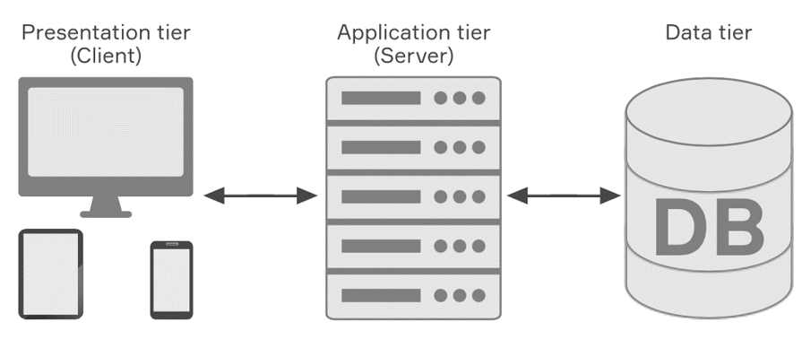
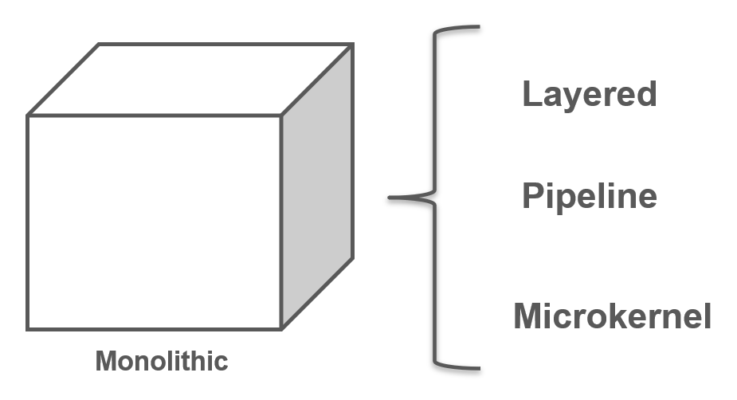
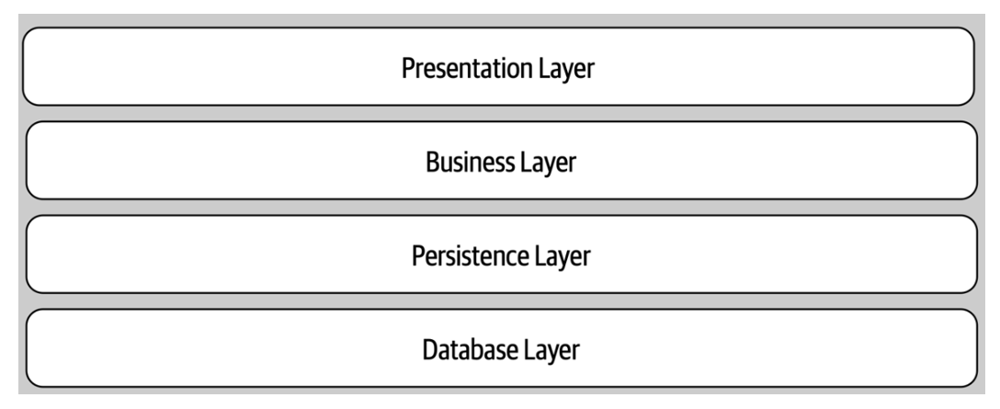
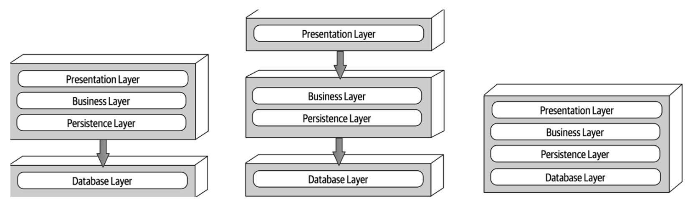
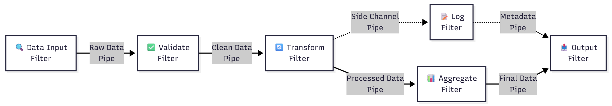
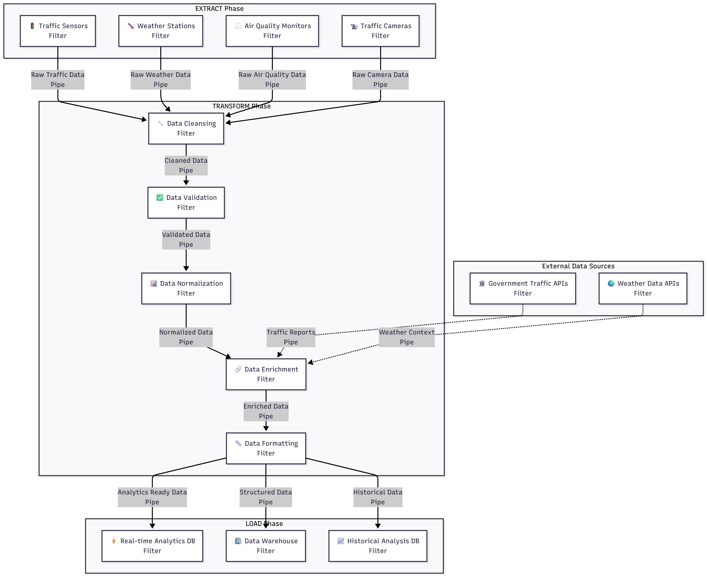

<!-- omit in toc -->
# Lecture 6 - Software Architectures Monolithic Approaches

<!-- omit in toc -->
## Lecture Information

| **Master's Degree** | Digital Automation Engineering (D.M.270/04)                                      |
|---------------------|----------------------------------------------------------------------------------|
| **Curriculum**      | Digital Infrastructure                                                           |
| **Course**          | Distributed IoT Software Architectures                                           |
| **Lecture Title**   | Software Architectures Monolithic Approaches                                     |
| **Author**          | Prof. Marco Picone (marco.picone@unimore.it)                                     |
| **License**         | [Creative Commons Attribution 4.0](https://creativecommons.org/licenses/by/4.0/) | 

<!-- omit in toc -->
# Table of Contents

- [6.1 Software Architecture - A Definition](#61-software-architecture---a-definition)
- [6.2 Software Architecture - Characteristics](#62-software-architecture---characteristics)
  - [6.2.1 Operational Characteristics](#621-operational-characteristics)
  - [6.2.2 Operational Architecture Characteristics \& DevOps](#622-operational-architecture-characteristics--devops)
  - [6.2.3 Structural Architecture Characteristics](#623-structural-architecture-characteristics)
  - [6.2.4 Cross-Cutting Architecture Characteristics](#624-cross-cutting-architecture-characteristics)
- [6.3 Extracting Software Architecture Characteristics](#63-extracting-software-architecture-characteristics)
- [6.4 Software Architecture Foundations](#64-software-architecture-foundations)
  - [6.4.1 Anti-Patterns - The Big Ball of Mud](#641-anti-patterns---the-big-ball-of-mud)
  - [6.4.2 Anti-Patterns - Additional Comments](#642-anti-patterns---additional-comments)
- [References](#references)
  
# 6.1 Software Architecture - A Definition

**Figure 6.1:** High-level representation of a multi-level Software Architectures.

Software Architecture is the **structured framework** used to conceptualize **software** **elements**, **relationships**, and **properties**. 
It involves a set of **design decisions** that define the **overall structure and behavior of a software system**, guiding its development and evolution.

---

# 6.2 Software Architecture - Characteristics

Architecture characteristics span a broad spectrum of concerns, from low-level code qualities to high-level operational behaviours. 
They are not universally standardized — organisations define and measure them according to context — and new terms and metrics constantly emerge as the ecosystem evolves.

- Core idea
  - Architecture characteristics are the measurable or observable properties that influence a system’s design, operation, maintenance, and evolution.
  - They represent trade-offs: improving one characteristic (e.g., **performance**) can impact others (e.g., **maintainability**).

- Common groups of characteristics
  - **Structural characteristics**
    - Focus on the system’s static organization: **modularity**, **cohesion**, **coupling**, **layering**, **component interfaces**.
    - Affect understandability, ease of change, and how responsibilities are decomposed.
  - **Operational characteristics**
    - Concern runtime behaviour and deployment: **scalability**, **elasticity**, **availability**, **reliability**, **performance**, **deployability**, **observability**.
    - Drive operational design choices (e.g., clustering, autoscaling, monitoring).
  - **Cross-cutting characteristics**
    - Apply across the whole system: **security**, **fault tolerance**, **logging**, **monitoring**, **configurability**, **interoperability**, **portability**.
    - Often enforced through common frameworks, policies, or platform services.

---

## 6.2.1 Operational Characteristics

Operational architecture characteristics define how a system behaves in production and under stress. They include measurable capabilities that guide design, deployment, and operational procedures.

- **Availability**
  - The proportion of time the system must be operational (e.g., 99.9%, 24/7).
  - Drives design choices: redundancy, failover, health checks, automated recovery.
  - Key considerations: Mean Time to Failure (MTTF), Mean Time to Repair (MTTR), service-level objectives (SLOs).

- **Continuity / Disaster Recovery**
  - Ability to maintain or restore critical services after a catastrophic event.
  - Includes backup strategy, off-site replication, Recovery Time Objective (RTO), and Recovery Point Objective (RPO).
  - Planning: runbooks (e.g., documentation), periodic DR (Disaster Recovery) drills, and failover validation.

- **Performance**
  - Response times, throughput, and resource utilization under expected and peak loads.
  - Requires capacity planning, stress and load testing, and profiling (CPU, memory, I/O, network).
  - Acceptance often requires dedicated test campaigns and SLAs (Service Level Agreements) for latency and throughput.

- **Recoverability**
  - How quickly and completely the system can be returned to operation after failure.
  - Impacts backup frequency, data integrity checks, and automated restore pipelines.
  - Measured by RTO/RPO and validated via restore exercises.

- **Reliability / Safety**
  - Consistency of service over time and whether failures cause unacceptable harms (financial, legal, or physical).
  - Determines need for fault-tolerant designs, graceful degradation, and safety-critical controls.
  - Validate through fault-injection testing and reliability growth tracking.

- **Robustness**
  - Ability to tolerate errors, edge cases, and partial infrastructure failures without catastrophic collapse.
  - Includes defensive coding, input validation, retry/backoff strategies, and circuit breakers.
  - Evaluated by chaos testing and error-rate monitoring.

- **Scalability**
  - Ability to maintain acceptable performance as load (users, requests, data) grows.
  - Includes vertical scaling (bigger resources) and horizontal scaling (more instances), and autoscaling policies.
  - Consider statelessness, sharding, load balancing, and capacity limits.

---

## 6.2.2 Operational Architecture Characteristics & DevOps

**Figure 6.2:** DevOps Phases.

Operational architecture characteristics overlap heavily with **operations** and **DevOps**, forming the practical bridge between design goals and production reality.

- **DevOps** — a combination of cultural practices, principles, and tooling that integrates **Development** and **Operations** to deliver software faster, more reliably, and at scale.

- Primary aims
  - **Collaboration**: cross-functional teams and shared ownership of code, infrastructure, and incidents.
  - **Automation**: reduce manual steps for builds, tests, deployments, and recovery.
  - **Faster feedback**: shorter feedback loops from production to development (metrics, logs, traces).
  - **Reliability & resilience**: build systems that meet SLOs (Service Level Objectives) and recover automatically.

- Core practices and techniques
  - **Continuous Integration / Continuous Delivery (CI/CD)** — automated build, test, and deploy pipelines to ensure safe, repeatable releases.
  - **Infrastructure as Code (IaC)** — versioned, reproducible infrastructure provisioning and configuration.
  - **Observability** — metrics, logs, and distributed tracing to diagnose behavior and validate SLOs.
  - **Testing & validation** — automated unit, integration, performance, and chaos/failure injection tests.
  - **Deployment strategies** — blue/green, canary, and automated rollbacks to reduce risk.
  - **Security automation (DevSecOps)** — automated scanning, secrets management, and compliance checks.

- How DevOps supports operational architecture characteristics
  - **Availability**: automated health checks, failover, and self-healing orchestrations driven by CI/CD and IaC.
  - **Scalability**: autoscaling policies, stateless design, and IaC enable predictable horizontal scaling.
  - **Performance**: performance testing in CI pipelines and production profiling inform capacity planning.
  - **Recoverability / Continuity**: repeatable backup/restore procedures, and tested recovery pipelines.
  - **Robustness & Reliability**: defensive coding, circuit breakers, retries, and chaos engineering exercises.
  - **Observability & Operability**: alerting tied to SLOs, dashboards, and runbooks enable faster detection and resolution.

- Organizational/cultural enablers
  - **Shift-left** testing and security practices; **shift-right** experimentation and progressive rollouts.
  - **Blameless postmortems** and continuous improvement from operational feedback.
  - Clear **SLOs/SLAs**, runbooks, and automated playbooks that connect architecture decisions to measurable operational outcomes.

- Common tooling categories (examples)
  - CI/CD servers, container registries, IaC frameworks, orchestration platforms, monitoring/observability stacks, and secret/configuration stores.

Together, DevOps practices operationalize architecture goals — turning non-functional requirements (availability, scalability, recoverability, performance, robustness) into automated, measurable, and repeatable processes.

---

## 6.2.3 Structural Architecture Characteristics

Architects are responsible for code and architecture quality — ensuring **modularity**, **controlled coupling**, **readability**, and other internal qualities that make a system maintainable, evolvable, and reliable.

- **Modularity**
  - Decomposition into well-defined, cohesive components with clear interfaces.
  - Enables independent development, testing, and deployment.

- **Controlled coupling**
  - Minimise and manage dependencies between modules (prefer abstractions, APIs).
  - Aim for loose coupling to reduce ripple effects from changes.

- **Readability / Code quality**
  - Clear, consistent code style, self-descriptive names, and documentation.
  - Facilitates onboarding, review, and maintenance.

- **Configurability**
  - Ability for users or operators to change behavior without code changes.
  - Examples: configuration files, feature flags, user-facing settings; pay attention to usability and validation.

- **Extensibility**
  - Ease of adding new features or components with minimal changes to existing code.
  - Patterns: plugins, extension points, well-defined APIs.

- **Installability**
  - Simplicity and reliability of installing the system on required platforms.
  - Includes packaging, installers, dependencies management, and clear installation docs.

- **Leverageability / Reuse**
  - Capacity to share components, libraries, and services across products.
  - Encourages common modules, versioning strategy, and documentation for reuse.

- **Localization**
  - Support for multiple languages, region-specific formats (dates, numbers, currencies), and multibyte character sets.
  - Design UI and data layers for easy translation and locale switching.

- **Maintainability**
  - Effort required to understand, fix, and enhance the system.
  - Measured by change lead time, number of artifacts to update, and clarity of tests and docs.

- **Portability**
  - Ability to run on different platforms, databases, or environments (e.g., Oracle vs MySQL, Windows vs Linux).
  - Minimise platform-specific assumptions and externalize platform bindings.

- **Supportability**
  - Facilities required for effective troubleshooting and support.
  - Includes logging, metrics, diagnostics, configurable verbosity, and runbooks for common issues.

- **Upgradeability**
  - Smooth migration path from one version to the next for servers and clients.
  - Consider data migrations, backward compatibility, and automated upgrade procedures.

Each characteristic should be tied to measurable criteria or acceptance checks (tests, metrics, documentation, or runbooks) so architectural decisions become verifiable and actionable.

---

## 6.2.4 Cross-Cutting Architecture Characteristics

Many architecture characteristics span multiple layers and concerns; these **cross‑cutting characteristics** should be treated as first‑class design constraints. 
Each item below includes a short definition, key design implications, and example acceptance checks.

- **Accessibility:** Access to all your users, including those with disabilities like colorblindness or hearing loss.
- **Archivability:** Will the data need to be archived or deleted after a period of time? (For example, customer accounts are to be deleted after three months or marked as obsolete and archived to a secondary database for future access.)
- **Authentication:** Security requirements to ensure users are who they say they are.
- **Authorization:** Security requirements to ensure users can access only certain functions within the application (by use case, subsystem, webpage, business rule, field level, etc.).
- **Legal:** What legislative constraints is the system operating in (data protection, Sarbanes Oxley, GDPR, etc.)? What reservation rights does the company require? Any regulations regarding the way the application is to be built or deployed?
- **Privacy:** Ability to hide transactions from internal company employees (encrypted transactions so even DBAs and network architects cannot see them).
- **Security:** Does the data need to be encrypted in the database? Encrypted for network communication between internal systems? What type of authentication needs to be in place for remote user access?
- **Supportability:** What level of technical support is needed by the application? What level of logging and other facilities are required to debug errors in the system?
- **Usability/Achievability:** Level of training required for users to achieve their goals with the application/solution. Usability requirements need to be treated as seriously as any other architectural issue.

For each characteristic, tie design choices to measurable acceptance criteria (tests, metrics, runbooks) and 
include them in architecture decision records so cross‑cutting concerns are verifiable and actionable.

---

# 6.3 Extracting Software Architecture Characteristics

**Figure 6.3:** Domain & Architecture Characteristics Extraction.

**- Start from the domain**
  - Describe what the system must do, who uses it, and when it is used.
  - Talk with stakeholders: product owners, users, operators, and experts to learn priorities and risks.

**- Capture and prioritize requirements**
  - List **functional needs** (features) and **non‑functional needs** (availability, speed, security, privacy, etc.).
  - Rank them by business impact. Example questions: Is uptime most important? Is low latency required? Is compliance mandatory?

**- Turn needs into measurable goals**
  - Convert priorities into clear targets: e.g. "99.9% uptime", "response <100 ms", "support 10k users", "RTO = 1 hour".
  - These targets become acceptance criteria for design and tests.

**- Make trade-offs explicit**
  - Note conflicts (e.g., stronger security can slow responses or cost more).
  - Decide and record acceptable compromises based on cost and risk.

**- Choose simple tactics that meet the goals**
  - Match tactics to goals: caching or CDNs for speed, auto‑scaling for load, encryption and IAM for security, regular backups for recoverability.
  - Prefer well‑understood, incremental changes that satisfy the measurable targets.

**- Validate and iterate**
  - Prototype and run simple tests: basic load tests, failure drills, and security scans.
  - Use monitoring and real incidents to adjust priorities and design.

**- Record decisions**
  - Keep short notes explaining: the business need → prioritized characteristics → measurable targets → chosen tactics.
  - Include runbooks or playbooks for operational steps (how to recover, who to call, what to monitor).

This simple loop (understand → prioritize → measure → choose → test → document) keeps architecture aligned with real needs and easy to review as requirements change.

---

# 6.4 Software Architecture Foundations

**Architecture styles** (or **architecture patterns**) are **named templates that describe how components are organized and how they interact**. 
They act as a communication shorthand among architects: **a single name conveys expected structure, common trade‑offs, deployment models, and typical data strategies**.

- What an architecture style gives you
  - A brief description of the system **topology** (how parts are arranged).
  - Typical **characteristics** that tend to be strong (benefits) and weak (costs).
  - Common **deployment** and **data** approaches you can expect.
  - A shared vocabulary so teams can reason quickly about design decisions.

- How to read a style in practice
  - When someone says "**layered monolith**", they implicitly communicate structure, maintainability trade‑offs, deployment simplicity, and where scaling or coupling issues may appear.
  - Treat the style as a starting point, not an exact blueprint: details and constraints matter.

- Choosing and using a style
  - Start from **requirements** (functional and non‑functional).
  - List expected **benefits** and known **trade‑offs** for each candidate style.
  - Consider **deployment**, **data ownership**, **scalability**, and **operational** needs before committing.
  - Mix and adapt patterns where useful, and record rationale in design notes or decision records.

---

## 6.4.1 Anti-Patterns - The Big Ball of Mud

**Figure 6.4:** The Big Ball of Mud Anti-Pattern.

In Software Architecture there is the anti-pattern denoted as "**Big Ball of Mud**" defined in a paper released in 1997 by Brian Foote and Joseph Yoder

It refers to a system or application that :

- lacks a clear, organized architectural structure
- is characterized by a chaotic and unstructured design

This term is often used to describe systems that **have evolved over time without a clear architectural plan**, resulting in a tangled and **hard-to-maintain codebase**.

In particular, a "Big Ball of Mud" typically exhibits the following characteristics:

- **Lack of Modularity:** Components and modules are tightly interwoven, making it difficult to isolate and update individual parts without affecting the entire system.
- **No Clear Separation of Concerns:** Functionalities and concerns are mixed throughout the codebase, leading to a lack of clear organization and abstraction.
- **High Coupling:** Components are highly dependent on each other, increasing the complexity of the system and making it challenging to make changes without unintended consequences.
- **Low Cohesion:** Code with low cohesion lacks a clear, focused purpose within a module, making it harder to understand and maintain.
- **Ad Hoc Design:** The system often evolves without a formal architectural plan. Design decisions are made reactively, leading to a structure that emerges organically rather than through intentional design.
- **Difficulty in Maintenance:** Due to the lack of structure and organization, maintaining and extending a "Big Ball of Mud" becomes increasingly difficult over time.
- **Prone to Bugs and Errors:** The lack of architectural clarity can result in unintended consequences when making changes, leading to a higher likelihood of introducing bugs and errors.

To avoid the "Big Ball of Mud" anti-pattern, it is essential to prioritize **good architectural practices**, such as **modularity**, **separation of concerns**, and **clear design principles**. Regular refactoring and architectural reviews can help maintain a clean and organized codebase.

---

## 6.4.2 Anti-Patterns - Additional Comments

**Figure 6.4:** The simple "representation" of Spaghetti Code.

Anti-pattern labels like the **Big Ball of Mud**, **Spaghetti code** (when code is tangled and hard to follow) are diagnostic tools — **not personal criticisms**. They point out structural and process problems that occur when a system evolves without a clear architectural vision.

- Purpose
  - **Diagnose** structural decay and risks to maintainability and scalability.
  - **Emphasize issues**, not blame developers or intentions.

- Common causes
  - **Lack of intentional design** or documented architectural decisions.
  - **Accumulated technical debt** from short-term fixes.
  - **Poor modularity** and missing separation of concerns.
  - **Insufficient tests, refactoring, or CI practices**.
  - **Organizational factors**: time pressure, unclear ownership, or missing incentives.

- Consequences
  - Lower **maintainability** and slower feature delivery.
  - Higher **bug rates** and increased cost of change.
  - Difficult **onboarding** and reduced developer productivity.

- Prevention and remediation (practical tactics)
  - Establish **intentional design**: capture architecture decision records and constraints.
  - Enforce **modularity**: clear components, interfaces, and boundaries.
  - Commit to **continuous refactoring** and scheduled technical‑debt reduction.
  - Use **testing & CI** to enable safe changes and regressions detection.
  - Apply **code reviews** and periodic architecture reviews.
  - Measure and monitor: metrics for **coupling**, **complexity**, and **test coverage** to prioritize work.
  - Clarify **ownership** and provide runbooks for operational stability.

- **Goals**
  - Turn anti-pattern signals into action so systems become **maintainable**, **scalable**, and **evolvable**.
  - Software architects aim to avoid or refactor "Big Ball of Mud" situations through design, tooling, and process improvements.

---

## 6.4.3 Simple Patterns - Unitary Architecture

Unitary Architecture describes systems where the entire software runs as a single, **tightly-coupled deployment on one machine or hardware platform**.

- Background / evolution
  - When software began, it ran on the same physical machine that provided computing resources — the software and hardware were effectively a single entity.
  - Over time, hardware and software responsibilities split as needs grew:
    - **Mainframes** moved toward separate data systems and storage subsystems.
    - **Personal computers** began as single-host applications; networking later enabled client/server and distributed architectures.
  - Today, Unitary Architecture remains common where constraints or simplicity make a single-host design appropriate.

- Core characteristics
  - **Single-host / monolithic** deployment: one executable or tightly-coupled process set.
  - **Simple deployment and testing**: fewer moving parts, easier to install and debug.
  - **Low operational overhead**: limited orchestration, fewer services to monitor.
  - **Limited scalability**: vertical scaling (bigger hardware) only; horizontal scaling is difficult.
  - **Tight coupling and low fault isolation**: failures can more easily affect the whole system.
  - **Easier data sharing**: in-process data access avoids network serialization and latency.

- Typical use cases
  - **Embedded systems** and firmware with strict resource constraints.
  - **Real-time systems** where predictable latency is critical.
  - Small applications, prototypes, or tools where simplicity and fast delivery matter.
  - Legacy systems that predate distributed paradigms.

- When to choose Unitary Architecture
  - Resource-constrained environments (CPU, memory, storage).
  - Hard real-time or deterministic latency requirements.
  - Projects prioritizing minimal operational complexity and fast time-to-market.

- When to move away / reasons to split
  - Need for greater **scalability** (support many users or high throughput).
  - Desire for independent **deployability** and faster, safer releases.
  - Improving **maintainability** by applying separation of concerns and reducing coupling.
  - Increasing **reliability** and fault isolation across components.

- Practical evolution
  - Common path: Unitary (monolith) → modular monolith (clear boundaries) → distributed architecture (services/microservices) as requirements for **performance**, **scale**, and operability grow.

---

## 6.4.4 Simple Patterns - Client Server Architecture

**Client–server (two‑tier)** architecture separates a system into **clients** (frontends) and a central **server** (backend). Core concepts and practical notes:

- Core idea
  - **Clients** send **requests**; the **server** processes requests, accesses or updates data, and returns **responses**.
  - Also called **two‑tier**: **frontend** (UI, input) vs **backend** (business logic, storage).

- Common variants
  - **Thin client**: minimal logic on client, most processing on server.
  - **Fat client**: significant business logic runs on the client.
  - **Multi‑tier evolution**: add app servers, DB servers, caches, proxies or load balancers between client and data store.

- State handling
  - **Stateless** servers: each request independent — easier to scale.
  - **Stateful** servers: sessions or in‑memory state — simpler semantics but harder to scale/failover.

- Benefits
  - **Simplicity** and clear responsibility split.
  - **Centralized control** of data, security, and business rules.
  - Easier to enforce policies, backups, and authorization.

- Trade‑offs / limitations
  - Potential **single point of failure** unless servers are replicated.
  - **Scalability** constrained by server capacity (mitigated by clustering, load balancing, caching).
  - Network **latency** and dependence on connectivity for remote clients.
  - Tight coupling to server APIs can complicate client diversity.

- Operational considerations
  - Use **load balancers**, **replication**, and **caching** to improve availability and performance.
  - Design clear **APIs** (REST, gRPC, WebSocket) and explicit **session management** strategies.
  - Monitor server health, scale horizontally when needed, and plan failover/runbooks.

- Typical use cases and evolution
  - Widely used for web apps, mobile backends, enterprise systems, and legacy monoliths.
  - Often evolves into **multi‑tier** or **distributed/microservices** architectures as scalability, modularity, or independent deployability become priorities.

---

## 6.4.5 Simple Patterns - Three-Tier Architecture

**Figure 6.5:** Schematic representation of Three-Tier Architecture.

The **Three‑Tier Architecture** is a canonical layered pattern popularized in the late 1990s that separates concerns into three distinct tiers to improve maintainability, scalability, and testability.
Each tier has a clear responsibility and communicates with adjacent tiers via well‑defined interfaces or APIs.

- **Presentation Tier** (UI / client)
  - Role: the user interface and communication layer that displays information and collects input from users.
  - Responsibilities:
    - Render views and handle user interactions.
    - Validate user input and provide client‑side feedback.
    - Forward requests to the Application Tier and display responses.
  - Typical technologies: **HTML**, **CSS**, **JavaScript** (web); native or cross‑platform frameworks for desktop/mobile GUIs.
  - Concerns: usability, accessibility, security (input sanitization), and responsiveness.

- **Application Tier** (Logic / middle tier)
  - Role: the core of the system where business rules, workflows, and application logic are executed.
  - Responsibilities:
    - Process and validate requests from the Presentation Tier.
    - Enforce business rules, orchestrate transactions, and apply domain logic.
    - Expose APIs (REST, gRPC, etc.) to the Presentation Tier and manage communication with the Data Tier.
  - Typical technologies: **Java**, **Python**, **C#**, **Ruby**, **PHP**, or other server platforms and frameworks.
  - Concerns: scalability (horizontal scaling, statelessness), security (authentication/authorization), performance, and observability.

- **Data Tier** (Database / storage)
  - Role: persistent storage and data management layer that stores and serves application data.
  - Responsibilities:
    - Provide durable storage, indexing, querying, and transactional guarantees as required.
    - Enforce data integrity, backups, and migrations.
  - Typical technologies: relational DBMS (**PostgreSQL**, **MySQL**, **SQL Server**) or NoSQL stores (**MongoDB**, **Cassandra**, etc.).
  - Concerns: consistency, availability, backup/restore, scaling (sharding/replication), and data security (encryption, access control).

- Cross‑tier considerations
  - Communication: typically synchronous API calls between Presentation ↔ Application and Application ↔ Data; consider async patterns (message queues, event streams) when decoupling is required.
  - Deployment: tiers can be co‑located or independently deployed/scaled depending on needs (e.g., separate app servers, DB cluster).
  - Trade‑offs: clearer separation and independent scaling vs. extra operational complexity and potential latency between tiers.
  - Best practices: define stable APIs, keep the Application Tier stateless when possible, secure every boundary, and instrument for observability and performance.

---

## 6.4.6 Software Architecture - Main Categories

Architecture styles are commonly grouped into two main categories:

- **Monolithic**
  - Definition: a single, self-contained application where all components run in the same process and typically share the same codebase and datastore.
  - Key characteristics:
    - **Single deployable unit** — one executable or process set.
    - **Shared codebase and storage** — simple data access and in-process integration.
    - **Simple development & deployment** — easier local debugging, testing, and CI pipelines.
    - **Limited horizontal scalability** — typically relies on vertical scaling; scaling the whole app even for small changes.
    - **Stronger coupling** — changes can have wide impact; large releases can be riskier.
  - Typical use cases: small apps, prototypes, embedded or real‑time systems, and projects where operational simplicity is a priority.

- **Distributed**
  - Definition: an application composed of multiple independent components or services that run on different machines and communicate over a network.
  - Key characteristics:
    - **Independent deployability** — services can be updated and scaled separately.
    - **Horizontal scalability** and **fault isolation** — scale parts of the system independently and contain failures.
    - **Networked communication** — introduces latency, partial failures, and serialization/compatibility concerns.
    - **Operational complexity** — needs service discovery, orchestration, monitoring, and robust deployment practices.
    - **Data partitioning & consistency trade-offs** — requires explicit strategies for consistency, replication, and transactions.
  - Typical use cases: cloud-native systems, high‑scale web services, IoT backends, and applications requiring independent scaling and rapid evolution.

- Common observations
  - **Trade-offs:** monoliths favor simplicity; distributed systems favor scalability and isolation at the cost of complexity.
  - **Shared challenges for distributed systems:** network faults and latency, partial failures, distributed transactions, consistency models, distributed testing, observability and tracing, deployment and configuration management, and security across boundaries.
  - Many real systems occupy intermediate positions (e.g., modular monoliths, service-oriented architectures) — choose the style driven by measurable requirements (scalability, availability, team structure, operational capability).

**Note:** **While no classification scheme is perfect**, distributed architectures all share a common set of challenges and issues not found in the monolithic architecture styles, making this classification scheme a good separation between the various architecture styles.

---

# 6.5 Software Architecture - Monolithic

**Figure 6.5:** A group of monolithic architecture styles.

In this class we examine three main common monolithic architecture styles, summarizing their intent, core characteristics, trade‑offs, and typical uses.

- **Layered architecture:** organize the system into stacked layers (e.g., Presentation → Application → Domain → Infrastructure) with well‑defined dependencies between adjacent layers.
- **Pipeline (pipes-and-filters) architecture:** process data through a sequence of stages (filters) connected by pipes inside a single process; each stage transforms or filters the data.
- **Microkernel (plug‑in) architecture:** a small core (microkernel) provides minimal runtime and extension points; features are implemented as plug‑ins or modules that run in the same process.

**Summary:** all three are monolithic deployment styles that favor a single process for simplicity and low operational overhead. Choose based on the primary goals (separation and testability → layered; streamlined data flow → pipeline; extensibility and plugins → microkernel) and weigh their performance, complexity, and maintainability trade‑offs.

---

## 6.5.1 Monolithic Software Architecture - Layered Architecture

**Figure 6.6:** N-Tier Layered Architecture with the main classic layers.

The **layered (n‑tier)** architecture is a widely adopted, pragmatic pattern for business applications. 
It organizes functionality into stacked layers (e.g., Presentation → Business/Domain → Persistence → Data), **each with a focused responsibility**.

- **Why it’s common**
  - **Familiar**: maps naturally to common team roles (UI, backend, rules, DB experts).
  - **Low friction**: easy to design, understand, test, and deploy.

- **Key benefits**
  - **Separation of concerns** — each layer has a clear responsibility.
  - **Maintainability & testability** — smaller, focused modules simplify changes and testing.
  - **Reuse & clarity** — stable interfaces between layers encourage reuse and clearer ownership.

- **When to choose**
  - Projects that require clear responsibilities, predictable delivery, and moderate scalability needs.

- **Trade-offs**
  - Can introduce extra latency and rigid boundaries; large systems may need modularization or a move toward distributed patterns as requirements grow.

---

## 6.5.1.1 Layered Architecture - Topology

**Figure 6.7:** Different Topologies in N-Tier Layered Architecture.

- **Topology overview**  
  Components are grouped into horizontal **layers**, each with a focused responsibility. There is no fixed number of layers, but the most common logical layers are: **Presentation**, **Business**, **Persistence**, and **Database**. Small systems may merge layers (3-layer), while large systems can have 5+ layers.

- **Typical deployment variants (physical topology)**  
  - **Monolithic deployment (app only)**: Presentation, Business and Persistence deployed as a single unit; Database is external (DB server or filesystem).  
  - **Separated UI**: Presentation deployed independently; Business + Persistence deployed together; Database external.  
  - **Single-package with embedded DB**: All four layers deployed together (useful for small apps or when using an embedded/in-memory DB).  
  - **Fully separated tiers**: Presentation, Business and Persistence each deployed independently, communicating via APIs; Database hosted separately.  
  - Choose the variant that balances operational simplicity, scalability needs, and fault isolation.

- **Layer responsibilities (concise)**  
  - **Presentation**: UI, input validation, rendering, and client-side orchestration.  
  - **Business**: Enforce business rules, workflows, calculations and orchestration of domain logic.  
  - **Persistence**: Data access patterns, mapping domain objects to storage, queries and transactions.  
  - **Database**: Durable storage, indexing, consistency and backups.

- **Separation of concerns — practical effect**  
  - Each layer abstracts work for the layer above it: the Presentation doesn’t know how customer data is retrieved; the Business layer doesn’t know how data is formatted for display.  
  - This enables focused expertise, clearer tests, and easier maintenance of each concern.

- **Benefits and trade-offs**  
  - Benefits: **clarity**, **testability**, **reuse**, and clear ownership boundaries.  
  - Trade-off: potentially reduced **agility** when cross-layer changes are frequent and deployments are coarse-grained.

- **Guideline**  
  - Define measurable boundaries and interfaces between layers, and pick a deployment topology that matches your scalability, operational, and delivery requirements.

---

## 6.5.1.2 Layered Architecture - Discussion

The layered architecture is an effective, low‑cost starting point for many projects. Key points:

- When to choose
  - Good for **small or simple applications**, prototypes, or websites.
  - Appropriate when **time** and **budget** are tight or requirements are uncertain.
  - Useful as a starting architecture while the domain and priorities are still being analyzed.

- Strengths
  - **Simplicity** and familiarity reduce onboarding and development friction.
  - Clear **separation of concerns** (presentation, business, persistence) aids understanding and testing at layer level.
  - Enables fast delivery and straightforward local debugging.

- Limitations (as the system grows)
  - **Maintainability**, **agility**, **testability**, and **deployability** can degrade as the codebase expands.
  - Tends to produce **tighter coupling** and **larger deployable units**, increasing risk and MTTR.
  - Not well suited for high horizontal scalability or independent component releases.

- Practical guidance
  - Start with layered when appropriate, but define clear module boundaries and keep code modular.
  - Monitor growth and technical debt; plan an incremental migration (modular monolith → services) if scaling, independent deployability, or reliability needs increase.

---

## 6.5.1.3 Layered Architecture - Rating

- **Summary:** Layered (monolithic) architectures favor simplicity and low cost but trade off deployability, scalability, and fault isolation.

- Key points
  - **Strengths**
    - **Simplicity:** Easy to understand, develop, and operate.
    - **Low cost:** Fewer moving parts and lower operational overhead.
  - **Deployability & testability**
    - **Low:** Any small code change typically requires redeploying the whole unit; changes are often bundled, increasing risk.
  - **Scalability & elasticity**
    - **Low:** Monolithic deployment limits horizontal scaling. Per-function scaling is possible but requires complex techniques (multithreading, internal messaging), which are awkward to implement and maintain.
  - **Performance**
    - **Low–Medium:** Not naturally suited for high parallelism; caching and concurrency can help but demand extra engineering.
  - **Reliability, fault tolerance & availability**
    - **Reliability:** Medium — benefits from lack of network complexity but still vulnerable to monolithic failure modes.
    - **Fault tolerance:** Low — a single component failure (e.g., OOM - Out Of Memory) can crash the entire application.
    - **Availability / MTTR (Mean Time To Recovery):** Medium–Low — long startup and recovery times increase mean-time-to-recovery (the time it takes to restore service after a failure) and availability risk.
  - **Operational implication**
    Suitable for small to medium systems, prototypes, or constrained environments. Monitor growth and plan modularization or service extraction before scale or availability requirements force risky rewrites.

    | Characteristic             | Rating       | Definition                                                             |
    |----------------------------|--------------|------------------------------------------------------------------------|
    | Simplicity                 | High         | Ease of understanding, building, and operating the system.             |
    | Cost                       | Low          | Development and operational expenses required to run the system.       |
    | Deployability              | Low          | Ease and granularity of packaging and releasing updates.               |
    | Testability                | Low          | Ease of writing, executing, and isolating automated tests.             |
    | Reliability                | Medium       | Consistency of correct behavior over time under normal conditions.     |
    | Elasticity / Scalability   | Low          | Ability to adjust capacity to meet variable load (horizontal scaling). |
    | Performance                | Low–Medium   | Typical throughput and latency characteristics under expected load.    |
    | Fault tolerance            | Low          | Ability to tolerate component failures without systemic collapse.      |
    | Availability / MTTR        | Medium–Low   | Expected uptime and average time to recover from failures.             |

---

# 6.6 Software Architecture - Pipeline 

**Figure 6.8:** An example of Pipeline Architecture.

The Pipeline architecture arranges processing as a linear sequence of stages (filters) connected by pipes. Each stage performs a focused operation on the data and forwards the result to the next stage.

- **Structure**
  - Stages (filters): self-contained units that perform one well-defined task.
  - Pipes: unidirectional channels that carry data between stages.
  - Data flows sequentially through the pipeline, enabling streaming or batch processing.

- **Key properties**
  - **Single responsibility:** each stage has a narrow, testable purpose.
  - **Separation of concerns:** logic is decomposed across stages, improving clarity and reuse.
  - **Parallelism:** independent stages (or multiple instances of a stage) can run concurrently to increase throughput.
  - **Composability:** pipelines are easy to build, extend, and rearrange by composing stages.

- **When to use**
  - High-throughput data processing (ETL, stream analytics).
  - Multimedia processing (audio/video encoding, transforms).
  - Network packet processing and protocol stacks.
  - Any workload that can be expressed as an ordered series of transformations.

- **Benefits**
  - Improved performance and scalability via parallelism and pipelining.
  - Better maintainability and testability due to small, isolated stages.
  - Predictable data flow and easier reasoning about processing steps.

- **Considerations**
  - Requires handling backpressure, buffering, and failure propagation between stages.
  - Ordering constraints may limit some optimizations; careful design needed for stateful operations.
  - Monitoring and instrumentation are important to diagnose bottlenecks.

Overall, pipeline architecture is ideal when tasks can be decomposed into ordered, independent transformations that benefit from streaming and parallel execution.

---

## 6.6.1 Pipeline Architecture - Components 

- **Pipeline components — overview**
  - The pipeline is built from two primary elements: **pipes** (channels) and **filters** (processing stages). Design for small, well‑defined messages and composable, focused logic.

- **Pipes**
  - Unidirectional, point‑to‑point channels connecting one filter's output to the next filter's input.
  - Carry arbitrary payloads, but prefer compact, serialized formats for performance and low latency.
  - Responsibilities: buffering, backpressure handling, and reliable delivery between stages.

- **Filters**
  - Self‑contained processing units with a single responsibility; prefer stateless implementations so they can scale or be replicated.
  - Complex behavior is composed by chaining multiple filters rather than embedding multiple tasks in one.
  - Typical filter types:
    - **Producer (Source):** generates or ingests data and pushes it into the pipeline (outbound only).
    - **Transformer (Map):** reads input, transforms or enriches data, then forwards the result.
    - **Tester (Filter):** evaluates criteria and conditionally forwards or drops items based on the test.
    - **Consumer (Sink):** terminal stage that materializes results (persist, emit, or render).

- **Design notes**
  - Keep filter interfaces small and explicit to ease composition and testing.
  - Address failure modes: retries, dead‑letter handling, and observability per stage.
  - Optimize for parallelism by allowing independent instances of stateless filters to run concurrently.

---

## 6.6.2 Pipeline Architecture & ETL Processing

ETL is the pipeline that makes data usable (e.g., IoT) for analytics and control: **Extract** raw telemetry, **Transform** it into consistent, enriched, and validated records, then **Load** it into a data store for real‑time or historical use.

- **Context (Smart City example)**
  - Sources: traffic sensors, weather stations, air‑quality monitors, cameras.
  - Goal: optimize traffic flow and reduce pollution via analytics and automated actions.

- **Extract**
  - Ingest telemetry (counts, temperatures, pollution indices, timestamps) from heterogeneous devices and protocols.
  - Support batch and streaming ingestion; handle variable arrival rates and intermittent connectivity.

- **Transform**
  - Normalize formats and units (e.g., Celsius → standardized unit, or convert to SenML).
  - Cleanse and validate (fill/drop missing values, remove spikes, correct timestamps).
  - Enrich with external data (map data, traffic reports, weather feeds) and derive features (rolling averages, anomaly flags).
  - Address schema evolution and add metadata (device id, location, ingestion time).

- **Load**
  - Persist into the chosen storage (time-series DB, data warehouse, data lake) optimized for queries and retention policies.
  - Provide both real‑time streams for control (e.g., adaptive signal timing) and historical stores for trend analysis and reporting.

- **Key operational notes**
  - Ensure observability, backpressure handling, and error handling (dead‑letter queues, retry policies).
  - Define acceptance criteria (latency targets, data completeness, schema conformity) and automate tests.

ETL turns messy IoT telemetry into reliable, analyzable data that powers real‑time decisions and long‑term insights.

---

## 6.6.2 An IoT ETL Example

**Figure 6.9:** An IoT oriented ETL pipeline example.

This Smart City IoT ETL Pipeline demonstrates the Pipeline (Pipes-and-Filters) architecture applied to real-world data processing. The diagram shows how raw IoT telemetry flows through a series of specialized filters connected by pipes to transform messy sensor data into actionable insights.

Architecture Highlights:
🔄 Extract Phase: Multiple Producer filters (traffic sensors, weather stations, air quality monitors, cameras) generate raw data streams that feed into the pipeline.

⚙️ Transform Phase: A sequence of Transformer filters process the data:

Data Cleansing removes corrupted/duplicate records
Data Validation ensures quality standards
Data Normalization converts to standardized formats (SenML)
Data Enrichment combines with external APIs for context
Data Formatting structures data for target systems
📊 Load Phase: Consumer filters materialize results into different storage systems optimized for specific use cases (real-time analytics, historical analysis, data warehousing).

Pipeline Benefits Realized:
Single Responsibility: Each filter has one focused task (cleanse, validate, normalize)
Composability: Filters can be rearranged or new ones added easily
Parallelism: Multiple instances of stateless filters can run concurrently
Fault Isolation: Failures in one stage don't crash the entire pipeline
Scalability: Individual stages can be scaled based on bottlenecks
This approach transforms the chaotic reality of heterogeneous IoT data into reliable, analyzable information that powers Smart City applications like traffic optimization and pollution reduction.

---

# References

- MQTT - [http://mqtt.org/](http://mqtt.org/)
- HiveMQ - MQTT Essentials - [https://www.hivemq.com/blog/](https://www.hivemq.com/blog/)
- Mosquito MQTT Bridge Mode - [http://www.steves-internet-guide.com/mosquitto-bridge-configuration/](http://www.steves-internet-guide.com/mosquitto-bridge-configuration/)
- Difference Between AMQP & MQTT - [https://www.educba.com/amqp-vs-mqtt/](https://www.educba.com/amqp-vs-mqtt/)
- Introduction to RabbitMQT - [https://www.cloudamqp.com/blog/2015-05-18-part1-rabbitmq-for-beginners-what-is-rabbitmq.html](https://www.cloudamqp.com/blog/2015-05-18-part1-rabbitmq-for-beginners-what-is-rabbitmq.html)
- RabbitMQT - [https://www.rabbitmq.com/](https://www.rabbitmq.com/)
- AMQP & RabbitMQT - Routing and Exchanges - [https://www.cloudamqp.com/blog/2015-09-03-part4-rabbitmq-for-beginners-exchanges-routing-keys-bindings.html](https://www.cloudamqp.com/blog/2015-09-03-part4-rabbitmq-for-beginners-exchanges-routing-keys-bindings.html)

