<!-- omit in toc -->
# Lecture 8 - Microservices Software Architectures

<!-- omit in toc -->
## Lecture Information

| **Master's Degree** | Digital Automation Engineering (D.M.270/04)                                      |
|---------------------|----------------------------------------------------------------------------------|
| **Curriculum**      | Digital Infrastructure                                                           |
| **Course**          | Distributed IoT Software Architectures                                           |
| **Lecture Title**   | Microservices Software Architectures                                             |
| **Author**          | Prof. Marco Picone (marco.picone@unimore.it)                                     |
| **License**         | [Creative Commons Attribution 4.0](https://creativecommons.org/licenses/by/4.0/) | 

<!-- omit in toc -->
# Table of Contents

- [8.1 Microservices Software Architectures - Introduction](#81-microservices-software-architectures---introduction)
- [8.2 Microservices Architecture - Definitions and Citations](#82-microservices-architecture---definitions-and-citations)
- [8.3 Microservices Architecture - Benefits \& Drawbacks](#83-microservices-architecture---benefits--drawbacks)
- [8.4 Monolithic vs Microservices Architecture - How to start ?](#84-monolithic-vs-microservices-architecture---how-to-start-)
- [8.5 Microservices \& Data Management](#85-microservices--data-management)
- [8.6 API Gateway Pattern](#86-api-gateway-pattern)
  - [8.6.1 Microservices Architecture - Benefits \& Drawbacks Summary](#861-microservices-architecture---benefits--drawbacks-summary)
  - [8.6.2 API Gateway Pattern - Modules \& Functionalities](#862-api-gateway-pattern---modules--functionalities)
  - [8.6.3 API Gateway Pattern - Backend for Frontend (BFF) Variation](#863-api-gateway-pattern---backend-for-frontend-bff-variation)
- [8.7 IoT Microservices Architecture - Example](#87-iot-microservices-architecture---example)
- [8.8 Microservices \& Scalability](#88-microservices--scalability)
  - [8.8.1 X-Axis Scaling](#881-x-axis-scaling)
  - [8.8.2 Y-Axis Scaling](#882-y-axis-scaling)
  - [8.8.3 X-Axis \& Y-Axis Scaling](#883-x-axis--y-axis-scaling)
  - [8.8.4 Z-Axis Scaling](#884-z-axis-scaling)
  - [8.8.5 Combining the Three Axes](#885-combining-the-three-axes)
- [8.9 Microservices - Virtual Machine \& Containerization](#89-microservices---virtual-machine--containerization)
  - [8.9.1 Microservices - Deployment Options](#891-microservices---deployment-options)
- [8.10 Microservices Design Patterns](#810-microservices-design-patterns)
  - [8.10.1 Sidecar Pattern (Single Node)](#8101-sidecar-pattern-single-node)
  - [8.10.2 Load Balancer Pattern (Multi-Node)](#8102-load-balancer-pattern-multi-node)
- [References](#references)

# 8.1 Microservices Software Architectures - Introduction

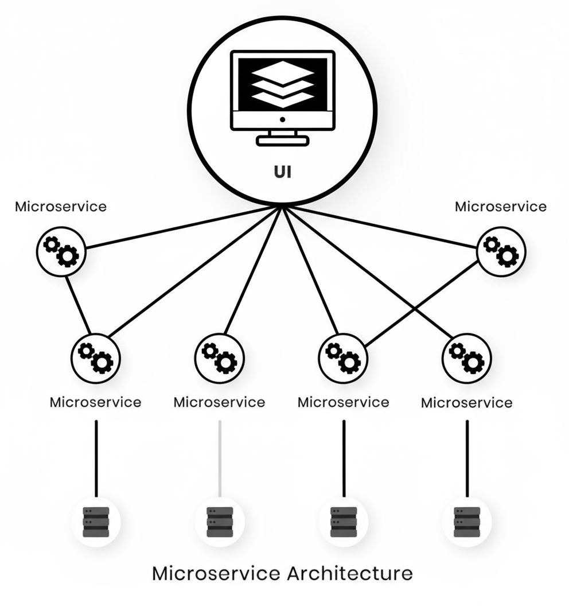

**Figure 8.1:** High-level overview of a Microservices Architecture.

**Microservices architecture** is a service-oriented approach that structures applications as a collection of **loosely coupled, autonomous services** rather than a single monolithic codebase.

**Key characteristics:**

- **Decomposition**: Applications are split into small, independent services that communicate over well-defined APIs
- **Autonomy**: Each microservice operates independently with its own business logic, data storage, and deployment cycle
- **Technology diversity**: Services can use different architectures, frameworks, and adapters based on their specific needs
- **Communication patterns**: Services interact through:
  - **REST APIs** for synchronous request-response
  - **RPC (Remote Procedure Call)** for direct service invocation
  - **Message-based protocols** for asynchronous communication
- **Interface types**: Services may expose various interfaces including APIs for backend communication or web UIs for user interaction

---

# 8.2 Microservices Architecture - Definitions and Citations

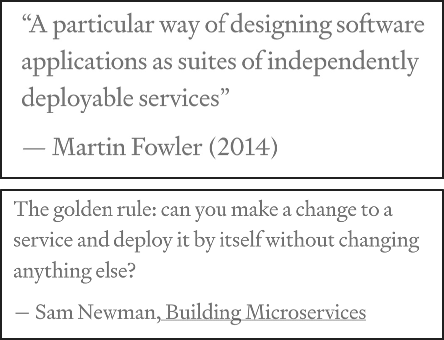

**Figure 8.2:** Definitions and citations related to Microservices Architecture.

**Core Principle**: Microservices architecture requires **independent, modular components** to be effective.

**Key considerations:**

- **Without modularity**: Systems become tightly coupled and low-cohesion "Frankensteins" that are difficult to:
  - Develop and deliver
  - Deploy and run
  - Maintain and evolve

- **Primary design goal**: Each service should solve its **specific business capability** in the most optimal way possible

- **Independence is critical**: True microservices must operate autonomously without creating unnecessary dependencies that negate architectural benefits

---

# 8.3 Microservices Architecture - Benefits & Drawbacks

**Benefits:**

- **Decomposition & Manageability**: Applications are broken into smaller, focused services that are faster to develop, easier to understand, and simpler to maintain
- **Independent Development**: Each service can be developed by a dedicated team working autonomously on their specific business capability
- **Technology Flexibility**: Teams can choose the most appropriate technology stack for each service without being constrained by legacy decisions
- **Independent Deployment**: Services can be deployed separately, enabling continuous deployment practices even for complex applications
- **Granular Scalability**: Each service can be scaled independently based on its specific resource requirements and load patterns

**Drawbacks:**

- **Increased Complexity**: Operating a distributed system introduces inherent challenges in network communication, error handling, and service coordination
- **Distributed Data Management**: Each service maintains its own database, making cross-service transactions and data consistency significantly more complex
- **Testing Overhead**: Testing requires coordinating multiple services, managing dependencies, and validating integration points across the distributed system
- **Coordinated Changes**: Multi-service updates demand careful planning, versioning strategies, and synchronized rollout procedures to maintain system stability
- **Deployment Complexity**: Managing numerous service instances requires sophisticated orchestration for configuration, deployment, scaling, and monitoring operations

---

# 8.4 Monolithic vs Microservices Architecture - How to start ?

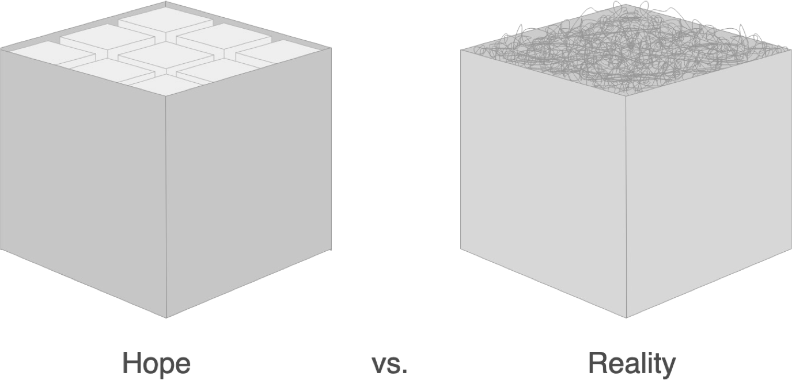

**Figure 8.3:** Hope vs Reality when starting with Microservices ([Source-Link](https://martinfowler.com/articles/dont-start-monolith.html)).

You can begin designing a monolithic application with a set of well-defined, smaller services that are integrated into the larger system, ready to be extracted for a transition to a microservices architecture. 

However, in practice, it is challenging to avoid creating numerous connections—both planned and unplanned. The essence of the microservices approach is to minimize such dependencies.

**Key Considerations:**

- **Subsystem Independence**: If the project is substantial, consider the subsystems you are building and aim to develop them as independently as possible.
- **Early Separation**: From the outset, adopt a strategy that divides your system into smaller components, treating each as a distinct entity with:
  - Its own development cycle
  - Its own deployment cycle
  - Its own internal architecture

This approach is a powerful concept that facilitates delivery, maintenance, and extension of the system.

Sometimes Microservices can be really complex in particular for big companies as Amazon and Netflix as depicted in the following figure.

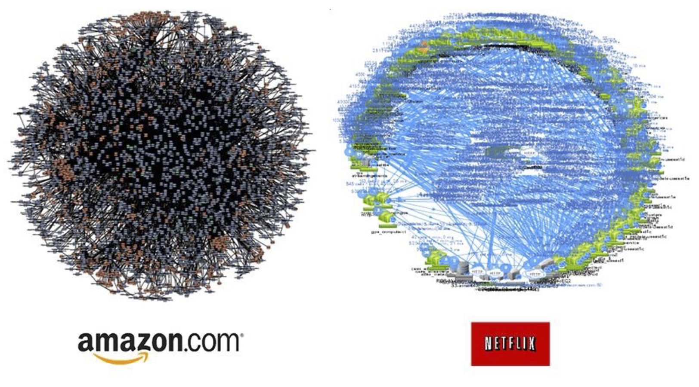

**Figure 8.4:** Some (Super) Complex Microservices Examples ([Source-Link](https://www.linkedin.com/pulse/find-your-path-death-star-microservices-architecture-van-der-schaaf/)).

---

# 8.5 Microservices & Data Management

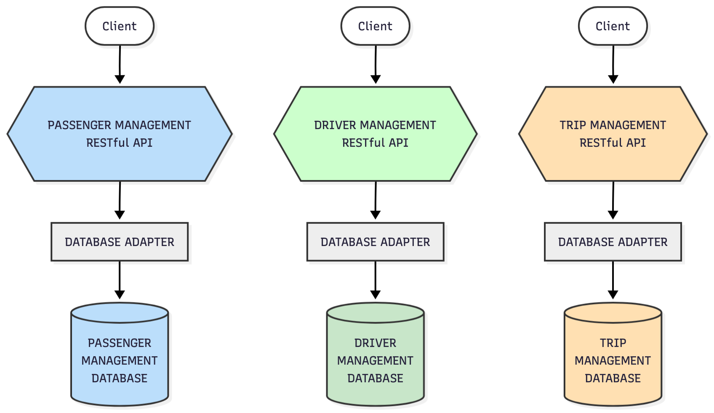

**Figure 8.5:** Example of Data Management in Microservices Architecture.

**Key Principle**: In microservices architecture, **each service owns its dedicated database schema** rather than sharing a centralized enterprise database.

**Critical implications:**

- **Decentralized data ownership**: Services maintain independent data stores, breaking away from traditional enterprise-wide data models
- **Data duplication trade-off**: Some data redundancy is inevitable and acceptable to maintain service autonomy
- **Loose coupling foundation**: Database isolation is **essential** for true microservices benefits—it prevents tight coupling through shared data dependencies
- **Independence enabler**: Separate databases allow services to evolve, scale, and deploy independently without coordinating schema changes across the system

**Important**: While this approach contradicts conventional database design principles, it's a **necessary architectural decision** to achieve the core benefits of microservices. It means accepting certain trade-offs in data consistency and duplication to gain service autonomy and flexibility.

---

# 8.6 API Gateway Pattern

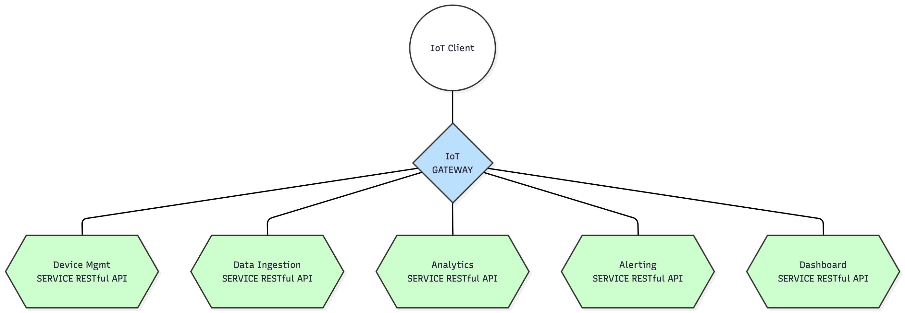

**Figure 8.6:** API Gateway Pattern in Microservices Architecture.

**Core Concept**: The **API Gateway** acts as a **single entry point** between external clients (mobile apps, web applications, desktop clients) and backend microservices.

**Key characteristics:**

- **Intermediary layer**: External clients don't access microservices directly—all requests flow through the API Gateway
- **Request routing**: The gateway directs incoming requests to the appropriate backend services
- **Cross-cutting concerns**: Handles common operational tasks including:
  - **Load balancing**: Distributes traffic across service instances
  - **Caching**: Stores frequently accessed responses to reduce latency
  - **Access control & authentication**: Enforces security policies and validates client credentials
  - **API metering**: Tracks usage patterns and enforces rate limits
  - **Monitoring & logging**: Provides centralized visibility into API traffic and performance
  - **Security enforcement**: Protects backend services from malicious requests and attacks
  - **Protocol translation**: Converts between different protocols used by clients and services (e.g., HTTP to WebSocket)

**Architectural benefit**: Centralizes common functionality that would otherwise need to be duplicated across individual microservices, simplifying both client integration and backend service implementation.

## 8.6.1 Microservices Architecture - Benefits & Drawbacks Summary

**Benefits:**

- **Client abstraction**: Shields clients from internal service boundaries and instance locations, simplifying integration
- **Optimized APIs**: Provides tailored interfaces for different client types (mobile, web, desktop) based on their specific needs
- **Request aggregation**: Enables clients to fetch data from multiple services in a single round-trip, reducing network overhead
- **Enhanced performance**: Fewer requests mean lower latency and improved user experience—critical for mobile applications
- **Simplified client logic**: Moves complex multi-service orchestration from clients to the gateway layer
- **Protocol translation**: Converts between public-facing protocols (REST, GraphQL) and internal communication patterns (gRPC, messaging)

**Drawbacks:**

- **Increased Complexity**: The API Gateway introduces an additional component that requires development, deployment, and ongoing management.  
- **Response Time Impact**: There may be a slight increase in response time due to the extra network hop through the API Gateway. However, for most applications, this additional round trip is often negligible.

**Implementation Considerations**:

- **Using Existing Solutions**: It is possible to leverage existing API Gateway solutions available in the market, which can save time and resources.  
- **Custom API Gateway Needs**: Assess whether a custom API Gateway is necessary for your specific business logic. Custom solutions may be required if unique functionalities or integrations are needed that existing gateways do not provide.
- **Key Questions to Consider**:
  - How will the API Gateway fit into your architecture?
  - What specific features do you require from the API Gateway?
  - Are there existing solutions that meet your needs?

We are lucky because there are several API Gateway products available in the market, both commercial and open source. 
Examples include:

- **Kong** (Open Source and Enterprise versions)
- **Amazon API Gateway** (Managed service by AWS)
- **Apigee** (Google Cloud's API management platform)
- **Nginx** (Widely used web server with API gateway capabilities)
- **Tyk** (Open Source and Enterprise API Gateway)
- **Zuul** (Open Source API Gateway by Netflix)
- **Microsoft Azure API Management** (Managed service by Microsoft Azure)
- **Envoy** (Open Source edge and service proxy)

**Figure 8.7:** Example of API Gateway Pattern in Microservices Architecture.

## 8.6.2 API Gateway Pattern - Modules & Functionalities

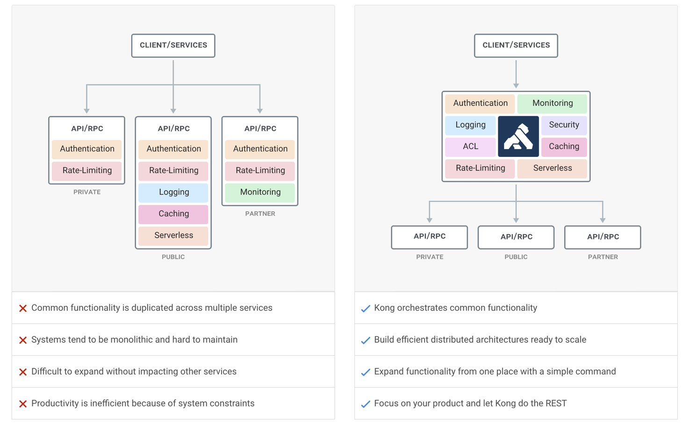

**Figure 8.8:** Schematic example of API Gateway Pattern Modules and Functionalities.

The image compares **two architectural approaches** to building APIs:

**Left Side – Without an API Gateway**

* Clients/Services communicate **directly with multiple APIs**.
* Each API is responsible for implementing its own cross-cutting concerns.
* Examples of duplicated modules inside each API include:

  * **Authentication**
  * **Rate-Limiting**
  * **Logging**
  * **Monitoring**
  * **Caching**

This leads to **repetition of common logic**, inconsistent policies, and more maintenance effort.

**Right Side – With an API Gateway**

* Clients/Services send all requests to a **central API Gateway**.
* The gateway handles shared responsibilities such as:

  * **Authentication**
  * **Rate-Limiting**
  * **Logging**
  * **Security / ACL**
  * **Caching**
  * **Monitoring**
  * **Serverless triggers**
* The downstream APIs become **simpler**, since they no longer need to implement these cross-cutting concerns individually.

The diagram visually illustrates how an API Gateway centralizes common functionality, reducing duplication and complexity across individual APIs.

A typical API Gateway provides a wide range of system-level features. Below is an overview of the core modules and their responsibilities:

1. **Authentication & Authorization**
   - Validates incoming client identities (tokens, API keys, OAuth2, JWT).
   - Enforces access policies before the request reaches the underlying service.
   - Supports roles, scopes, and fine-grained permissions.
2. **Rate-Limiting & Throttling**
   - Controls the number of requests a client can make.
   - Prevents abuse and mitigates DoS attacks.
   - Supports quotas, bursts, and per-client or per-API rules.
3. **Logging & Observability**
   - Captures structured logs for every request.
   - Provides request/response tracing and correlation IDs.
   - Supports integration with monitoring platforms (e.g., Prometheus).
4. **Monitoring & Metrics**
   - Tracks system-level metrics such as latency, error rates, and throughput.
   - Provides dashboards and alerts.
   - Helps teams understand API usage and performance trends.
5. **Caching**
   - Stores frequent or static responses to reduce backend load.
   - Supports TTL rules, cache invalidation, and local/distributed caching.
6. **Security Module**
   - Performs input validation, threat detection, and payload inspection.
   - Blocks common attack vectors (e.g., SQL injection, malicious payloads).
   - Enforces HTTPS/TLS and secure communication practices.
7. **Access Control Lists (ACL)**
   - Allows/denies traffic based on IPs, tenants, or network zones.
   - Supports whitelists, blacklists, and zero-trust enforcement policies.
8. **Serverless / Function-Driven Integration**
   - Triggers serverless or function-driven features to process requests.
   - Allows dynamic request transformation or enrichment.
   - Can implement custom logic without modifying backend APIs.
9. **Request Routing & Load Balancing**
   - Determines which backend service should receive each request.
   - Performs path-based, host-based, or version-based routing.
   - Balances traffic across multiple service instances.
10. **Transformation & Orchestration**
    - Modifies headers, payloads, or protocol formats (JSON, XML, etc.).
    - Aggregates responses from multiple services.
    - Supports API composition for microservices.

A **generic API Gateway** centralizes cross-cutting concerns—authentication, rate limiting, logging, caching, monitoring, security, routing—so downstream APIs can remain simple. This leads to cleaner architecture, improved performance, and stronger governance.

---

## 8.6.3 API Gateway Pattern - Backend for Frontend (BFF) Variation

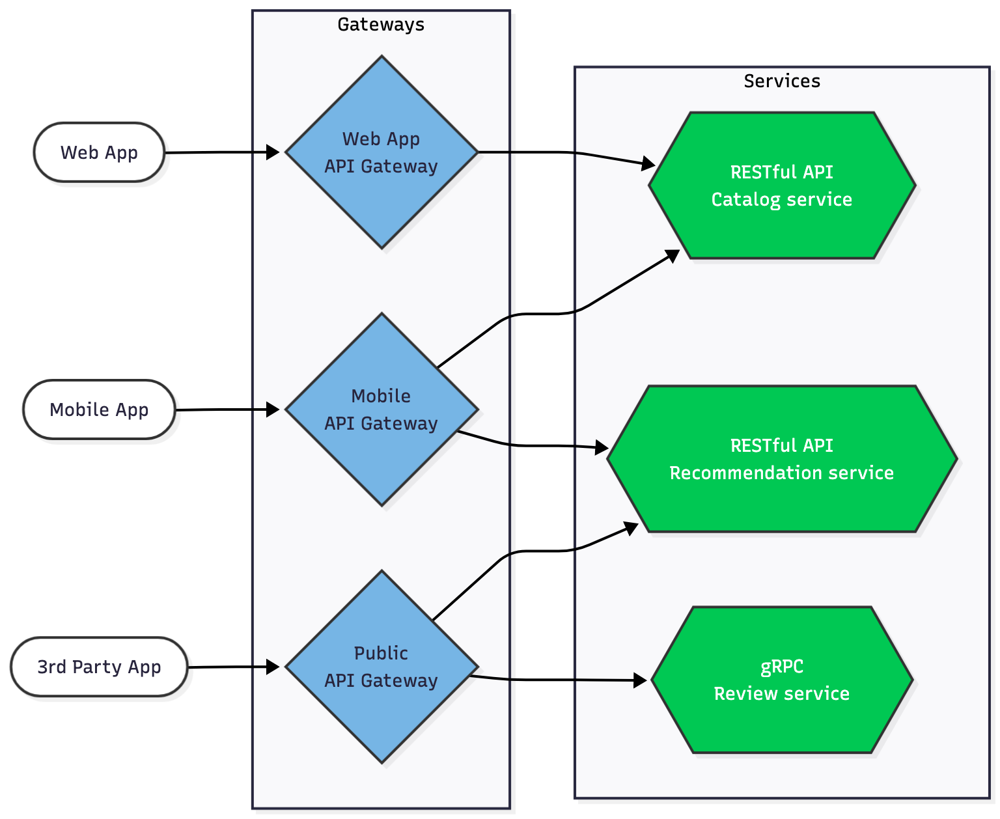
  
**Figure 8.9:** Backends for Frontends (BFF) Variation of the API Gateway Pattern.

**Core Concept**: The **Backends for Frontends (BFF)** pattern extends the API Gateway by creating **dedicated gateway instances for each client type** instead of using a single unified gateway.

**Architecture characteristics:**

- **Client-specific gateways**: Each client category gets its own optimized API Gateway:
  - **Web Application Gateway**: Tailored for browser-based clients
  - **Mobile Application Gateway**: Optimized for mobile constraints (bandwidth, battery, screen size)
  - **External 3rd Party Gateway**: Designed for partner integrations with appropriate security and rate limiting

**Key benefits:**

- **Optimized interfaces**: Each gateway provides APIs specifically designed for its client's capabilities and constraints
- **Independent evolution**: Client-specific gateways can evolve without impacting other client types
- **Targeted optimization**: Mobile gateways can implement aggressive caching and data compression, while web gateways might prioritize feature richness
- **Simplified client logic**: Clients receive precisely the data they need in the format they expect, reducing client-side processing
- **Security granularity**: Different authentication, authorization, and rate-limiting policies per client type

**When to use BFF:**

- Multiple client types with **significantly different requirements**
- Need for **client-specific optimizations** that would complicate a unified gateway
- Teams organized around **client platforms** who can own their respective gateways

---

# 8.7 IoT Microservices Architecture - Example

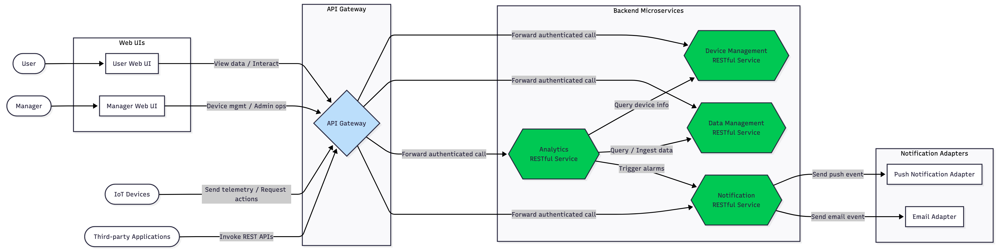

**Figure 8.10:** Example of IoT Microservices Architecture with multiple microservices, applications and adapters.

**Core Microservices Principles:**

- **Decomposition over monoliths**: Applications are split into smaller, interconnected services rather than a single monolithic codebase
- **Focused functionality**: Each service implements a distinct business capability (e.g., order management, customer management, device management)
- **Mini-application structure**: Every microservice is self-contained with its own:
  - Business logic layer
  - Technology stack and adapters
  - Deployment lifecycle

**Service Types:**

- **API services**: Expose RESTful endpoints consumed by other microservices or external clients
- **UI services**: Implement web interfaces for user interaction
- **Runtime instances**: Deployed as cloud VMs or Docker containers for scalability and isolation

**IoT Platform Architecture:**

This design demonstrates a **microservices-based IoT and device management platform** with the following characteristics:

- **Centralized orchestration**: API Gateway serves as the single entry point for all client interactions
- **Independent services**: Core functionalities (Device Management, Data Management, Analytics, Notification) operate autonomously
- **Loose coupling**: Services communicate through well-defined RESTful APIs, minimizing interdependencies
- **Functional separation**: Each business domain is implemented by its dedicated microservice, enabling independent evolution and scaling

**Key Characteristics:**

- **Independently Deployable Services**: Each backend service (Device Management, Data Management, Analytics, Notification) is independently deployable and can scale based on its own demand.[4][5]
- **API Gateway as Entry Point**: All user interfaces, IoT devices, and external clients interact through an API Gateway, which authenticates and routes requests, reducing direct coupling.[6][4]
- **Separation of Concerns**: Each microservice focuses on a single business capability (e.g., device management, analytics).[6]
- **Adapters and Integration**: Notification functionalities (push/email) are abstracted via adapters, allowing easy replacement or extension with different providers.[5]
- **Loosely Coupled**: Services interact through explicit, well-defined APIs, ensuring that changes in one microservice seldom impact others.[4]
- **Extensibility**: New services or integrations (e.g., extra notification channels) can be added with minimal platform disruption.[1][2]
- **Security and Observability**: The central gateway enforces access, while service boundaries promote clear monitoring and tracing points for operations.

**Main Entities**

| Entity               | Role/Responsibility                                                         |
|----------------------|-----------------------------------------------------------------------------|
| **User**             | End user interacting with the system via the User Web UI                    |
| **Manager**          | Admin role with access to the Manager Web UI for higher-level and admin ops |
| **IoT Devices**      | Connected devices sending telemetry and receiving commands                  |
| **Third-party Apps** | External systems using the public RESTful API via the API Gateway           |
| **API Gateway**      | Orchestrates and secures all frontends and service traffic                  |
| **Device Mgmt Svc**  | Handles CRUD and lifecycle operations for devices                           |
| **Data Mgmt Svc**    | Manages storage, access, and ingestion of device-related data               |
| **Analytics Svc**    | Runs analytics, queries, and triggers alarms based on data                  |
| **Notification Svc** | Sends push/email notifications as prescribed by business rules              |
| **Push Adapter**     | Delivers push notifications to user devices                                 |
| **Email Adapter**    | Delivers emails to users/managers                                           |

**Main Interactions**

- **User/Manager → User/Manager Web UI**: Users log in and interact with personal or admin dashboards.
- **Web UIs/Devices/Apps → API Gateway**: All actions (viewing data, managing devices, admin commands, and device telemetry) pass through the gateway, which authenticates and routes them to microservices as needed.
- **API Gateway → Backend Services**: Requests are forwarded to one or multiple backend microservices:
    - **Device Management**: Manages device configuration, registration, and commands.
    - **Data Management**: Handles telemetry, historical logs, and data queries.
    - **Analytics**: Aggregates, analyzes, and extracts insights from device and application data; may trigger alarms.
    - **Notification**: Delivers alerts and events to users by invoking adapters.
- **Analytics → Device and Data Management**: When analytics requires device metadata or more data, it queries respective services.
- **Analytics → Notification**: If a rule/threshold is breached, the service instructs Notification to alert the user.
- **Notification → Adapters**: Forwards events to concrete adapters for push or email delivery, decoupling channel specifics.

**Example Workflow**

1. A user requests a device status report via the User Web UI.
2. The UI calls the API Gateway, which authenticates and routes the request to the Analytics service.
3. The Analytics service queries Device Management and Data Management to gather up-to-date information.
4. If an anomaly is detected, Analytics tells Notification to send an alert.
5. The Notification service uses either the Push Adapter or Email Adapter, based on user preference.

---

# 8.8 Microservices & Scalability

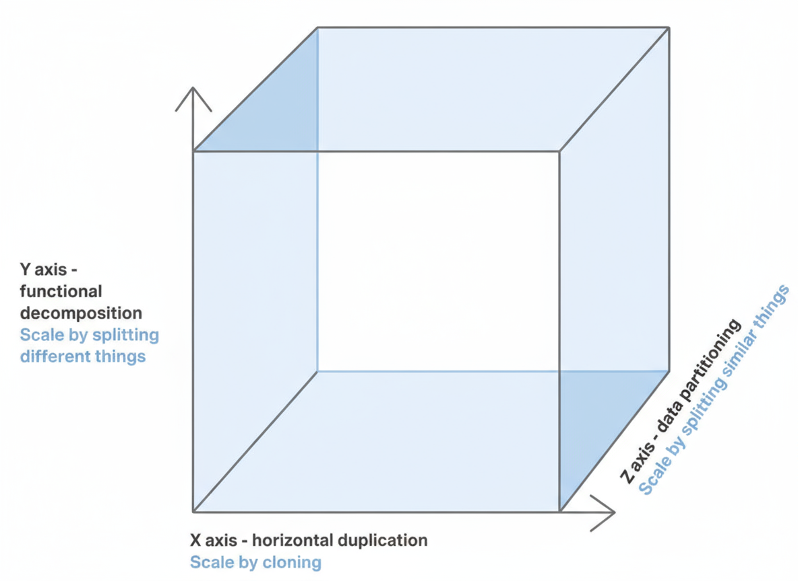
  
**Figure 8.10:** Scalability Cube model.

**Microservices architecture** implements **Y-axis scaling** from the Scale Cube model (introduced in *The Art of Scalability* by Martin L. Abbott and Michael T. Fisher), which defines three fundamental scalability dimensions:

**Scale Cube Dimensions:**

- **X-axis (Horizontal Duplication)**: Scale by **cloning** identical instances of the entire application
- **Y-axis (Functional Decomposition)**: Scale by **splitting different functions** into separate services—this is the microservices approach
- **Z-axis (Data Partitioning)**: Scale by **splitting similar data** across multiple instances (sharding)

**Microservices & Y-axis Scaling:**

The microservices pattern leverages **functional decomposition** to achieve scalability by:

- **Service-level granularity**: Each microservice handles a specific business capability and can be scaled independently
- **Targeted resource allocation**: Scale only the services experiencing high demand rather than the entire application
- **Optimized performance**: Deploy computational resources precisely where needed based on individual service requirements

**Combined approach**: Production systems often combine all three dimensions—using microservices (Y-axis) with multiple instances per service (X-axis) and data partitioning strategies (Z-axis) for optimal scalability.

## 8.8.1 X-Axis Scaling

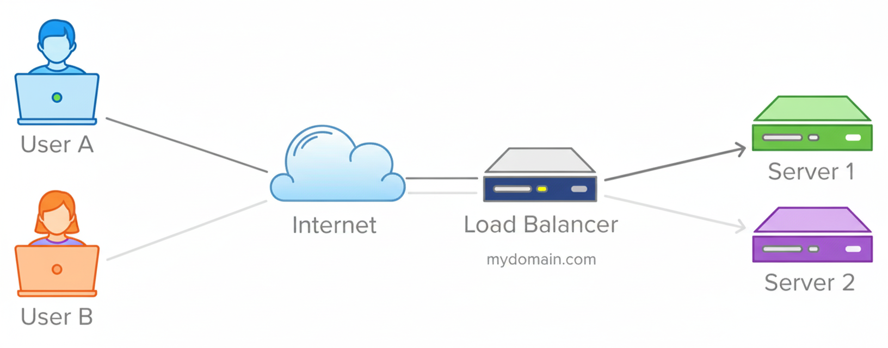

**Figure 8.11:** Scaling on X-axis by cloning service instances.

**X-axis scaling** involves running **multiple identical application instances** behind a load balancer to distribute traffic evenly.

**How it works:**
- With N instances, each handles approximately 1/N of the total load
- Load balancer distributes incoming requests across all copies
- Most straightforward and commonly adopted scaling strategy

**Advantages:**

- **Simplicity**: Easy to implement and manage—just add more instances as needed
- **Reliability**: Increases fault tolerance—if one instance fails, others continue serving
- **Predictable performance**: Linear scaling—doubling instances roughly halves load per instance

**Limitations:**

- **Memory inefficiency**: Each instance potentially accesses the entire dataset, requiring larger caches to maintain effectiveness across all copies
- **Complexity persistence**: Does not address underlying issues of increasing codebase complexity or development challenges—it simply replicates the existing application structure
- **Diminishing returns**: While effective for load distribution, it doesn't solve architectural or modularity problems inherent in monolithic applications

---

## 8.8.2 Y-Axis Scaling

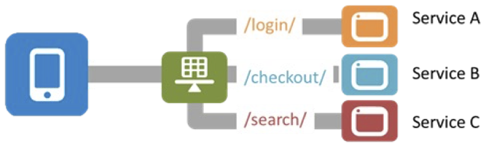

**Figure 8.11:** Scaling on Y-axis by splitting application into services.

Y-axis scaling decomposes an application into multiple, domain-aligned services. Each service owns a cohesive business capability and can be built, deployed, and scaled independently.

- **Service responsibility**: One business capability with closely related operations.
- **Decomposition strategies**:
  - **Verb-based (use-case)**: Services per workflow (e.g., “telemetry”, “search”).
  - **Noun-based (entity/domain)**: Services around entities (e.g., “device”, “data”).
- **Combination**: Most systems mix both strategies; choose what best preserves cohesion and minimizes coupling.
- **Benefits**: **Independent scaling**, **faster deployments**, **fault isolation**, **smaller codebases**.
- **Caveats**: Requires clear **service boundaries**, stable **API contracts**, and **decentralized data ownership** to avoid tight coupling.

---

## 8.8.3 X-Axis & Y-Axis Scaling

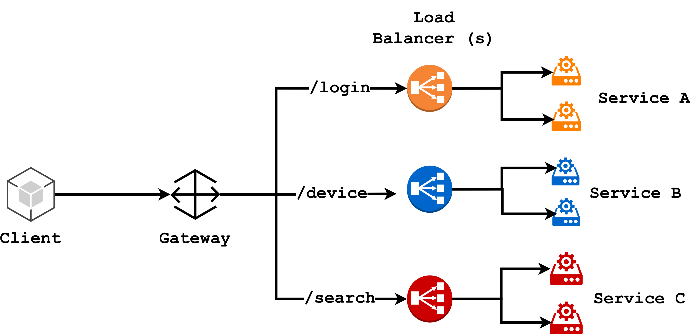

**Figure 8.12:** Combining X-axis and Y-axis scaling.

It is common to combine X-axis and Y-axis scaling.
Each service is deployed as multiple instances behind a load balancer and each service can be scaled independently based on its specific resource requirements and load patterns.

This combined approach provides the benefits of both scaling strategies:

- **Targeted resource allocation**: Scale only the services experiencing high demand rather than the entire application
- **Optimized performance**: Deploy computational resources precisely where needed based on individual service requirements
- **Increased reliability**: Each service can be scaled independently, improving fault tolerance and availability
- **Simplified management**: Load balancers handle traffic distribution for each service, simplifying scaling operations
- **Flexibility**: Services can evolve independently, allowing for faster development and deployment cycles

Existing limitations of each individual scaling strategy still apply, but the combined approach provides a more robust and flexible solution for scaling complex applications.

---

## 8.8.4 Z-Axis Scaling

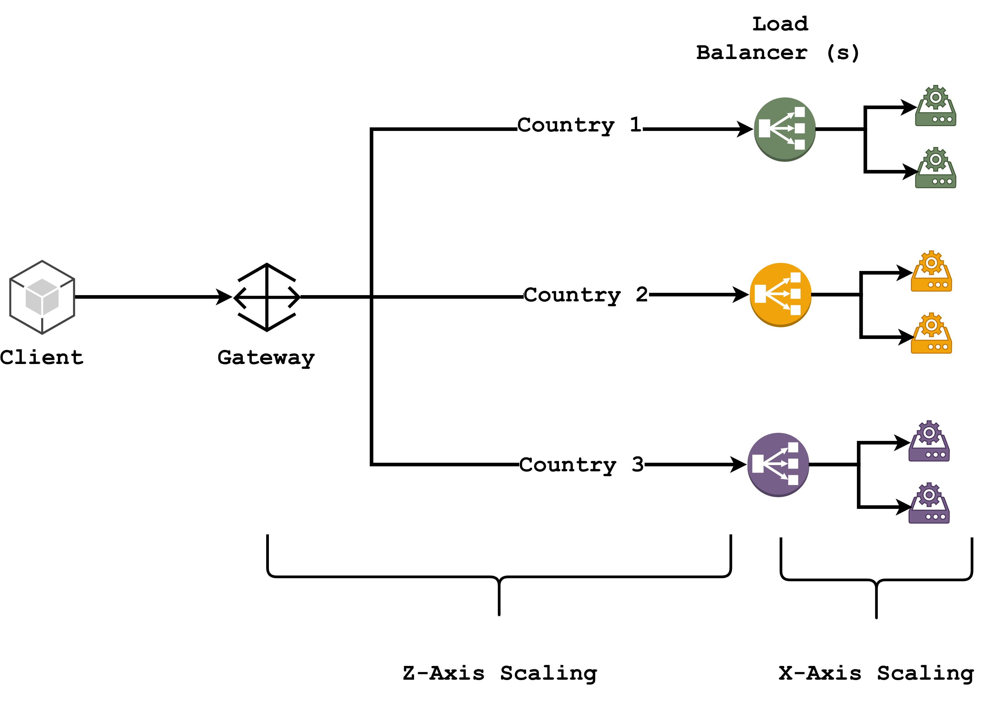

**Figure 8.13:** Z-axis scaling.

**Z-axis scaling** implements **data partitioning (sharding)** where each server runs identical code but handles only a **subset of the total data**.

**How it works:**

- **Similarity to X-axis**: Multiple identical server instances, but with a critical difference
- **Data distribution**: Each server is responsible for a specific data partition, not the entire dataset
- **Request routing**: A routing component directs requests to the appropriate server based on:
  - **Primary key** of the entity being accessed
  - **Customer type** (e.g., premium vs. free users)
  - **Geographic location** or other request attributes

**Benefits:**

- **Optimized resource usage**: Each server handles less data, improving cache effectiveness and reducing memory/I/O requirements
- **Enhanced transaction scalability**: Distributes database operations across multiple servers, reducing contention
- **Improved fault isolation**: Failures affect only a portion of the data, maintaining partial system availability

**Drawbacks:**

- **Implementation complexity**: Requires designing and maintaining a partitioning scheme that efficiently distributes data
- **Repartitioning challenges**: Rebalancing data across servers can be operationally complex and risky
- **Architectural limitations**: Does not address codebase complexity or development challenges—**Y-axis scaling** (microservices) is needed for that

---

## 8.8.5 Combining the Three Axes

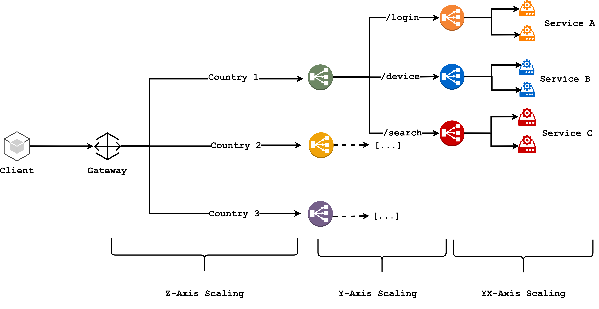

**Figure 8.14:** Combining X-axis, Y-axis, and Z-axis scaling.

In practice, production systems often combine all three dimensions of the Scale Cube:

- **Y-axis (Microservices)**: Decomposes the application into multiple, focused services
- **X-axis (Cloning)**: Each service is deployed as multiple instances behind a load balancer
- **Z-axis (Data Partitioning)**: Each service partitions its data across multiple instances based on a defined scheme

This combined approach provides a comprehensive scalability solution that addresses:

- **Codebase complexity**: Y-axis scaling (microservices) breaks down large applications into manageable components
- **Load distribution**: X-axis scaling ensures even traffic distribution and fault tolerance
- **Data management**: Z-axis scaling optimizes resource usage and transaction scalability
- **Flexibility and resilience**: Each service can evolve, scale, and recover independently, enhancing overall system robustness
- **Operational efficiency**: Tailored scaling strategies for each service based on its unique requirements and load patterns
- **Optimized performance**: Resources are allocated precisely where needed, improving responsiveness and user experience

Limitations of each individual scaling strategy still apply, but the combined approach offers a powerful framework for building scalable, resilient applications that can adapt to changing demands. Of course, implementing and managing such a multi-dimensional scaling strategy requires careful planning, robust infrastructure, and sophisticated monitoring to ensure optimal performance and reliability.

---

# 8.9 Microservices - Virtual Machine & Containerization

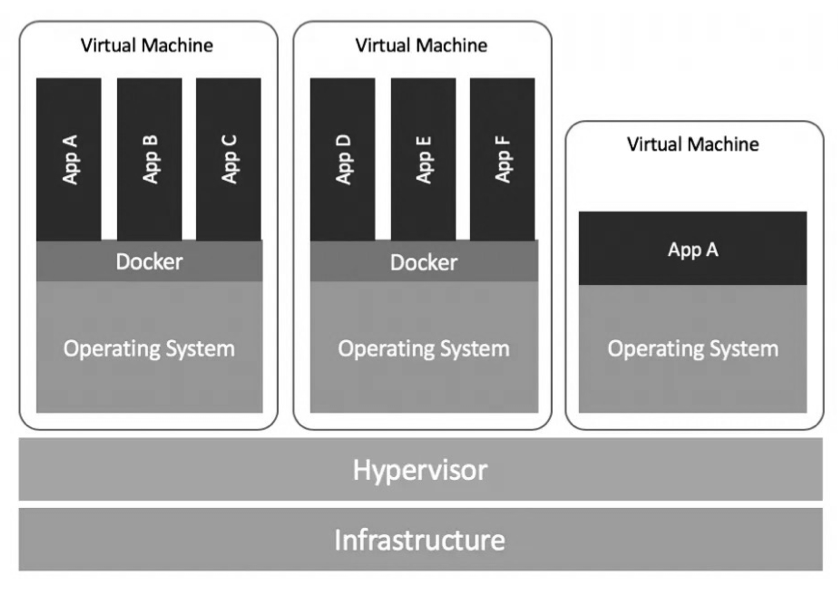

**Figure 8.15:** Virtual Machines and Containers.

- **Virtual Machines (VMs)**:
  - Virtualize the **hardware and OS**
  - Include a full **guest OS** per VM
  - Pros: **Strong isolation**, broad compatibility
  - Cons: **Heavier footprint**, slower boot/provisioning

- **Containers (e.g., Docker)**:
  - Provide **OS-level virtualization**; share the host **kernel**
  - Package app + dependencies in a lightweight unit
  - Pros: **Lightweight**, **fast startup**, high **density**
  - Cons: **Weaker isolation** than VMs, require compatible host kernel

- **Microservices Guidance**:
  - Default to **containers** for small, independently deployable services, rapid **CI/CD**, and **elastic scaling** (often with **Kubernetes**)
  - Prefer **VMs** when you need stricter **isolation/compliance**, **heterogeneous OS** requirements, or full **OS control**

- **Rule of thumb**: **Containerize by default**; **virtualize** when isolation, OS diversity, or regulatory constraints demand it.

## 8.9.1 Microservices - Deployment Options

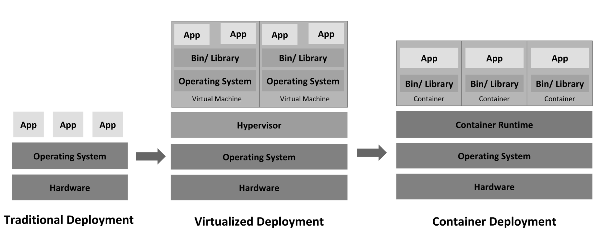

**Figure 8.16:** Different Deployment Options from traditional to modern with VMs and Containers.

**Virtual Machines (VMs):**

- **Isolation mechanism**: Virtualizes both hardware and OS, creating complete execution environments
- **Resource overhead**: Each VM requires full OS replication, consuming significant resources
- **Multi-service limitation**: Running multiple microservices per VM defeats the purpose of isolation—library conflicts and component issues persist
- **Storage**: Dedicated physical disk space allocated to each VM with **stateful storage** (OS, programs, data always occupy disk space)
- **Configuration complexity**: Hypervisor requires extensive upfront setup (guest OS, storage, network preferences)
- **Size**: Minimum several GBs per VM due to full OS stack
- **Startup time**: Slower boot process due to hypervisor overhead

**Containers:**

- **Isolation mechanism**: OS-level virtualization—multiple containers share a single OS kernel while maintaining separate execution environments
- **Resource efficiency**: No OS duplication per service; single OS supports multiple isolated containers with minimal overhead
- **Independent environments**: Each microservice has its own database and environment despite cohabitation on one OS
- **Storage flexibility**: 
  - **Stateful or stateless** options available
  - Storage created with container and discarded on deletion
  - Sandbox layer stores modifications only while container is active
  - Per-service storage can be managed independently
- **Resource optimization**: Smart workload allocation efficiently utilizes server capacity (e.g., CPU-intensive vs. network-intensive services)
- **Size**: Typically as small as **10MB** per container
- **Deployment speed**: 
  - No hypervisor required
  - Images pulled from repositories via simple commands
  - **Startup time**: Milliseconds to a few seconds
- **Density**: Same physical server holds **significantly more containers** than VMs

**Key Trade-off**: VMs provide stronger isolation at the cost of resource overhead, while containers maximize efficiency and deployment speed with OS-level isolation.

---

# 8.10 Microservices Design Patterns

**Microservices Design Patterns** provide **general blueprints** for organizing distributed systems without mandating specific technologies or application choices.

**Purpose & Value:**

- **Guidance over prescription**: Patterns offer structural advice to guide design decisions rather than strict implementation rules
- **Broad applicability**: Solutions are designed to work across diverse applications and environments
- **Standing on giants' shoulders**: Leverage proven approaches instead of solving previously-encountered problems from scratch
- **Common challenges**: While your business model may be unique, the technical challenges (reliability, agility, scalability) are well-understood and addressable through established patterns

**Pattern Categories:**

**Single Node Patterns** - Organize components within a single instance:

- **Sidecar**: Augments primary application with helper functionality in a separate container
- **Ambassador**: Proxies connections to external services, abstracting networking complexity
- **Adapter**: Standardizes interfaces between applications and external systems

**Multi-Node Patterns** - Coordinate behavior across distributed services:

- **Replicated & Load Balanced Services**:
  - **Stateless services**: Identical instances handle requests interchangeably
  - **Session tracking**: Maintains user state across distributed instances
  - **Caching**: Stores frequently accessed data to reduce latency
  - **Rate limiting & DoS defense**: Protects services from overload and attacks

- **Coordination patterns**:
  - **Scatter/Gather**: Distributes requests across nodes and aggregates results
  - **Decorator**: Dynamically adds functionality to service requests
  - **Replica management & ownership election**: Coordinates which instance handles specific responsibilities
  - **Circuit Breaker**: Prevents cascading failures by detecting and isolating unhealthy services

These patterns form the **foundational toolkit** for building robust, scalable microservices architectures.

--- 

## 8.10.1 Sidecar Pattern (Single Node)

TODO ...

--- 

## 8.10.2 Load Balancer Pattern (Multi-Node)

TODO ...

---

# References

- Design Distributed Systems: Patterns and Paradigms for Scalable, Reliable Services, by Brendan Burns, Released August 2018, ISBN: 9781491983645
- Fundamentals of Software Architecture: An Engineering Approach, by Mark Richards, Benjamin Lange, Neal Ford, Released February 2021, ISBN: 9781663728357
- Monolithic vs Microservices - [Link](https://articles.microservices.com/monolithic-vs-microservices-architecture-5c4848858f59)
- Pattern: Microservice Architecture - [Link](https://microservices.io/patterns/microservices.html)
- Monolithic Architecture - [Link](https://microservices.io/patterns/monolithic.html)
- Don’t start with Monolith - [Link](https://martinfowler.com/articles/dont-start-monolith.html)
- Monolithic vs Microservice and all in between - [Link](https://medium.com/swlh/monolithic-vs-micro-services-and-all-in-between-7d496408ad02)
- Best Architecture for an MVP: Monolith, SOA, Microservices, or Serverless? - [Link](https://rubygarage.org/blog/monolith-soa-microservices-serverless)
- Microservices Introduction (Monolithic vs. Microservice Architecture) - [Link](https://dzone.com/articles/microservices-1-introduction-monolithic-vs-microservices)
- How to break a Monolith into Microservices - [Link](https://martinfowler.com/articles/break-monolith-into-microservices.html)
- Serverless Design Architecture: [Link](https://www.trendmicro.com/it_it/devops/23/f/serverless-architecture-design-patterns-guide.html)
- Serverless Architecture: [Link](https://middleware.io/blog/serverless-architecture/)
- A Guide to Serverless Architecture: [Link](https://www.serverless.com/blog/serverless-architecture)
- The Art of Scalability: Scalable Web Architecture, Processes, and Organizations for the Modern Enterprise, by Martin L. Abbott and Michael T. Fisher, Released April 2015, ISBN: 9780134032801

