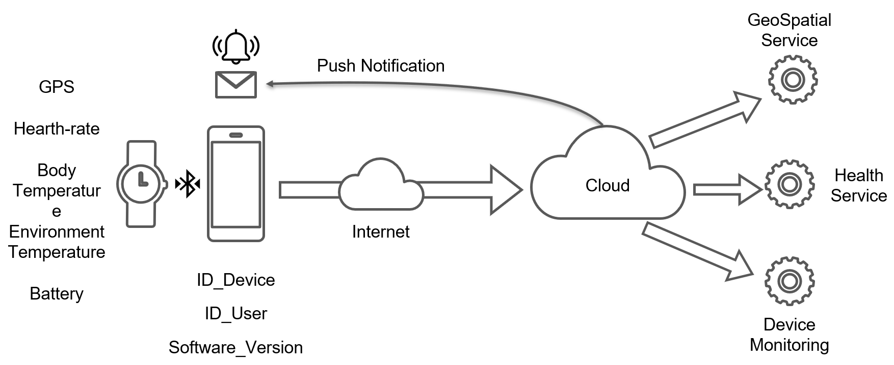
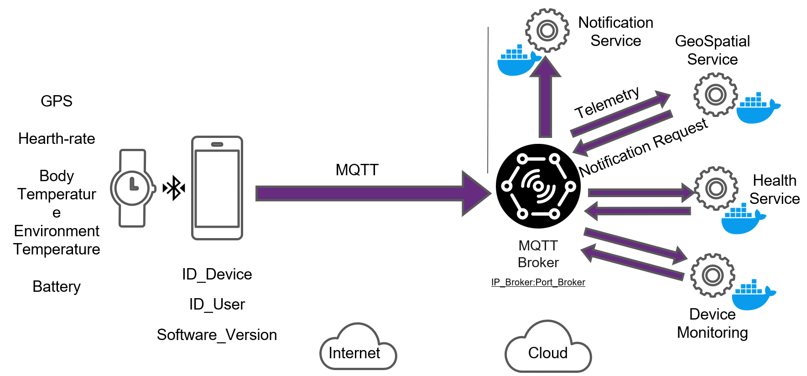
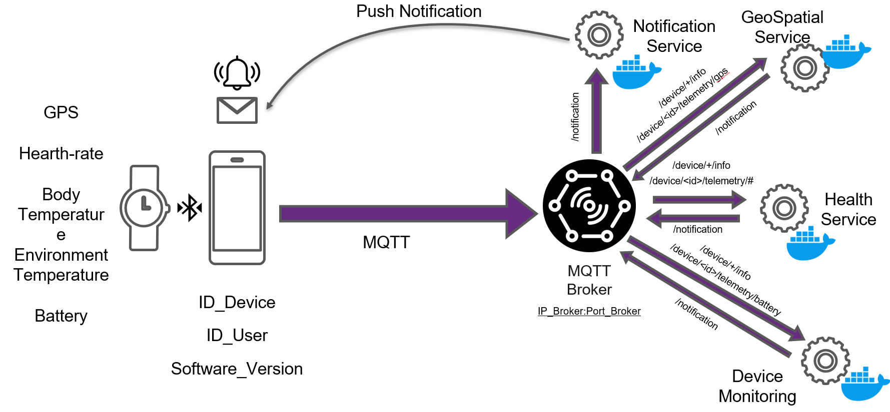

<!-- omit in toc -->
# Lecture 9 - End-2-End Architecture Design

<!-- omit in toc -->
## Lecture Information

| **Master's Degree** | Digital Automation Engineering (D.M.270/04)                                      |
|---------------------|----------------------------------------------------------------------------------|
| **Curriculum**      | Digital Infrastructure                                                           |
| **Course**          | Distributed IoT Software Architectures                                           |
| **Lecture Title**   | End-2-End Architecture Design                                           |
| **Author**          | Prof. Marco Picone (marco.picone@unimore.it)                                     |
| **License**         | [Creative Commons Attribution 4.0](https://creativecommons.org/licenses/by/4.0/) | 


<!-- omit in toc -->
# Table of Contents

- [8.1 Microservices Software Architectures - Introduction](#81-microservices-software-architectures---introduction)
- [8.2 Microservices Architecture - Definitions and Citations](#82-microservices-architecture---definitions-and-citations)
- [8.3 Microservices Architecture - Benefits \& Drawbacks](#83-microservices-architecture---benefits--drawbacks)
- [8.4 Monolithic vs Microservices Architecture - How to start ?](#84-monolithic-vs-microservices-architecture---how-to-start-)
- [8.5 Microservices \& Data Management](#85-microservices--data-management)
- [8.6 API Gateway Pattern](#86-api-gateway-pattern)
  - [8.6.1 Microservices Architecture - Benefits \& Drawbacks Summary](#861-microservices-architecture---benefits--drawbacks-summary)
  - [8.6.2 API Gateway Pattern - Modules \& Functionalities](#862-api-gateway-pattern---modules--functionalities)
  - [8.6.3 API Gateway Pattern - Backend for Frontend (BFF) Variation](#863-api-gateway-pattern---backend-for-frontend-bff-variation)
- [8.7 IoT Microservices Architecture - Example](#87-iot-microservices-architecture---example)
- [8.8 Microservices \& Scalability](#88-microservices--scalability)
  - [8.8.1 X-Axis Scaling](#881-x-axis-scaling)
  - [8.8.2 Y-Axis Scaling](#882-y-axis-scaling)
  - [8.8.3 X-Axis \& Y-Axis Scaling](#883-x-axis--y-axis-scaling)
  - [8.8.4 Z-Axis Scaling](#884-z-axis-scaling)
  - [8.8.5 Combining the Three Axes](#885-combining-the-three-axes)
- [8.9 Microservices - Virtual Machine \& Containerization](#89-microservices---virtual-machine--containerization)
  - [8.9.1 Microservices - Deployment Options](#891-microservices---deployment-options)
- [8.10 Microservices Design Patterns](#810-microservices-design-patterns)
  - [8.10.1 Microservices Design Pattern Categories](#8101-microservices-design-pattern-categories)
  - [8.10.2 Sidecar Pattern (Single Node)](#8102-sidecar-pattern-single-node)
    - [8.10.2.1 - Sidecar Pattern Example 1 - Adding HTTP Security](#81021---sidecar-pattern-example-1---adding-http-security)
    - [8.10.2.2 - Sidecar Pattern Example 2 - Dynamic Configurability](#81022---sidecar-pattern-example-2---dynamic-configurability)
    - [8.10.2.3 - Sidecar Pattern Benefits](#81023---sidecar-pattern-benefits)
    - [8.10.2.4 - Sidecar Pattern \& Modularity](#81024---sidecar-pattern--modularity)
  - [8.10.3 Load Balancer Pattern (Multi-Node)](#8103-load-balancer-pattern-multi-node)
- [References](#references)

# 9.0 Edge and Clo

# 9.1 Scenario 1 - Personal Health Device & Monitoring System



**Figure 9.1:** Schematic representation of a Personal Health Device & Monitoring System with high-level components and interactions.

A distributed IoT health monitoring solution for continuous personal health tracking. Wearable devices capture biometric and contextual data (heart rate, body temperature, environmental temperature, GPS, battery), relay them via a smartphone to cloud microservices for ingestion, processing, storage, analytics, and real-time notifications. The design supports reliability, security, and scalability across multiple users and devices.

---

## 9.1.1 - High-Level Architecture & Main Components

- **Edge Layer (Wearable IoT Device)**
  - Sensors:
    - **GPS**: user location for activity and emergency context
    - **Heart Rate**: cardiovascular monitoring and anomaly detection
    - **Body Temperature**: thermal health status
    - **Environmental Temperature**: ambient context enrichment
    - **Battery Level**: device health and lifecycle

- **Connectivity Layer (Smartphone + Network)**
  - **BLE** link to wearable
  - **Wi‑Fi/Mobile data** uplink to cloud

- **Cloud Layer**
  - **GeoSpatial Service**: GPS ingestion, map-matching, geofencing, activity context
  - **Health Service**: biometric processing, anomaly detection, trends, alerts
  - **Device Monitoring Service**: fleet management, OTA updates, device health
  - **Notification Service**: push messages and alerts to mobile apps (e.g., through platform specific services like Android or iOS push notification services)


## 9.1.2 - Data Models

Each sensor reading is modeled as an independent entity with its own schema, optimized for the specific microservice that will process it.
In all data models, timestamps are represented as Unix epoch time in milliseconds for consistency and ease of temporal correlation across different data types.
The presence of the timestamp field in each data model is crucial for enabling time-series analysis, trend detection, and correlation of events across different sensor types.
Furthermore, including a timestamp allows the system to handle out-of-order (or duplicated) data arrivals, which is common in distributed systems, by providing a temporal context for each reading.

**GPS Data Model**

Designed for the **GeoSpatial Service** to handle location tracking, geofencing, and activity mapping.

| **Field** | **Type** | **Description** | **Rationale** |
|-----------|----------|-----------------|---------------|
| `latitude` | Double | Latitude coordinate (WGS84) | Double precision required for sub-meter accuracy |
| `longitude` | Double | Longitude coordinate (WGS84) | Double precision required for sub-meter accuracy |
| `altitude` | Double | Elevation above sea level (meters) | Enriches context for activity classification (climbing, hiking) |
| `timestamp` | Long | Unix epoch timestamp (ms) | Enables trajectory reconstruction and temporal correlation |


**Heart-rate Data Model**

Designed for the **Health Service** to monitor cardiovascular health and detect anomalies.

| **Field** | **Type** | **Description** | **Rationale** |
|-----------|----------|-----------------|---------------|
| `value` | Double | Heart rate measurement | Double allows fractional BPM from advanced sensors |
| `unit` | String | Unit of measure (e.g., "bpm") | Explicit unit prevents misinterpretation |
| `timestamp` | Long | Unix epoch timestamp (ms) | Critical for detecting tachycardia/bradycardia events |


**Body Temperature Data Model**

Designed for the **Health Service** to detect fever, hypothermia, and health trends.

| **Field** | **Type** | **Description** | **Rationale** |
|-----------|----------|-----------------|---------------|
| `value` | Double | Body temperature measurement | Double supports precision to 0.1°C |
| `unit` | String | Unit of measure (e.g., "Celsius", "Fahrenheit") | Enables multi-region deployments |
| `timestamp` | Long | Unix epoch timestamp (ms) | Tracks temperature variations over time |


**Environmental Temperature Data Model**

Designed for **contextual enrichment** in both GeoSpatial and Health Services.

| **Field** | **Type** | **Description** | **Rationale** |
|-----------|----------|-----------------|---------------|
| `value` | Double | Ambient temperature measurement | Double supports precision weather integration |
| `unit` | String | Unit of measure (e.g., "Celsius") | Standardizes cross-region data |
| `timestamp` | Long | Unix epoch timestamp (ms) | Correlates with body temperature for heat stress detection |

**Battery Data Model**

Designed for the **Device Monitoring Service** to manage device health and lifecycle.

| **Field** | **Type** | **Description** | **Rationale** |
|-----------|----------|-----------------|---------------|
| `value` | Double | Battery level (0-100%) | Double allows fractional percentages |
| `timestamp` | Long | Unix epoch timestamp (ms) | Tracks battery drain rate for predictive maintenance |

**Device Info Data Model**

Designed as **metadata** for all microservices to trace device and user context.

| **Field** | **Type** | **Description** | **Rationale** |
|-----------|----------|-----------------|---------------|
| `id` | String | Unique device identifier (UUID) | Enables device-specific analytics and fleet management |
| `user_id` | String | Unique user identifier (UUID) | Links device data to user profiles for personalized health insights |
| `software_version` | String | Firmware/software version (e.g., "1.2.3") | Critical for OTA updates and compatibility tracking |

---

## 9.1.3 Protocols & Communication



**Figure 9.2:** Mapping of the MQTT protocol on the target scenario with the broker and the main data flows.

The target scenario in mainly associated to the concept of **Telemetry Data Ingestion** from edge devices to cloud services with a few messages coming from the cloud to the edge associated to 
**notification** messages. In this context, the MQTT protocol is a perfect fit due to its lightweight nature, publish-subscribe model, and efficiency in handling intermittent connectivity common in IoT environments.

The Figure 9.2 shows how the MQTT protocol can be mapped on the target scenario with the broker and the main data flows. In this case, the MQTT broker can be hosted in the cloud since the main data flows are from the edge to the cloud and edge devices are connected via smartphone with internet access and the broker can be reached without problems. A deployment where the broker is hosted on the edge could be considered in scenarios where edge devices are connected via local network without internet access or with limited connectivity.

The same scenario can be also implemented with other protocols such a request/response solution (e.g., HTTP or CoAP) depending on specific requirements and constraints. 
However, MQTT is configuration associated mainly to a pub/sub interaction and a telemetry driven application scenario and the need of decoupling between data producers (edge devices) and data consumers (cloud services) makes MQTT a more suitable choice.

### 9.1.3.1 MQTT Topics & Data

In this section, the MQTT topics and the associated data payloads for each sensor type are defined. The topics are structured to facilitate easy subscription and filtering by the respective microservices in the cloud.

**Device Info Topic**

- **Topic**: `devices/{device_id}/info`
- **Payload**:
  ```json
  {
    "id": "string",
    "user_id": "string",
    "software_version": "string"
  }
  ```
- **QoS Level**: 2 (ensures exactly once delivery for critical metadata)
- **Retain Flag**: true (to keep the latest device info available for new subscribers)

With this setup, each microservice can subscribe to the relevant topics to receive real-time data from the wearable devices, enabling efficient processing and analysis tailored to their specific functions. Furthermore, the usage of a retain flag for the device info topic ensures that new microservices or instances can quickly obtain the latest device metadata without waiting for the next update from the edge device.

**GPS Data Topic**

- **Topic**: `devices/{device_id}/telemetry/gps`
- **Payload**:
  ```json
  {
    "latitude": double,
    "longitude": double,
    "altitude": double,
    "timestamp": long
  }
  ```
- **QoS Level**: 1 (ensures at least once delivery for location data)
- **Retain Flag**: false (location data is time-sensitive and should not be retained

This topic configuration allows the GeoSpatial Service to efficiently receive and process GPS data for real-time location tracking and geofencing.
The QoS level of 1 balances reliability with performance, ensuring that location updates are delivered without overwhelming the network.
In case of an higher frequency data generation, a QoS level of 0 could be considered to further reduce network load, accepting the possibility of occasional data loss.
With QoS level 1, duplicate messages may be received, so the interested Services should implement idempotent processing to handle potential duplicates.
The retain flag is set to false to prevent outdated location data from being sent to subscribers.

**Heart-rate Data Topic**

- **Topic**: `devices/{device_id}/telemetry/heart_rate`
- **Payload**:
  ```json
  {
    "value": double,
    "unit": "string",
    "timestamp": long
  }
  ```
- **QoS Level**: 1 (ensures at least once delivery for health data)
- **Retain Flag**: false (heart rate data is time-sensitive and should not be retained)

This topic configuration allows the Health Service to efficiently receive and process heart rate data for real-time health monitoring and anomaly detection.
The QoS level of 1 balances reliability with performance, ensuring that heart rate updates are delivered without overwhelming the network.
In case of an higher frequency data generation, a QoS level of 0 could be considered to further reduce network load, accepting the possibility of occasional data loss.
With QoS level 1, duplicate messages may be received, so the interested Services should implement idempotent processing to handle potential duplicates.
The retain flag is set to false to prevent outdated health data from being sent to subscribers.

**Body Temperature Data Topic**

- **Topic**: `devices/{device_id}/telemetry/body_temperature`
- **Payload**:
  ```json
  {
    "value": double,
    "unit": "string",
    "timestamp": long
  }
  ```
- **QoS Level**: 1 (ensures at least once delivery for health data)
- **Retain Flag**: false (body temperature data is time-sensitive and should not be retained)

This topic configuration allows the Health Service to efficiently receive and process body temperature data for real-time health monitoring.
The QoS level of 1 balances reliability with performance, ensuring that body temperature updates are delivered without overwhelming the network.
In case of an higher frequency of body temperature data generation, a QoS level of 0 could be considered to further reduce network load, accepting the possibility of occasional data loss.
With QoS level 1, duplicate messages may be received, so the interested Services should implement idempotent processing to handle potential duplicates.
The retain flag is set to false to prevent outdated health data from being sent to subscribers.

**Environmental Temperature Data Topic**

- **Topic**: `devices/{device_id}/telemetry/environmental_temperature`
- **Payload**:
  ```json
  {
    "value": double,
    "unit": "string",
    "timestamp": long
  }
  ```
- **QoS Level**: 1 (ensures at least once delivery for contextual data)
- **Retain Flag**: false (environmental temperature data is time-sensitive and should not be retained)

This topic configuration allows both the GeoSpatial and Health Services to efficiently receive and process environmental temperature data for contextual enrichment.
The QoS level of 1 balances reliability with performance, ensuring that environmental temperature updates are delivered without overwhelming the network.
In case of an higher frequency data generation, a QoS level of 0 could be considered to further reduce network load, accepting the possibility of occasional data loss.
With QoS level 1, duplicate messages may be received, so the interested Services should implement idempotent processing to handle potential duplicates.
The retain flag is set to false to prevent outdated contextual data from being sent to subscribers.

**Notification Topic**

- **Topic**: `devices/{device_id}/notification`
- **Payload**:
  ```json
  {
    "message": "string",
    "timestamp": long
  }
  ```
- **QoS Level**: 2 (ensures exactly once delivery for critical notifications)
- **Retain Flag**: false (notifications are time-sensitive and should not be retained)

This topic configuration allows the Notification Service to efficiently send real-time alerts and messages to the wearable devices via the smartphone.
The QoS level of 2 ensures that critical notifications are delivered exactly once, preventing duplicates that could confuse users.
The retain flag is set to false to ensure that notifications are only delivered when they are relevant and timely.

---

### 9.1.3.2 MQTT Topics & Service Mapping



**Figure 9.3:** Association of the different MQTT topics with the corresponding services in the target scenario.

Once the MQTT topics and their configurations are defined, they can be mapped to the respective microservices in the cloud architecture as shown in Figure 9.3.
This mapping is strategic for the scenario design, as it ensures that each microservice subscribes only to the topics relevant to its functionality, optimizing resource usage and processing efficiency.

In particular we have the mapping described and summarized below:


| Topic / Pattern                     | Purpose                               | Publisher                       | Subscriber(s)                 | Notes |
|-------------------------------------|---------------------------------------|---------------------------------|--------------------------------|-------|
| `device/+/info`                     | Device metadata (id, user, sw)        | Edge device (wearable/phone)    | Health, Device Monitoring      | Retained for late subscribers |
| `device/<id>/telemetry/#`           | All telemetry from a device           | Edge device (wearable/phone)    | Health (generic ingest)        | Use when a service wants all signals |
| `device/<id>/telemetry/gps`         | GPS location stream                   | Edge device (wearable/phone)    | GeoSpatial Service             | High-frequency; QoS 1 |
| `device/<id>/telemetry/heart_rate`  | Heart-rate stream                     | Edge device (wearable/phone)    | Health Service                 | QoS 1; idempotent processing |
| `device/<id>/telemetry/body_temperature` | Body temperature stream          | Edge device (wearable/phone)    | Health Service                 | QoS 1 |
| `device/<id>/telemetry/environmental_temperature` | Ambient temp stream          | Edge device (wearable/phone)    | Health, GeoSpatial             | Context enrichment |
| `device/<id>/telemetry/battery`     | Battery level                         | Edge device (wearable/phone)    | Device Monitoring              | Drives alerts/maintenance |
| `device/<id>/notification`          | Downlink app/wearable notifications   | Notification Service            | Mobile app / wearable client   | QoS 2 for critical alerts |
| `notification` (service→service)    | Cloud notification requests/events    | Health, GeoSpatial, Device Monitoring | Notification Service      | Internal fan-in/fan-out via broker |

In particular it is important to highlight the following aspects:

- The use of wildcards (`+` and `#`) in topics allows for flexible subscription patterns, enabling services to subscribe to multiple related topics without needing to specify each one individually.
- The QoS levels are chosen based on the criticality and frequency of the data, balancing reliability with network efficiency.
- The retain flag is used judiciously to ensure that only relevant and timely data is delivered to subscribers, preventing outdated information from causing confusion or errors.
- The notification topic is designed for downlink communication from the cloud to the edge devices, ensuring that users receive timely alerts and messages.
- The Notification Service acts as a centralized hub for sending notifications, receiving requests from multiple services and dispatching them to the appropriate devices.

---

# References

- Design Distributed Systems: Patterns and Paradigms for Scalable, Reliable Services, by Brendan Burns, Released August 2018, ISBN: 9781491983645
- Fundamentals of Software Architecture: An Engineering Approach, by Mark Richards, Benjamin Lange, Neal Ford, Released February 2021, ISBN: 9781663728357
- Monolithic vs Microservices - [Link](https://articles.microservices.com/monolithic-vs-microservices-architecture-5c4848858f59)
- Pattern: Microservice Architecture - [Link](https://microservices.io/patterns/microservices.html)
- Monolithic Architecture - [Link](https://microservices.io/patterns/monolithic.html)
- Don’t start with Monolith - [Link](https://martinfowler.com/articles/dont-start-monolith.html)
- Monolithic vs Microservice and all in between - [Link](https://medium.com/swlh/monolithic-vs-micro-services-and-all-in-between-7d496408ad02)
- Best Architecture for an MVP: Monolith, SOA, Microservices, or Serverless? - [Link](https://rubygarage.org/blog/monolith-soa-microservices-serverless)
- Microservices Introduction (Monolithic vs. Microservice Architecture) - [Link](https://dzone.com/articles/microservices-1-introduction-monolithic-vs-microservices)
- How to break a Monolith into Microservices - [Link](https://martinfowler.com/articles/break-monolith-into-microservices.html)
- Serverless Design Architecture: [Link](https://www.trendmicro.com/it_it/devops/23/f/serverless-architecture-design-patterns-guide.html)
- Serverless Architecture: [Link](https://middleware.io/blog/serverless-architecture/)
- A Guide to Serverless Architecture: [Link](https://www.serverless.com/blog/serverless-architecture)
- The Art of Scalability: Scalable Web Architecture, Processes, and Organizations for the Modern Enterprise, by Martin L. Abbott and Michael T. Fisher, Released April 2015, ISBN: 9780134032801

