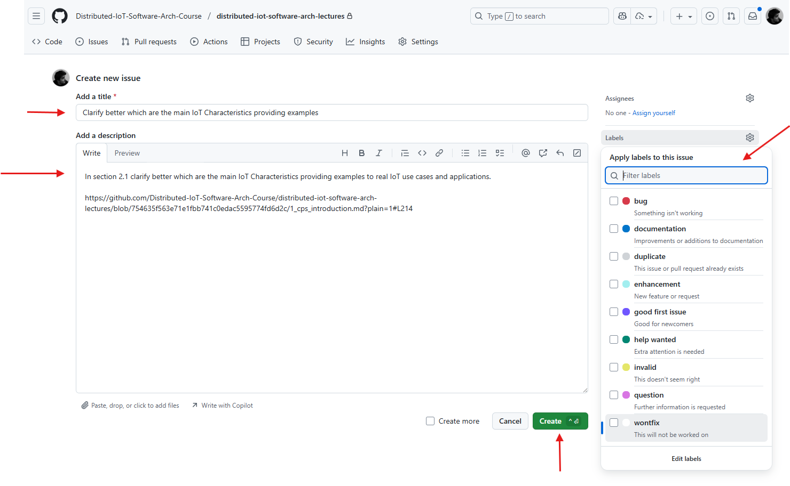

# 📚 Distributed and Internet of Things Software Architectures - Lecture Contents

This repository contains the complete lecture content for the course "Distributed and Internet of Things Software Architectures" held at the University of Modena and Reggio Emilia. 

## 📋 Repository Structure and Content Formats

This repository provides lecture contents in multiple formats to enhance accessibility and learning experience:

- **📝 Markdown Format**: Primary source files containing lecture content directly in markdown format for easy editing, version control, and collaborative development
- **📕 PDF Export**: Professional PDF versions exported for easy note-taking, printing, and offline reading
- **📘 ePub Format**: Electronic publication format for massive readability across different devices and applications (e-readers, tablets, smartphones, reading apps)

The multi-format approach ensures that students can access and study the material using their preferred reading method and device.

## 🎯 Course Overview

The Distributed and Internet of Things Software Architectures course aims to equip students with a comprehensive understanding of the challenges and characteristics of Cyber-Physical and Internet of Things (IoT) Distributed Software Systems. This course covers the main principles of distributed architectures and software systems, with a specific focus on communication patterns, design principles, and development techniques.

**🎓 Learning Objectives**

- **🏗️ Understanding Distributed Architectures:** Study and analyze the core principles of distributed systems, focusing on communication patterns, design principles, and development techniques.
- **🔗 Interoperability and End-to-End Architectures:** Apply these principles with particular attention to interoperability, and the design and development of end-to-end architectures.
- **💻 Hands-On Experience with Cutting-Edge Technologies:** Gain practical knowledge through the use of state-of-the-art technologies such as development tools, software libraries, microservice solutions, IoT devices, prototyping boards, computational facilities, and edge/cloud assets in the course laboratories.
- **🔬 Technological and Research Trends:** Explore technological and research trends influencing the field of distributed intelligent cyber-physical and IoT systems, including the design and construction of Digital Twin solutions.

**📌 Key Topics**

- **⚙️ Cyber-Physical Systems (CPS):** Explore the integration of computational algorithms and physical components in CPS.
- **🏛️ Software Architectures:** Study various architectural patterns and their applications in distributed systems.
- **🛠️ Design and Development:** Learn best practices for designing and developing robust and scalable distributed systems.
- **🚀 Deployment:** Understand the deployment strategies for distributed systems across different environments.

## 📚 Lecture List

1. [📖 Introduction to Cyber-Physical Systems and Internet of Things](Lectures/1-CPS-Introduction/1_cps_introduction.md)
2. ... (Additional lectures to be added step-by-step)

## 🤝 Contributing & Improving the Repository

Contributions to enhance the lecture content, fix issues, or add new features are welcome.
Please feel free to contribute following one of the following two options: 

- 🐛 Open an issue to discuss your ideas or suggestions before making any changes.
- 🍴 Fork the repository, make your changes, and submit a pull request for review.

### 🆕 Create a New Issue

To create a new issue and help improve the lecture content, follow these steps:

1. **📂 Navigate to target Lecture Markdown File**  
    Go to the repository's GitHub page and locate the specific lecture markdown file you want to discuss.

2. **💻 Open the Markdown File in Code Mode**  
    
    

    Switch from `Preview` mode to `Code` mode by clicking the respective tab at the top right of the file view. In this way, you can see the raw markdown content and line numbers, which will help you reference specific parts of the text in your issue.  
    Then, click on the `...` (three dots) and clici on `Reference in new issue` to automatically create a new issue with a reference to the specific line you are viewing.

3. **✏️ Describe Your Suggestion or Problem**  
    
    

    - Provide a clear and descriptive **title** for your issue.
    - In the description, explain your suggestion, feedback, or the problem you found in the lecture content.
    - If possible, reference specific sections, files, or lines to make your feedback actionable.
    - You can also attach screenshots or code snippets to clarify your point.
    - The Link "Reference in new issue" will automatically include a reference to the specific line you were viewing, making it easier for maintainers to understand the context of your issue.
    - If you are creating the issue manually please refer to the specific line numbers or sections in your description in order to provide context.
    - If you want you can also assign **labels** to your issue (e.g., `bug`, `enhancement`, `question`) to help categorize it.

4. **✅ Create the Issue**  
    Once you have filled out the details, click "Create"  
    The repository maintainers will review your issue and respond as soon as possible.

Creating issues is a great way to contribute, ask questions, or suggest improvements. 
**💡 Your feedback helps keep the lecture materials accurate and up-to-date!**

### 🍴 Fork and Submit a Pull Request

To contribute directly by making changes to the lecture content, you can fork the repository, make your changes, and submit a pull request. Here’s how to do it:

1. **🍴 Fork the Repository**  
    - Go to the repository's GitHub page.
    - Click the "Fork" button at the top right corner of the page. This will create a copy of the repository under your GitHub account.
2. **💾 Clone Your Fork**  
    - Open your terminal or command prompt.
    - Clone your forked repository to your local machine using the command:
      ```bash
      git clone <your-fork-url>
      ```
3. **🌿 Create a New Branch**  
    - Navigate to the cloned repository:
      ```bash
      cd <repository-name>
      ```
    - Create a new branch for your changes:
      ```bash
      git checkout -b <your-branch-name>
      ```
4. **✏️ Make Your Changes**  
    - Open the files you want to edit in your preferred text editor or IDE.
    - Make the necessary changes to the lecture content.
5. **💾 Commit Your Changes**  
    - After making your changes, stage the modified files:
      ```bash
      git add <file1> <file2> ...
      ```
    - Commit your changes with a descriptive message:
      ```bash
      git commit -m "Your descriptive commit message"
      ``` 
6. **📤 Push Your Changes to Your Fork**  
    - Push your changes to the branch you created on your forked repository:
      ```bash
      git push origin <your-branch-name>
      ```
7. **🔄 Create a Pull Request**  
    - Go to your forked repository on GitHub.
    - You will see a prompt to create a pull request for the branch you just pushed. Click on "Compare & pull request".
    - Provide a clear title and description for your pull request, explaining the changes you made and why they are beneficial.
    - Click "Create pull request" to submit your changes for review.

The repository maintainers will review your pull request and may provide feedback or request changes before merging it into the main repository.


## 🔧 Content Generation and Conversion

The conversion of markdown files to PDF, HTML, and ePub formats is done using `pandoc`, a versatile document converter.
Pandoc supports a wide range of input and output formats, making it an ideal tool for this purpose.
Useful resources and links for `pandoc` used in this repository:

- 📖 Official Pandoc documentation: [Link](https://pandoc.org/documentation.html)
- 🐳 Docker image for Pandoc: 
    - [Pandoc Core Link](https://hub.docker.com/r/pandoc/core)
    - [Pandoc Extra with Latex Link](https://hub.docker.com/r/pandoc/extra)
- 🎨 Gallery of Pandoc templates: [Link](https://pandoc-templates.org/)
- 📄 Template: [Eisvogel](https://github.com/Wandmalfarbe/pandoc-latex-template?tab=readme-ov-file)

### 🚀 How to use the PDF, HTML and ePub generation scripts

The script `file_generator.sh` can be used to generate PDF, HTML, and ePub versions of the markdown files. 
It is based on the `Docker` version of `pandoc` and requires `docker` to be installed on your system.
To generate the files, run the script with the desired output format as an argument. For example, to generate PDF files, use:

```bash
chmod +x file_generator.sh
./file_generator.sh
```

This will create the PDF, HTML, and ePub files in the main directory.
Already generated files are available in the different subdirectories for each format.

## 📄 License

This work is licensed under the [Creative Commons Attribution 4.0 International License](https://creativecommons.org/licenses/by/4.0/).

[![CC BY 4.0][cc-by-image]][cc-by]

You are free to:
- **📤 Share** — copy and redistribute the material in any medium or format for any purpose, even commercially
- **🔧 Adapt** — remix, transform, and build upon the material for any purpose, even commercially

Under the following terms:
- **✏️ Attribution** — You must give appropriate credit, provide a link to the license, and indicate if changes were made

[cc-by]: http://creativecommons.org/licenses/by/4.0/
[cc-by-image]: https://i.creativecommons.org/l/by/4.0/88x31.png